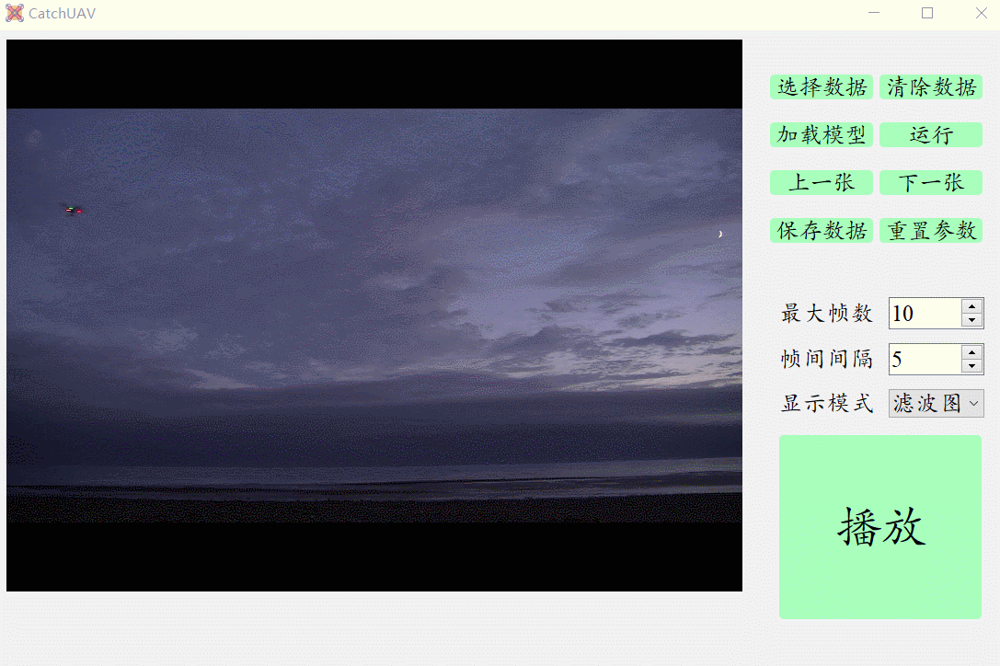
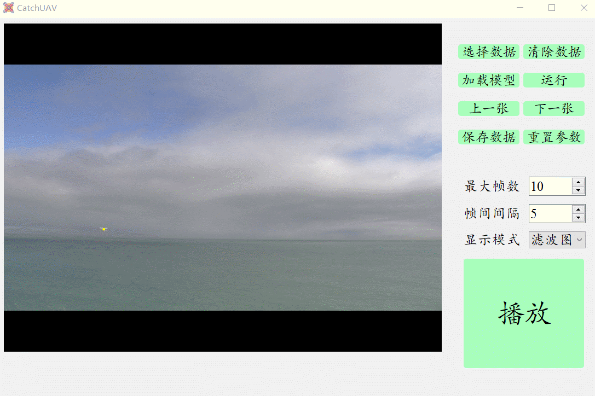

参考
====

[KalmanFilter.Net](https://www.kalmanfilter.net)

- 一个非常好的教程，由浅入深，很直观的解释了卡尔曼滤波器中的各个公式、变量的含义

Capture UAV With Kalman Filter
==============================

Goal && Why Kalman Filter?
--------------------------

利用目标检测模型`YOLOv3`对图像中无人机进行检测，将检测结果反馈给相机云台用作控制信息。如果仅仅返回无人机的锚框，则很难做到实时跟踪，难点主要有：

- 难以做到对无人机进行飞行预测：返回的锚框是一个静态数据，没能利用到视频流数据之间的时序性；
- 无人机可能被遮挡：当无人机被遮挡时，模型的输出将为空，从而丢失追踪；
- 难以捕捉无人机的深度信息：由于利用的是图像信息，输出的 Bounding Box 是二维的锚框，无法估计无人机距离相机云台的远近，即丢失了深度信息，从而增加了云台的控制难度。

在学习卡尔曼滤波器时，其中一个案例就是进行利用雷达对空中无人机进行跟踪，所以利用卡尔曼滤波器来结合目标跟踪问题的想法也就顺理成章了。利用卡尔曼滤波器的原因：

- `YOLOv3`在目标识别方面存在噪声、不确定性：`Kalman Filter` 能利用上视频帧之间的连贯性，来减小由 `YOLOv3` 目标检测模型带来的误差；
- 当`UAV`被遮挡时，能利用"状态外推公式"来对无人机状态进行预估；
- 状态信息更加丰富：这里在建模时对无人机的位置坐标、锚框参数进行建模，假设无人机进行匀加速运动，从而能在迭代过程中记录无人机的速度、加速度；
- `Kalman Filter` 计算量低，非常适用于嵌入式系统。

假设无人机是一个 `constant accleration` 的系统。

Modeling
--------

### Prediction1: The State Extrapolation Equation

$$
\boldsymbol{\hat{x}_{n+1,n}=F\hat{x}_{n,n}+Gu_{n}+w_{n}}
$$

状态外推公式，反映理论上系统的动态特性，并利用该动态特性对下一状态进行预测。由于没有外部输入，故$\boldsymbol{u} = 0$。

状态$\boldsymbol{x_n}:$
$$
\boldsymbol{x}_{\boldsymbol{n}}=\ \left[ \begin{array}{c}
	x_n\\
	\dot{x}_n\\
	\ddot{x}_n\\
	y_n\\
	\dot{y}_n\\
	\ddot{y}_n\\
	w_n\\
	\dot{w}_n\\
	\ddot{w}_n\\
	r\\
	\dot{r}\\
	\ddot{r}\\
\end{array} \right]
$$
其中

- $x_n:$ 无人机在像素坐标下横轴坐标(实际为锚框中心坐标)；
- $\dot{x_n}:$ $x$轴方向的速度
- $\ddot{x_n}: $ $x$轴方向的加速度
- $y_n:$ 无人机在像素坐标下的纵坐标
- $w_n:$ 锚框的宽度
- $r_n: $  锚框的高宽比($r_n = \frac{h_n}{w_n}$)

锚框的信息可以由这四个0阶变量来描述，对于锚框的长宽，用$w_n$和$r_n$来描述，最初考虑直接使用$w_n$和$h_n$作为状态变量，但是这样会导致二者具有较高相关性，从而在描述不确定性时较为复杂，故换用了$r_n$，一方面可以描述$h_n$，另一方面$r_n$的速度还可以反映无人机的倾斜变化。

根据匀加速运动的运动学公式可得：
$$
\boldsymbol{\hat{x}_{{n+1,n}}} \left[ \begin{matrix}
	1&		\Delta t&		0.5\Delta t^2&		0&		0&		0&		0&		0&		0&		0&		0&		0\\
	0&		1&		\Delta t&		0&		0&		0&		0&		0&		0&		0&		0&		0\\
	0&		0&		1&		0&		0&		0&		0&		0&		0&		0&		0&		0\\
	0&		0&		0&		1&		\Delta t&		0.5\Delta t^2&		0&		0&		0&		0&		0&		0\\
	0&		0&		0&		0&		1&		\Delta t&		0&		0&		0&		0&		0&		0\\
	0&		0&		0&		0&		0&		1&		0&		0&		0&		0&		0&		0\\
	0&		0&		0&		0&		0&		0&		1&		\Delta t&		0.5\Delta t^2&		0&		0&		0\\
	0&		0&		0&		0&		0&		0&		0&		1&		\Delta t&		0&		0&		0\\
	0&		0&		0&		0&		0&		0&		0&		0&		1&		0&		0&		0\\
	0&		0&		0&		0&		0&		0&		0&		0&		0&		1&		\Delta t&		0.5\Delta t^2\\
	0&		0&		0&		0&		0&		0&		0&		0&		0&		0&		1&		\Delta t\\
	0&		0&		0&		0&		0&		0&		0&		0&		0&		0&		0&		1\\
\end{matrix} \right] = \boldsymbol{\hat{x}_{{n,n}}}
$$

### Prediction2: The Covariance Extrapolation Equation

对于`Prediction1`中预测的$\boldsymbol{\hat{x}_{{n+1,n}}} $，我们需要衡量其可靠程度、不确定程度，即$Conv(\boldsymbol{\hat{x}_{{n+1,n}}} )$。预测的不确定度来自于当前状态的不确定度，同时还需要考虑过程噪声，故预测的不确定度由两部分组成：
$$
\boldsymbol{
P_{n+1,n} = FP_{n,n}F^T + Q
}
$$
其中$Q$即反映了过程噪声，是由环境等不确定因素所造成的，其越大则表示月不能相信状态预测。这里的不确定性是来自于加速度并不像假设的那样恒定，假设$x$和$y$的加速度不确定度为$\sigma_{a_{xy}}$(标准差)，$w$的加速度不确定度为$\sigma_{a_x}$，$r$的加速度不确定度为$\sigma_{a_r}$，则根据[推导](https://www.kalmanfilter.net/covextrap.html#withQ)可知：
$$
Q = \left[ \begin{matrix} 
Q_{a_{xy}} & 0 & 0 \\
0 & Q_{a_{w}} & 0 \\
0 & 0 & Q_{a_{r}}
\end{matrix} \right]
$$
其中
$$
Q_{a_{xy}} = \left[\begin{array}{ccc}
\frac{\Delta t^{4}}{4} & \frac{\Delta t^{3}}{2} & \frac{\Delta t^{2}}{2} \\
\frac{\Delta t^{3}}{2} & \Delta t^{2} & \Delta t \\
\frac{\Delta t^{2}}{2} & \Delta t & 1
\end{array}\right] \sigma_{a_{xy}}^{2} \\

Q_{a_{w}} = \left[\begin{array}{ccc}
\frac{\Delta t^{4}}{4} & \frac{\Delta t^{3}}{2} & \frac{\Delta t^{2}}{2} \\
\frac{\Delta t^{3}}{2} & \Delta t^{2} & \Delta t \\
\frac{\Delta t^{2}}{2} & \Delta t & 1
\end{array}\right] \sigma_{a_w}^{2} 

\\
Q_{a_r} = \left[\begin{array}{ccc}
\frac{\Delta t^{4}}{4} & \frac{\Delta t^{3}}{2} & \frac{\Delta t^{2}}{2} \\
\frac{\Delta t^{3}}{2} & \Delta t^{2} & \Delta t \\
\frac{\Delta t^{2}}{2} & \Delta t & 1
\end{array}\right] \sigma_{a_{r}}^{2}
$$

- $\Delta t$ 是两次连续测量之间的时间间隔

### Measurement1: The Measurement Equation

建立了状态变量和观测变量之间的关系
$$
z_n = \boldsymbol{Hx_n} + v_n
$$

- 其中$H$有多个用途，直观上说是从状态域转变到观测域，可能是做量纲变换、变量选择等
- $v_n$是测量过程中存在的随机误差，这是有测量系统的不准确度影响的，这也直接影响了 `Kalman Gain` 是偏向于相信预测值，还是偏向于相信测量值！

这里的$H$只是用于变量选择，选出4个0阶变量：
$$
H = \left[\begin{matrix}
1 & 0 & 0 & 0 & 0 & 0 & 0 & 0 & 0 & 0 & 0 & 0 \\
0 & 0 & 0 & 1 & 0 & 0 & 0 & 0 & 0 & 0 & 0 & 0 \\
0 & 0 & 0 & 0 & 0 & 0 & 1 & 0 & 0 & 0 & 0 & 0 \\
0 & 0 & 0 & 0 & 0 & 0 & 0 & 0 & 0 & 1 & 0 & 0 \\
\end{matrix}\right]
$$

### Measurement2: The Measurement Uncertainty

对应于上面的$v_n$，这里假设四个观测变量之间互不影响(如果是选择$h_n$而不是$r_n$则后两个变量不是独立的了)。
$$
R_n = \left[\begin{matrix} 
\sigma_{x_m}^2& 0 & 0 & 0 \\
0& \sigma_{y_m}^2& 0 & 0 \\
0& 0 & \sigma_{w_m}^2& 0 \\
0& 0 & 0 & \sigma_{r_m}^2 \\
\end{matrix}\right]
$$
由于这是测量系统带来的不确定性，也就是模型的不确定度，所以将其记为常量：
$$
R_1 = R_2\cdots R_{n - 1} = R_n
$$

### Update1: The Kalman Gain

卡尔曼增益是在更新的时候使用，反映预测值与测量值之间的权衡，不确定度越小则越应该相信，故其分别受到预测值的不确定度$P_{n,n-1}$和测量值的不确定度$R_n$的影响：
$$
K_{n}=P_{n, n-1} H^{T}\left(H P_{n, n-1} H^{T}+R_{n}\right)^{-1}
$$

- 需要以$H$作为桥梁

### Update2: The State Update Equation

综合考虑测量数据和预测数据，利用最优的系数$K_n$对两个数据进行汇总，得到当前状态的估计值！
$$
\hat{\boldsymbol{x}}_{n, n}=\hat{\boldsymbol{x}}_{n, n-1}+\boldsymbol{K}_{n}\left(\boldsymbol{z}_{n}-\boldsymbol{H} \hat{\boldsymbol{x}}_{n, n-1}\right)

\label{eq1}
$$

### Update3: The Covariance Update Equation

计算$\boldsymbol{\hat{x}_{n, n}}$的不确定度，根据式$\eqref{eq1}$推导出其不确定度的更新公式：
$$
\boldsymbol{P}_{n, n}=\left(\boldsymbol{I}-\boldsymbol{K}_{n} \boldsymbol{H}\right) \boldsymbol{P}_{n, n-1}\left(\boldsymbol{I}-\boldsymbol{K}_{n} \boldsymbol{H}\right)^{\boldsymbol{T}}+\boldsymbol{K}_{n} \boldsymbol{R}_{n} \boldsymbol{K}_{n}^{T}
$$

Initialize Parameters
---------------------

- 测量时间间隔：$\Delta t = 5(f)$
- 加速度不确定度：
  - $\sigma_{a_{xy}} = 10 \  \frac{p}{f^2} $
  - $\sigma_{a_w} = 10 \  \frac{p}{f^2}$
  - $\sigma_r = 0.1\  \frac{1}{f^2}$
- 初始化测量不确定度：
  - $\sigma_{x_m}=\sigma_{y_m} = 50 \  p$
  - $\sigma_{w} = 20\  p$
  - $\sigma_{r} = 0.5\  p$

- 初始化状态向量，将第一次识别到无人机的数据用于初始化$\boldsymbol{\hat{x}_{0,0}}$
- 初始化的状态不确定度为：

$$
\boldsymbol{{P}_{0,0}} = \left[\begin{matrix}
1 & 0 & 0 & 0 & 0 & 0 & 0 & 0 & 0 & 0 & 0 & 0 & \\
0 & 20 & 0 & 0 & 0 & 0 & 0 & 0 & 0 & 0 & 0 & 0 & \\
0 & 0 & 20 & 0 & 0 & 0 & 0 & 0 & 0 & 0 & 0 & 0 & \\
0 & 0 & 0 & 1 & 0 & 0 & 0 & 0 & 0 & 0 & 0 & 0 & \\
0 & 0 & 0 & 0 & 20 & 0 & 0 & 0 & 0 & 0 & 0 & 0 & \\
0 & 0 & 0 & 0 & 0 & 20 & 0 & 0 & 0 & 0 & 0 & 0 & \\
0 & 0 & 0 & 0 & 0 & 0 & 1 & 0 & 0 & 0 & 0 & 0 & \\
0 & 0 & 0 & 0 & 0 & 0 & 0 & 20 & 0 & 0 & 0 & 0 & \\
0 & 0 & 0 & 0 & 0 & 0 & 0 & 0 & 20 & 0 & 0 & 0 & \\
0 & 0 & 0 & 0 & 0 & 0 & 0 & 0 & 0 & 1 & 0 & 0 & \\
0 & 0 & 0 & 0 & 0 & 0 & 0 & 0 & 0 & 0 & 20 & 0 & \\
0 & 0 & 0 & 0 & 0 & 0 & 0 & 0 & 0 & 0 & 0 & 20 & \\
\end{matrix}\right]
$$

- 这里对0阶状态变量设计为$1$是因为初始位置不确定度较低
- 但是对于速度和加速度则需要设置更大一些

实验结果
========

匀速情况
--------

变加速度情况
------------

建模时将无人机的运动考虑为二阶运动(匀加速的情况)，而实际的无人机大多处于变加速的情况，对于上图，无人机由远到近，在最近时突然减速，预测的黄点的弯曲程度直接反映了无人机的减速情况。
