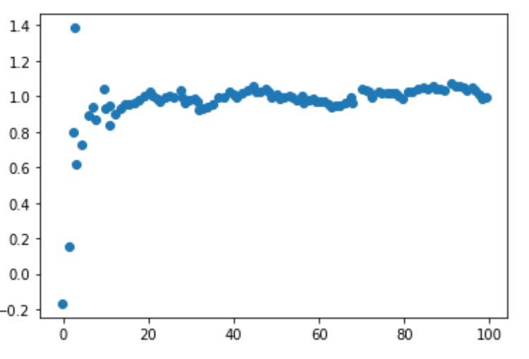
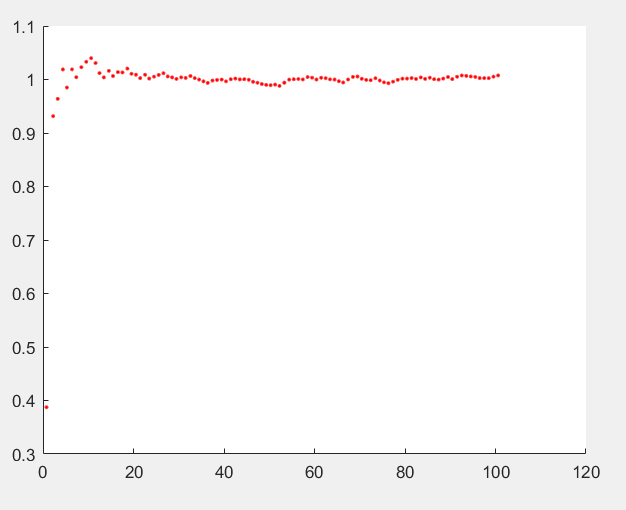

参考
====

- [目标检测的实例](https://zhuanlan.zhihu.com/p/460286284)
- [可视化的实例](https://www.youtube.com/watch?v=IFeCIbljreY)
- [卡尔曼滤波背后的数学原理(机器学习)](https://www.youtube.com/watch?v=UVNeulkWWUM)
- [可视化的理解卡尔曼滤波(MatLab实现)](https://www.youtube.com/watch?v=2-lu3GNbXM8)

究极教程

- https://www.kalmanfilter.net/kalmanmulti.html

疑问与解答
==========

为什么叫做滤波？而不是预测？
----------------------------

- 估计过去的状态叫平滑，估计当前的状态叫滤波，估计未来的状态叫预测
- 滤波有个广义的说法是把我们感兴趣的信号增强，不感兴趣的抑制

得到的当前观测值含有一些测量误差等噪声，而卡尔曼可以利用以前的历史数据来消除部分噪声从而得到更加精确的值，这相当于是滤除了噪声，所以叫做滤波器

todo: 小车例子中如果含有加速度则预测效果很差?状态的设定的影响是什么？仅考虑位移作为状态呢？
-------------------------------------------------------------------------------------------

- todo


案例
====

### 小车匀速运动的例子

#### Python版本

```python
import numpy as np
import matplotlib.pyplot as plt

# Data from sensor
Y = np.arange(0, 100) + np.random.randn(1, 100)

# Parameters 
X = np.asarray([0, 0], dtype=np.float32).reshape(-1, 1)
P = np.eye(2, dtype=np.float32)
F = np.asarray(
    [[1, 1], [0, 1] ], dtype=np.float32)
Q = np.asarray([[0.0001, 0], [0, 0.0001]], dtype=np.float32)
H = np.asarray([1, 0], np.float32).reshape(1, -1)
R = np.asarray([1], dtype=np.float32)

len = 100
X_rec = None
for i in range(0, len):
    X_tmp = np.asarray([1, 1], dtype=np.float32).reshape(-1, 1)
    X_hat = F @ X
    P_hat = F @ P @ F.T + Q
    S = H @ P_hat @ H.T + R
    K = P_hat @ H.T @ np.linalg.inv(S)
    X = X_hat + K @ (Y[0, i] - H @ X_hat)
    P = (np.eye(2) - K @ H) @ P_hat
    print(X)
    if X_rec is None:
        X_rec = X
    else:
        X_rec = np.column_stack((X_rec, X))
        
plt.scatter(X_rec[0], X_rec[1])
```



#### MatLab版本

```matlab
% 观测数据
Z = (1:100); 
noise = rand(1, 100);  
Z = Z + noise;

% 参数 
X = [0; 0];  % 状态
P = [1, 0; 0, 1];  % 状态协方差矩阵
F = [1, 1; 0, 1];  % 状态转移矩阵
Q = [0.0001, 0; 0, 0.0001];  % 状态转移协方差矩阵
H = [1, 0];  % 观测矩阵
R = 1;  % 观测噪声协方差

figure(1);

for i = 1:100
    X_ = F * X;
    P_ = F * P * F' + Q;
    K = P_ * H' / ( H * P_ * H' + R );
    X = X_ + K * (Z(i) - H*X_);
    P = (eye(2) - K*H) * P_;
    hold on
    plot(X(1), X(2), '.r');   % (p, v)
end
```


