目录
====

[TOC]

参考
====

- [目标检测的实例](https://zhuanlan.zhihu.com/p/460286284)
- [可视化的实例](https://www.youtube.com/watch?v=IFeCIbljreY)
- [卡尔曼滤波背后的数学原理(机器学习)](https://www.youtube.com/watch?v=UVNeulkWWUM)
- [可视化的理解卡尔曼滤波(MatLab实现)](https://www.youtube.com/watch?v=2-lu3GNbXM8)

究极教程

- https://www.kalmanfilter.net/kalmanmulti.html

感悟
====

第一次学习这种确定性过程 + 随机过程的建模，因为现实物理过程本身就是伴随着不确定性的！

以小车的位置测量为例，在以往的学习中，我们常常没有去考虑测量误差、过程噪声这种随机变量，因而我们只需要在一开始测一测小车的位置、速度，然后明确小车的变换规律(状态转移方程)，而后就可以直接推理得到其在任意时间$t$的状态了。但是在实际的物理过程中，往往伴随着过程噪声、测量噪声，且一般随着时间的推移，其造成的偏差越大，所以我们不得不隔一段时间就测量一次，每次测量后，就利用新的数据点对原本状态进行更新。

在KalmanFilter中，我们将 预测得到的数据 描述为一个随机变量，将测量到的数据描述为另一个随机变量，每一次修正的时候就根据两个随机变量的不确定度为依据进行修正，保证更新后的数据具有最低的不确定度。

在综合的过程中，由于状态变量和观测变量在不同的线性空间，则中间利用观测矩阵来进行建模。

总体感觉
========

卡尔曼滤波器提供了一个精确的方法用于估计当前系统的隐状态，从而能跟精确的进行测量、跟踪。整个卡尔玛滤波器的过程，就是不断搜集数据，然后更新自己的认知(一些表征不确定度的参数，迭代过程中不断收敛到真实的分布)，最后能很好地掌握系统存在的不确定性，从而能"滤除掉"其中的不确定性。

整体上，呈"predict-correct"的循环：

- predict: 根据历史信息，对下一次状态进行预测，注意到需要将不确定度考虑进来，故还需要对不确定度进行预测
- correct: 利用当前新的测量信息及其不确定度，修正预测，同样也是需要修正状态和不确定度
- 修正的目标是：当前状态的不确定度最小

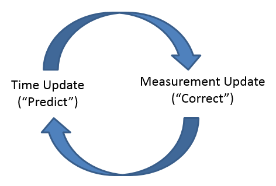

符号说明
========

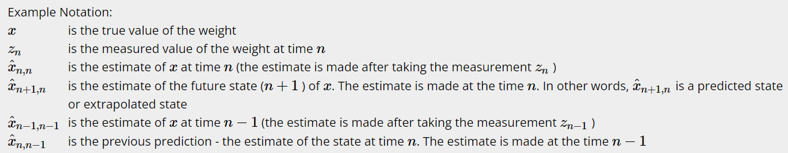

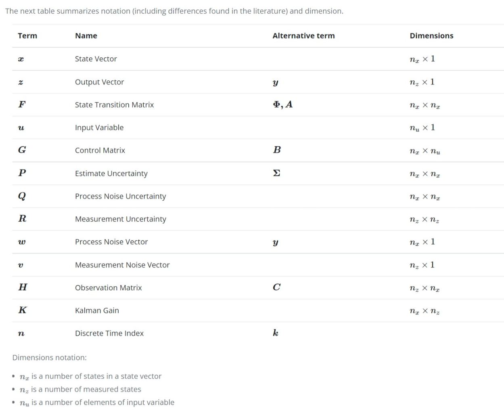

公式及理解
==========

公式汇总
------------

- 在预测状态下，根据对该线性系统的建模，利用状态、不确定度外推公式，从前$n$次数据积累下的经验中推导出第$n+1$次的状态、不确定性。
- 在测量得到数据$z_n$后，进入修正(更新)状态：首先计算 Kalman Gain，这是用于调和 "预测量" 和 "测量量" 的唯一参数(一维情况下就是一个加权系数)，而后更新当前的状态和当前不确定度

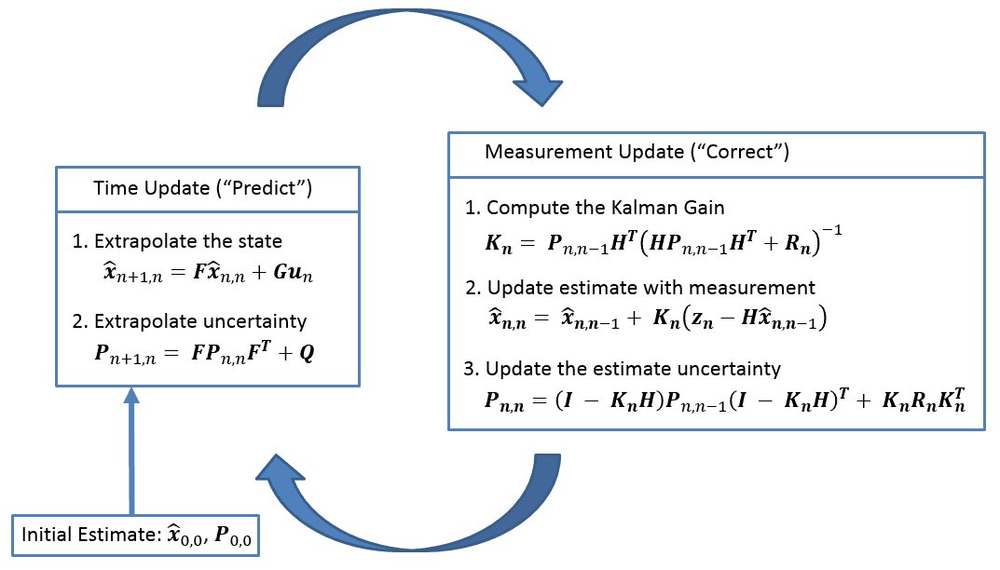

State Extraplolation Equaton
----------------------------

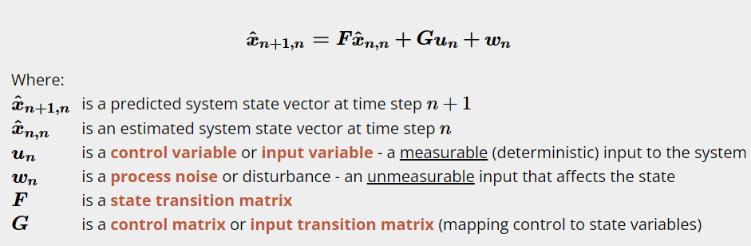

基于已知的前$n$个测量数据，对该系统的运行规律(微分方程)进行建模，对下一次状态进行外推，例如若我们已知小球是在向右做速度为$1m/s$的匀速运动，则我们可以推测其下一秒的速度为$1m/s$，下一秒的位置为当前位置加1。

但是在实际运动中，会存在各种未知干扰，表现在这里的$\omega_n$项中，其作为一个列向量，直接加在了对下一次状态的预测上。例如，若小球在运动过程中收到微风扰动，则下一秒可能是在$x_0 + 0.98$的位置，速度可能在$1 + (-0.01)$，那么这里的$\omega_n = \left [\begin{matrix} -0.02 & -0.01 \end{matrix}\right]^T$了。所有环境对小球运动造成的干扰，我们通通将其建模在$\omega_n$中，注意这里的$\omega_n$是一个随机变量，我们在预测的时候显然是不知道其真实值的(unmeasurable)，通常这种干扰是服从高斯分布的，我们使用其协方差矩阵 $Q$ 来描述这种不确定度，这种不确定度越大，表明我们越不能相信我们的预测值，反之则应该越相信。

注：在实际预测的时候，$\omega_n$这一项表明的是不确定度的均值(TODO: 应该是这样)，大部分的噪声干扰都是服从$N(0, \sigma^2)$，所以$\omega_n$常常为0。TODO: 如果有一些干扰均值不是0，比如给一个服从$N(1, 10)$的恒定的力，那么可以将该力转换成一个控制变量+均值为0的过程噪声。而由于这一项增加了状态的不确定度，故将其不确定度反映在$P$上。

注：该方程是建立在系统的运行规律之上的，通常来源于系统微分方程、状态空间模型等

在初始化状态变量$x_{0, 0}$时，其通常是一个很不准确的状态，故其不确定度$P_{0, 0}$也将较大。

Covariance Extrapolation Equation
---------------------------------

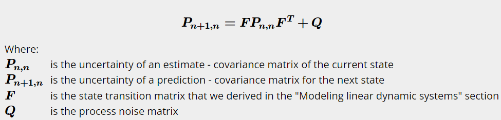

该公式可以直接根据 `State Extrapolation Equation` 的$x_{n+1,n}$推导而来，其中的$Q$即反映了$\omega_n$带来的不确定度。

推导也比较简单，直接求$x_{n+1,n}$协方差即可，结果中的第一项是根据$Cov(Ax) = ACov(x)A^T$得来，而后直接加上一项$Q$(独立的两个随机变量相加后的不确定度即是两个随机变量不确定度的和)

### Derivation of $Q$

> - TODO：[Covariance Extrapolation Equation (kalmanfilter.net)](https://www.kalmanfilter.net/covextrap.html)
>   - 这里投影的目的是什么？

先分析$\omega_n$的来源，假设我们的系统是一个匀加速直线运动，对于上面小球的例子中，加速度初始为$0 m/s^2$，由于存在风，风会对小球产生阻力，从而直接影响到其加速度，进一步影响其速度、位移。我们将风阻力等外界干扰建模为为一个随机变量，其服从$N(\mu, \sigma^2_a)$。

然后给出由于加速度的不确定度而整体随机变量造成的不确定的公式，假设两次测量的时间间隔为$\Delta t$，当前状态不确定度描述为：
$$
Q_{a} = \left[ \begin{matrix} 
0 & 0 & 0 \\
0 & 0 & 0 \\
0 & 0 & 1
\end{matrix} \right] \sigma_a^2
$$

- 初始时，只有加速度带来不确定性，然后该不确定性随着时间的流逝，进一步影响其他状态量的不确定性

在经过了$\Delta t$时间后，根据状态转移矩阵$F$，可以推导出$Q$: 
$$
Q = FQ_aF^T =\left[\begin{array}{ccc}
\frac{\Delta t^{4}}{4} & \frac{\Delta t^{3}}{2} & \frac{\Delta t^{2}}{2} \\
\frac{\Delta t^{3}}{2} & \Delta t^{2} & \Delta t \\
\frac{\Delta t^{2}}{2} & \Delta t & 1
\end{array}\right] \sigma_{a^{2}} \\
$$
$Q$矩阵时变量吗？由于$Q$反映的是外部干扰、过程噪声，一般情况下如果外界环境变化不大，则可以认为$Q$不变。

Measurement Equation
--------------------

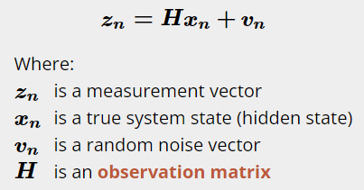

测量公式反映状态量到观测量之间的转移，通过观测矩阵$H$来完成，由于测量存在不确定度，即存在随机噪声，故需要添加一项$v_n$来表示测量的偏差。

测量不确定度的表示：使用$R_n$来表示测量不确定度，对于测量的$n_z$个变量，其偏差向量为$v_n$，则$R_n = Cov(v_n)$。通常下$R_n$是不变的，因为他是随着系统测量精度的改变而改变。例如，在电阻器测量电阻值时，我们可以假设说该电阻器在一定范围内的测量不确定度不变，但是在到另一个范围时，其测量不确定度也可能改变为另一个值。

$H$的意义：从状态空间转换到测量空间，常常用于 Scale\Selection\Combination

State Update Equation
---------------------

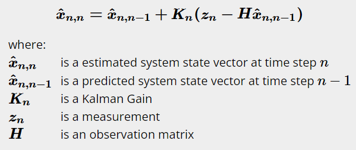

综合上一次($n-1$)对当前($n$)状态的预测$\hat{x}_{n,n-1}$，以及当前观测量$z_n$，得出当前状态的估计量$\hat{x}_{n, n}$。最关键的是找出那个"综合"所需的系数$K_n$。

公式的直观理解：

- $K_n$直接反映了偏向$Z_n$的程度，可以理解为一个权重

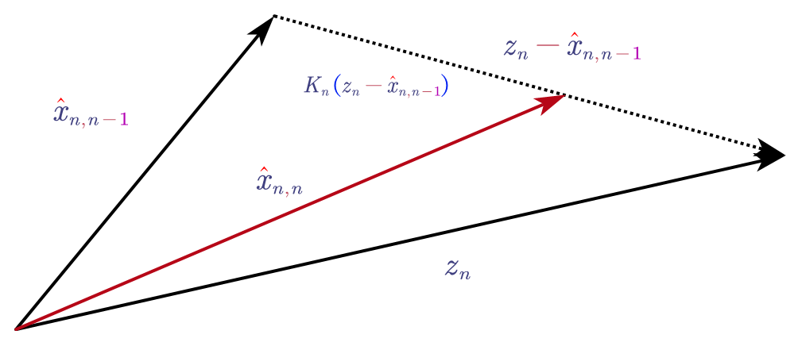

### The Kalman Gain

在进行状态更新时，需要用到 Kalman Gain，其实状态更新的核心，反映了当前状态对上一次的预测状态域观测状态之间的权衡。

直观上，$K_n$直接反映对$z_n$的重视程度，而重视程度是来源于"信赖与否"，对于$\hat{x}_{n, n-1}$和$z_{n}$，这两个随机变量，均存在随机性，随机性越小，则表示其信赖度越高。

推导上理解$K_n$，说白了$K_n$的选取是一个决策变量，而我们的目标是为了让预估状态的不确定度最小

- [一维情况下的证明](https://www.kalmanfilter.net/KalmanGainDeriv.html)：最终的系数会偏爱不确定度更小者(调和平均)

### 更直观的理解状态更新

状态更新是对状态变量均值的更新 + 对不确定度的更新，更新的不低是为了新状态的不确定度最低(最窄)。

- 下图为预测不确定度更大的情况，可见估计值会偏向于测量值

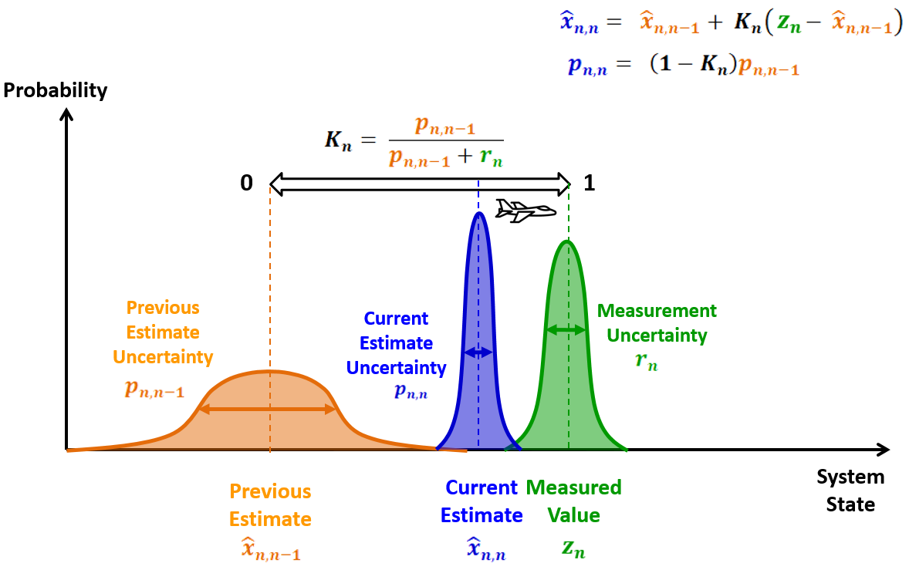

Covariance Upadate Equation
---------------------------

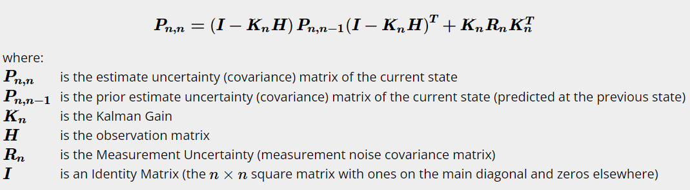

直接求解$Cov(\hat{x}_{n, n})$即可，显然其是由$P_{n, n-1}$和$R_n$经过$K_n$调和得到的！

实用过程
========

> 这里以[追踪二维平面上的小车](https://www.kalmanfilter.net/multiExamples.html)为例说明实用的过程
>

$\Delta t$
----------

明确测量的时间间隔

- TODO: 这个有什么影响？

## $F$ AND$G$

首先根据实际问题，针对该系统的物理特性，选定状态变量，建立系统的状态空间模型，然后经过求解得到其 `State Extrapolation Equation`：

$$
\boldsymbol{\hat{x}_{n+1,n}=F\hat{x}_{n,n}+Gu_{n}+w_{n}}
$$
而后明确$F$ 和 $G$

例如：
$$
\boldsymbol{x_{n}}=
									\left[ \begin{matrix}
											x_{n}\\
											\dot{x}_{n}\\
											\ddot{x}_{n}\\
											y_{n}\\
											\dot{y}_{n}\\
											\ddot{y}_{n}\\
										\end{matrix}
									\right] 
									\quad \quad 
									\left[ \begin{matrix}
										\hat{x}_{n+1,n}\\
										\hat{\dot{x}}_{n+1,n}\\
										\hat{\ddot{x}}_{n+1,n}\\
										\hat{y}_{n+1,n}\\
										\hat{\dot{y}}_{n+1,n}\\
										\hat{\ddot{y}}_{n+1,n}\\
									\end{matrix}
									 \right]
									 =
									\left[ \begin{matrix}								
										1 	& \Delta t 		& 0.5\Delta t^{2} 		& 0 				& 0   			& 0\\
										0 	& 1 			& \Delta t 				& 0 		 		& 0 			& 0\\
										0 	& 0 			& 1 					& 0 		 		& 0 			& 0\\
										0 	& 0 			& 0	 					& 1 				& \Delta t 		& 0.5\Delta t^{2}\\
										0 	& 0 			& 0 					& 0 		 		& 1				& \Delta t\\
										0 	& 0 			& 0 					& 0 		 		& 0 			& 1\\
									\end{matrix}
									\right]
									\left[ \begin{matrix}
										\hat{x}_{n,n}\\
										\hat{\dot{x}}_{n,n}\\
										\hat{\ddot{x}}_{n,n}\\
										\hat{y}_{n,n}\\
										\hat{\dot{y}}_{n,n}\\
										\hat{\ddot{y}}_{n,n}\\
									\end{matrix}
									\right]
$$


## $P$ AND $P_{0, 0}$ AND $Q$

然后根据实际情况，明确$P$的形式，一般情况下都是部分变量存在相关性，故形式一般如下：

$$
\boldsymbol{P} = 
									\left[ \begin{matrix}								
										p_{x} 				& p_{x\dot{x}} 			& p_{x\ddot{x}} 		& 0 				& 0  					& 0						\\
										p_{\dot{x}x} 		& p_{\dot{x}} 			& p_{\dot{x}\ddot{x}}	& 0 				& 0  					& 0						\\
										p_{\ddot{x}x} 		& p_{\ddot{x}\dot{x}}	& p_{\ddot{x}} 			& 0 				& 0  					& 0						\\
										0 					& 0 					& 0	 					& p_{y} 			& p_{y\dot{y}} 			& p_{y\ddot{y}}			\\
										0 					& 0 					& 0	 					& p_{\dot{y}y} 		& p_{\dot{y}}			& p_{\dot{y}\ddot{y}}	\\
										0 					& 0 					& 0	 					& p_{\ddot{y}y} 	& p_{\ddot{y}\dot{y}} 	& p_{\ddot{y}}			\\
									\end{matrix}
									 \right]
$$
然后初始化$P_{0, 0}$，可以根据统计情况给定，如果实在不清楚就随便大致给定即可，如以下数据：

$$
\boldsymbol{P_{0,0}}=
												\left[ \begin{matrix}								
													500 	& 0		& 0 		& 0 		& 0  		& 0			\\
													0 		& 500 	& 0	 		& 0 		& 0  		& 0			\\
													0 		& 0		& 500 		& 0 		& 0  		& 0			\\
													0 		& 0 	& 0	 		& 500 		& 0 		& 0			\\
													0 		& 0 	& 0	 		& 0 		& 500		& 0			\\
													0 		& 0 	& 0	 		& 0 		& 0 		& 500		\\
												\end{matrix}
												\right]
$$


- 注：如果初始状态本身比较好，则可以将$P$改小一点

然后明确$Q$，$Q$ 一般是个常量，根据之前对一个维度下加速度的影响的[推导](https://www.kalmanfilter.net/covextrap.html#withQ)，容易写出二维坐标下的影响：

$$
\boldsymbol{Q} = 
										\left[ \begin{matrix}								
											\frac{\Delta t^{4}}{4} 	& \frac{\Delta t^{3}}{2} 	& \frac{\Delta t^{2}}{2}	& 0 						& 0  						& 0							\\
											\frac{\Delta t^{3}}{2} 	& \Delta t^{2} 				& \Delta t					& 0 						& 0  						& 0							\\
											\frac{\Delta t^{2}}{2} 	& \Delta t					& 1 						& 0 						& 0  						& 0							\\
											0 						& 0 						& 0	 						& \frac{\Delta t^{4}}{4}	& \frac{\Delta t^{3}}{2} 	& \frac{\Delta t^{2}}{2}	\\
											0 						& 0 						& 0	 						& \frac{\Delta t^{3}}{2} 	& \Delta t^{2} 				& \Delta t					\\
											0 						& 0 						& 0	 					 	& \frac{\Delta t^{2}}{2} 	& \Delta t					& 1							\\
										\end{matrix}
										\right]
										\sigma_{a}^{2}
$$

## $H$ AND $R_n$

根据实际情况，确定观测矩阵$H$，对于这个例子，$H$是用于变量选取的：
$$
\boldsymbol{H} = 
									\left[ \begin{matrix}
										1	& 0	& 0	& 0	& 0	& 0 \\
										0	& 0	& 0	& 1	& 0	& 0 \\
									\end{matrix}
									\right]
$$
对于$R_n$，其用于反映测量设备的不确定性，直接表明测量值的不确定性：
$$
\boldsymbol{R_{n}} = 
									\left[ \begin{matrix}
										\sigma_{x_{m}}^{2} 	&  \sigma_{yx_{m}}^{2} \\
										\sigma_{xy_{m}}^{2} &  \sigma_{y_{m}}^{2} \\
									\end{matrix}
									\right]
$$

- 可以根据实际情况来初始化各个参数

对于本例：
$$
\boldsymbol{R_{n}} = 
									\left[ \begin{matrix}
										\sigma_{x_{m}}^{2} 	&  0 					\\
										0 					&  \sigma_{y_{m}}^{2} 	\\
									\end{matrix}
									\right]
$$

- 且认为测量设备不变，故有

$$
\boldsymbol{R_{1}} = \boldsymbol{R_{2}} ... \boldsymbol{R_{n-1}} = \boldsymbol{R_{n}} = \boldsymbol{R}
$$

Coding
------

```python
import numpy as np
from filterpy.kalman import KalmanFilter


class ColaKalmanFilter(KalmanFilter):
    def __init__(self, dim_x, dim_z, dim_u=0):
        super().__init__(dim_x, dim_z, dim_u)

    
    """
    根据自己的需求，设计函数接口
    """
```

专业词汇及解释
==============

Dynamic systems modeling (DSM)
------------------------------

直观上来说，该系统会随着时间的推移而改变，而系统的动态模型就是来描述其如何改变的，在这里，其反映了系统的状态如何演化，也就是这里的 **状态转移矩阵**。例如在小车的位置估计例子中，其状态的确是动态的，在测量房子高度的例子中，其动态模型是 constant。

> *Dynamic System Models* generally represent systems that have internal dynamics or memory of past states such as integrators, delays, transfer functions, and state-space models.
>
> 动态系统模型通常用来表示具有内部动态特性、对过去状态具有记忆性的系统，例如……

> Examining each component of the term *dynamic systems modeling* can help clarify its meaning. The *dynamic* component indicates that time is incorporated as an essential element of the model. In more traditional static models, time is often ignored and thus possibly confounds the variables' effects being studied. In dynamic models, time is fundamental to both the basic structure of the data and the understanding of how a process unfolds. 
>
> 检查动态系统的每一个变量可以帮助阐明其中的含义。动态成分表明时间是被这个模型考虑进去的一个关键元素。在很多传统的静态模型中，时间通常是被忽略的且通常可能混淆变量的效用。在动态模型中，不管是对数据最基础的结构，还是对理解这个过程如何开展，都是至关重要的。

疑问与解答
==========

> 这里记录下学习时遇到的疑惑与解答

为什么叫做最优估计？最优体现在哪？
----------------------------------

最优估计指的是在每一次估计的时候都需要最优，最优体现在估计值的不确定度最小。

为什么叫做滤波？而不是预测？
----------------------------

- 估计过去的状态叫平滑，估计当前的状态叫滤波，估计未来的状态叫预测
- 滤波有个广义的说法是把我们感兴趣的信号增强，不感兴趣的抑制

得到的当前观测值含有一些测量误差等噪声，而卡尔曼可以利用以前的历史数据来消除部分噪声从而得到更加精确的值，这相当于是滤除了噪声，所以叫做滤波器

小车例子中如果含有加速度则预测效果很差?状态的设定的影响是什么？仅考虑位移作为状态呢？滞后"常量"怎么来的？
-------------------------------------------------------------------------------------------

从数学上来看，小车的动力学方程实际上就是其位移的泰勒展开，显然阶数越高月准确。在设定状态的时候，如果仅仅考虑了速度，不考虑加速度，相当于将系统考虑为了一个匀加速系统，将环境噪声直接添加在速度这一项上，而如果实际的情况是匀加速的情况，那么速度的噪声就会表现出每次都滞后$\Delta t a$这样一个常量(会有扰动)，从而形成常量滞后！

总结下来就是：选择一个合适的动态模型很重要！

仅仅测量了z，为什么还能预测速度和加速度
---------------------------------------

z之间的变化即反映了速度，速度之间的变化即反映了加速度，没有直接测量速度，但是可以通过测量值之间的变化来预估速度和加速度。

TODO: 如何选取系统的状态变量？
------------------------------

YOLOv3模型中，加了滤波器反而跟不上！有什么用呢？
------------------------------------------------

- 不准确的原因是，系统本身是一个变加速运动，建模时却将其认为是一个匀速运动！所以当设置的$Q$较小时，就会比较相信预测的值，从而性质之后。
- 加滤波器的目的是为了滤除随机误差，由于yolov3模型本身就具有较高的准确度了，所以完全是可以仅用yolov3的模型来进行跟踪。
- 但是单无人机被遮挡后，就必须要使用KalmanFilter来进行预测了！

KalmanFilter的本质？
--------------------

根据历史数据，来提取历史数据的分布特点，然后在下一次估计的时候综合历史数据和观测数据，从而得出一个更好的值！

- 直观上，如果位移的测量值较大，则需要手动将其降低一点

卡尔曼增益的物理意义，为什么要取这样的值？（目的是什么）？非矩阵形式如何证明？矩阵形式又如何证明？
--------------------------------------------------------------------------------------------------

卡尔曼增益是用在状态更新公式里面，用于权衡上一步对这一步的预测值，以及这一步的测量值，权衡的依据是这两个值的不确定性。

- 这次估计值是：上一步的不确定性和这一次测量的不确定性来综合而成的

其目标是为了让这一次的估计值的不确定度最小！

- 也就是最小化$Cov(\hat{x}_{n, n})$的迹

Q的意义是什么？
---------------

> 将由于测量延迟、测量是一个过程而造成的无法测量因素考虑进来的噪声。如果Q很大，则估计值将会更偏向于信任测量值。

q反映系统存在的过程噪声，量纲同$\sigma^2$。

- 在测量房子高度的时候，可以认为房子高度几乎不变，将$q$取值很小
- 在测量液体温度的时候，由于两次测量时间可能较大，故液体的问题本身可能具有一定的变化，故可以将$q$取大一点

在多状态测量下，即$Q$

如果没有过程噪声，则estimate的不确定度等于上一次预测的不确定度与测量不确定度的调和平均！但是没有考虑到在测量的过程中也会有不确定性，所以需要考虑上这个不确定度，所以需要加上一个过程噪声。

P的初始化值如何选？
-------------------

P反映了状态的不确定性。

- 初始化可以猜测，如果胡乱猜测，则需要将状态的不确定度设置大一点！
  - 例如人体的温度，猜测是10度，则p设置为30
  - 猜测是37，则p设置为 4
  - 初始化的不确定性越大，则收敛速度越慢，需要更多的数据！
- 注意P的参数是方差，单位是平方

初始状态随便取？
----------------

当$P_{0, 0}$取得很大时，在第一步迭代中Kn对初始值的修正，由于此时Kn将会很大，即使初始的参数取得偏差很大，则也会被忽略掉而更加偏向于初始测量值，相当于用第一次的测量值来代替了状态，所以一般初始状态随便取就好了。

滤波的意义到底在哪？直接使用原数据的平均值会怎么样？
----------------------------------------------------

- 滤波的意义在于，滤波器可以根据历史数据来抓住系统的误差的统计属性，从而对数据进行修正
- 如果不用滤波器，测的一个数据，它具有不准确性，如果简单的将其增加或者减小这样的处理，是不科学的，额(⊙o⊙)…
- 而如果使用了滤波器，你就会发现，在滤波器掌握了系统的统计规律后，遇到一个有噪声的数据就能很快的将其噪声滤除，使得预估数据接近于真实数据

最终测量结果
------------

$$
x_n \pm p
$$

最高阶是速度的状态空间对应匀速？最高阶是加速的的状态对应匀加速度？最高阶是位移的状态模型对应静止？
--------------------------------------------------------------------------------------------------

- 对于0阶模型，人为其静止的原因是：其extraplolation的公式为$x' = x$
- 对于1阶模型，则
  - $x' = x + dt * v$
  - $v' = v$
- 对于二阶模型，则
  - $x' = x + dt * v + 0.5 * a * dt^2$
  - $v' = v + dt * a$
  - $a' = a$

什么是线性时不变系统？
----------------------

- 系统的特性不随着时间改变 -> 时不变
- 线性 -> 满足一些性质、输出的值仅由线性运算得到
  - 线性运算：变量间相加 or 变量乘以常量后再相加

$R$和$Q$的区别？
----------------

- R反映了测量值的不确定性，这是由测量误差所造成的
- Q反映了状态的不确定性，这是由环境噪声对系统内部机理的影响造成的？

Python With KalmanFilter
========================

> - https://filterpy.readthedocs.io/en/latest/kalman/KalmanFilter.html

`install` 之后直接将卡尔曼滤波器 `import`，然后设置对应的矩阵参数，而后即可开始使用。

迭代顺序：

```python
z = get_sensor_reading()
f.predict()
f.update(z)

# 在`update` 之前一定要先读取数据、预测
```

案例
====

小车跟踪案例
------------

- [exmples (kalmanfilter.net).html](https://www.kalmanfilter.net/multiExamples.html)
- [code.m](./coding/ex9.m)

无人机跟踪案例
--------------

- [Github.html](https://github.com/shaochengyan/CaptchUAV)
- 继承于 `filterpy` 并进行了接口封装

## 小车距离测量

- [code.m](./coding/ex_car.m)

观测数据是`1~100`，表示小车从理论上是匀速从1开始走向100，对观测值加上高斯噪声以代表测量不确定性。状态设定为小车的当前位移和速度。

