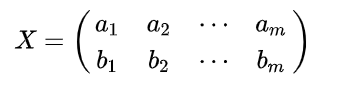
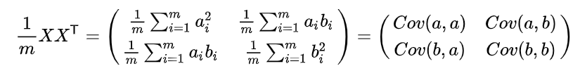
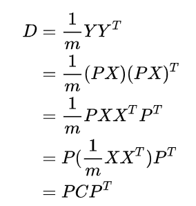
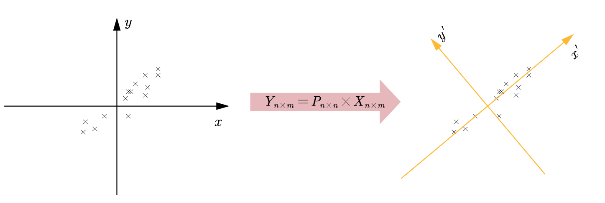
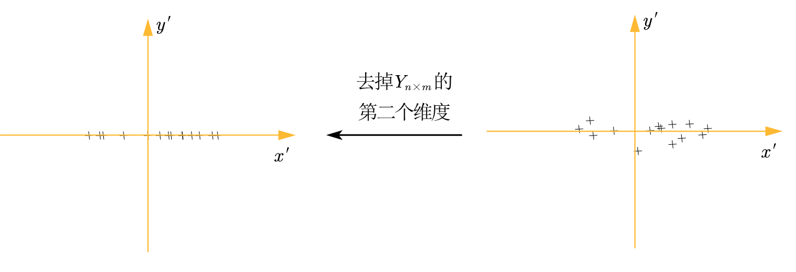
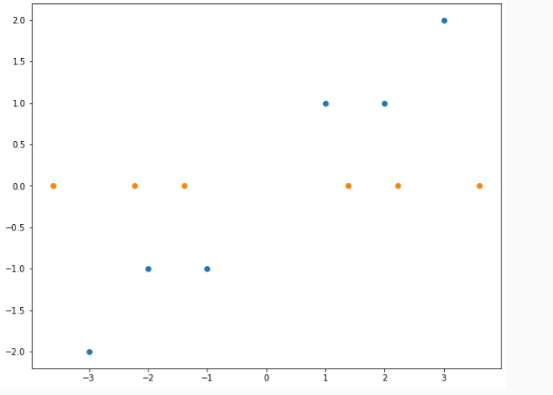

PCA降维
=========

> - [【机器学习】降维——PCA（非常详细） - 知乎 (zhihu.com)](https://zhuanlan.zhihu.com/p/77151308)
> - [主成分分析，协方差，SVD可视化解释（中英文字幕）_哔哩哔哩_bilibili](https://www.bilibili.com/video/BV1RL411572w/?spm_id_from=333.788)
> - [深入理解PCA与SVD的关系 - 知乎 (zhihu.com)](https://zhuanlan.zhihu.com/p/58064462)

要点
----

- 明确降维的目的是为了去除冗余、去除相关性
- 理解降维的目标及降维原理
- 明确Python中进行主成分分析的方法

为何降维？
----------

> 为了去除冗余信息，冗余信息就是数据之间的相关性！

数据之间具有相关性！为什么具有相关性就要降维？

- 当数据之间存在相关性时，例如二维平面下的四个点

$$
X_{2\times 4} = \left[ \begin{matrix}
	1&		2&		3&		4\\
	2&		4&		6&		8\\
\end{matrix} \right]
$$

- 如果说，这四个点对训练一个模型有用！那么我直接从第一个点乘以很多值就可以自动创建很多数据了！！！显然这样是不行的！

降维即乘以一个维度更小的矩阵$P$
--------

根据对矩阵乘法的理解，矩阵相乘相当于将一个$n$维向量映射到一个$m$维度的向量，当这个$m$小于$n$时，显然就达到了将降维的目的！

- 原始数据共有$m$个，维度为$n$，表示为$X_{n\times m}$的矩阵，一个变换矩阵为$P_{q\times n}$
- 则 $ Y_{q\times m}= P \times X $，显然当$q \lt m$时，维度降低了

如何找到那个$P$使得降维结果最优
-------------------------------

### 何为最优?

根据我们降维的目的可知，为了使得降维之后

- 不同维度的相关性最小
- 同一维度投影值尽可能分散！

### 如何度量最优？

通过协方差来度量两个变量之间的分散程度：
$$
Conv(X_{a, : }, X_{b, :}) = \frac{1}{m - 1}\sum_{i = 1}^{m}(X_{a, i} - \mu_a)(X_{b, i} - \mu_b)
$$

- 当协方差为0时，两个变量线性不相关，为了让协方差为0，我们在选择第二个基时只能在与第二个基正交的方向上进行选择

通过方差来衡量同一维度的分散性，当$a = b$时，二者的协方差即方差

### 目标总结

最终优化目标为，将一组$n$维的向量降维$k$维，其目标是选择$k$个单位正交基，使得原始数据变换到这个基上后，各个变量两两之间的协方差为0，而变量方差则尽可能大！

求解
----

### 协方差矩阵

> 将协方差和方差统一在一个矩阵里面

假设我们只有两个变量



然后计算协方差矩阵：



### 重视目标

- 对于$m$个$n$维的数据，将其排列为矩阵$X_{n\times m}$，设$C = \frac{1}{m - 1}X X^T$，显然$C$是一个对角阵，其对角线是对应变量的方差，非对角线是对应变量的协方差
- 显然，由于冗余信息的存在，这个$C$在非对角线上的值不为$0$
- 我们希望通过$Y_{p\times m} = PX$之后，$Y$对应的$C$在非对角线上的为0！

首先计算$Y$对应的$C$，记为$D$：



**从而目标转化为：**

- 找到一个$P$使得$C$经过$PCP^T$变换后得到一个对角阵！

### 对角化$C$的$P$

首先，在线性代数中，我们知道实对称矩阵$C$本身就可以进行特征值分解：
$$
C=E\Lambda E^T
$$

- 其中$E$是单位正交阵，$\Lambda$是对角阵

从而可得：
$$
\Lambda =E^{-1}C\left( E^{-1} \right) ^T=E^TCE
$$

- 第二个变换用到了单位正交阵与其转置互逆
  - $EE^T = I$

从而，我们就得到了一个矩阵$P_{n\times n} = E^T$，其能对$X_{n\times m}$进行变换：

- 如下，左边的点中显然两个变量间存在线性相关，经过$P$的变换之后得到右边的图



- 将右边的图掰正来看，得到下面的右图，然后去掉第二个维度得到下面的作图：



- 去掉第二个维度的操作可以直接乘以$P$的时候值选择第一个维度(去掉第二行及之后的)

PCA With numpy
--------------------

> - 还可以使用`numpy.linalg.eig`求得特征值和特征向量，然后做矩阵乘法

使用`Sklearn`库即可

> - [sklearn.decomposition.PCA — scikit-learn 1.1.1 documentation](https://scikit-learn.org/stable/modules/generated/sklearn.decomposition.PCA.html)

```python
import numpy as np
import matplotlib.pyplot as plt
from sklearn.decomposition import PCA

# 产生数据
X = np.array([[-1, -1], [-2, -1], [-3, -2], [1, 1], [2, 1], [3, 2]])

# 降维
pca_model = PCA(n_components=1)
Y = pca_model.fit_transform(X)

# 绘图
plt.figure(figsize=(10, 8))
plt.scatter(X[:, 0], X[:, 1])
plt.scatter(Y, np.zeros_like(Y))
```

降维结果：



PCA与SVD
--------

- SVD可以将一个矩阵分解为三个矩阵相乘$A = U\Sigma V^T$，然后取$\Sigma$的前$k$个奇异值，从而降低了最终数据的存储量
- PCA则是用于降低数据之间的冗余性

