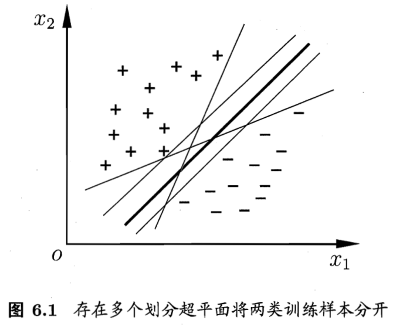
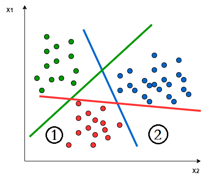

SVM实现二分类
=======

核心思想
--------

找到一个超平面将不同的类别划分开来

直观上，中间最初的超平面具有最大的裕度、泛化能力。关键在于如何找到这一个超平面(如何将其转换为一个最优化问题？)

建模 模型1
----------

### 建模过程

下面的方程即描述了一个$n$维超平面：
$$
w^Tx + b = 0
$$

> 疑问：如何确定是中间那个呢？

图中粗线的特点在于

- 能将两个类别分离开来
  - 如何描述？ -> 作为一个约束条件
- 左右移动的裕度最大
  - 找到一个特定的方向$(w)$，然后该方向对应的平面的裕度范围最大
  - 裕度范围如何表示？平行平面的裕度范围可以通过$b$和$w$来表示

> 想要最终用数学语言描述出来，必须非常明确心里的那种"直观描述"的核心"特点"，然后就是数学语言的描述了，最终用数学语言来解决

对于一个平面：
$$
w^Tx + b = 0
$$
存在两个类别$\{(x^{(0)}, y^{(0)}), (x^{(1)}, y^{(1)})\}$，该平面需要将这两类分开，故存在线性约束条件：
$$
\begin{cases}
	w^Tx^{\left( 0 \right)}+b_0\ge 0&	class_0\\
	w^Tx^{\left( 1 \right)}+b_1\le 0&		class_1\\
\end{cases}

\label{ref1}
$$
我们的目标就是让分离那两类的平面之间的距离最大，这两个平行平面之间的距离为：
$$
d = \frac{|b_0 - b_1|}{\Vert w \Vert }
$$
这里的控制变量是$w$和$b_0$和$b_1$。

下面是为了优化求解过程而做的考虑：

- 考虑到$w$的长度可变，但是对最优平面没有影响，故可以假设$\Vert w \Vert  = 1$
- $d$的公式中含有$|b_0 - b_1|$，这是一个非线性函数，是由两个平面上下不确定而造成的，为了去除掉绝对值，我们假设$b_0 \ge b_1$
  - 这对最终结果没有影响，例如$2x + 1 = 0$这条直线，和$-2x - 1 = 0$是相同的

### 修正

满足式$\ref{ref1}$的情况有两种

- 对于线(1)和线(3)，区别在于$w$的方向刚好相反，(2)和(3)也是，在搜索的时候，若刚好线(1)对应于$b_0$，则会搜索成左图的样子。

> TODO: 如何约束为右边的形式？

分析本质原因: 使用了两条线来划分，所以需要约束两个直线之间的距离，从而将两条直线的范围约束在右边的情况。
$$
\frac{|b_0 - b_1|}{\Vert w\Vert} \le D_{\min}
$$

### 形式化描述

$$
\max\textrm{ }d_0-d_1
\\
\begin{cases}
	w^Tx^{\left( 0 \right)}+b_0\ge 0\\
	w^Tx^{\left( 1 \right)}+b_1\le 0\\
	\lVert w \rVert =1\\
	b_0\ge b_1\\
	\frac{|b_0 - b_1|}{\Vert w\Vert} \le D_{\min}
\end{cases}
$$

建模 模型2
----------

### 建模过程

> 最初看到西瓜书上的一些公式很不理解，直到看到了《MATHEMATICS FOR MECHANE LEARNING》上的一种新的解释
>
> 要点在于理解为什么要限制住 $\Vert w \Vert = 1$

首先明确，我们需要一个平面，来将两个类别分割开来，这个平面满足如下要求：
$$
\begin{cases}
	w^Tx+b\ge r & y = 1\\
	w^Tx+b\le -r &  y= -1\\
\end{cases}
$$

> 为什么将最初的$0$替换为了$r$?
>
> - 如果直接写0则需要向之前一样来计算边界之间的距离，而这里，相当于通过增加一个变量来避免计算(这是最优化建模中常用的手段！)
>
> 为什么要将原本的$\{0, 1\}$替换为$\{1, -1\}$，
>
> - 可以不替换，这里这样替换只是一种技巧，便于后面将两个线性的式子统一到一个非线性的式子中去

现在两个平面之间的距离就是$2r$了！所以我们要最大化这个$r$
$$
\max_{w, b, r} \quad r
$$

> 思考：这里的$r$可能无限大吗！！！
>
> - 是可以的，本质上这里的$r$原本的含义是距离，但是这里其量纲并不是距离，而是和$w^Tx+b\ge r$同量纲的变量，这里就要参考[对超平面各个参数的思考](# 对超平面各个参数的思考)了。
> - 想象一线，我们将$\langle w, b\rangle$倍增为$\langle kw, kb\rangle$，原平面$kw^Tx + kb = 0$依然满足，故平面不变，但是$r$也必将可以增加为原本的$k$倍，所以$r$可以无限大
> - 本质原因：$r$表示的是与$w$的相对长度大小，故我们可以将$\Vert w \Vert$设置为$1$，来保证$r$的量纲就是该坐标系下的距离单位(长度为则$r = 1$)

限制法向量为单位向量:
$$
\Vert w \Vert = 1
$$

### 形式化描述

$$
\max_{w,b,r} \quad r
\\
s.t. \begin{cases}
	y\left( w^Tx+b \right) \ge 1\\
	\lVert w \rVert =1\\
\end{cases}
$$

建模 模型3(传统)
----------------

> 与模型2的部分
>
> - 模型2中，我们为了度量$r$，将$w$长度设置为1来固定$r$的量纲(从而可以直接根据其值大小来判断$r$即边界的大小)
> - 在这里，我们假设这个边界对应的方程为$w^Tx+b = 1$

接下来我们推导这两条边界之间的距离，假设平面2上存在一点$x_a$，其在平面1上的投影点为$x_a$，二者分别满足：
$$
\begin{cases}
w^Tx_a +b =1 \\
w^Tx_a' +b =0 
\end{cases}
$$
两式相减得到：
$$
w^T(x_a - x_a') = 1 \Rightarrow \Vert w \Vert r = 1 \Rightarrow r = \frac{1}{\Vert w\Vert}
$$
所以最终形式化描述为：

> 最终思考，限制住$w^Tx+b = 1$有什么意义？与之前限制$\Vert w\Vert = 1$有什么异曲同工之妙？
>
> - 我们知道$w^Tx+b = 0$在倍乘$k$之后依然是该平面，但是在非该平面上的$w^Tx_a + b = ky_a$，换句话说将不再是原本的那个$y_a$了，所以这里的本质还是在将这个$k$给确定下来
> - 而$\Vert w\Vert = 1$，也相当于是在限制这个$k$
> - 神奇的是，在看到12.2.3的时候，作者居然专门解释了这个问题！！！

最终转化为等价的最小化问题：

SVM实现多分类
=============

核心思想：将多分类问题划分为二分类问题

> 新的问题不会求解，将其套在已有的模型中进行逐个肢解，然后求解！

成对分类方法
------------

假设我们有$n$个类别的数据，每两个类别之间都需要使用一个二分类SVM进行划分，所以一共需要$C_n^2$个超平面

- 类别$i, j$之间训练一个超平面

对于新数据，采用投票策略来决定其类别

- 对于任意一个给定的点，这$n(n-1)/2$个平面都将对这个点进行划分(投票)
- 我们只需选出最被看好的那个类别即可(例如投票数量最多)

一类对余类
----------

> [REF](https://www.baeldung.com/cs/svm-multiclass-classification#:~:text=Multiclass%20Classification%20Using%20SVM&text=The%20idea%20is%20to%20map,into%20multiple%20binary%20classification%20problems.)

> - In the *One-to-Rest* approach, the classifier can use $m$ SVMs. Each SVM would predict membership in one of the $m$ classes.
> - 一对余的方式中，分类器使用$m$个SVM模型，每一个SVM模型预测这$m$个类别中的一个成员

- 对于这里的点$1$，红色分类器将其划分为红色、其他两条都将其换分为非蓝色、非绿色，所以可以确认其为红色
- 对于这里的点$2$，红色分类器将其划分为红色，蓝色分类器将其划分为蓝色，绿色分类器将其划分为非绿色，那选择谁呢？
  - 所以需要考虑

Sklearn With SVC
================

> - [1.4. Support Vector Machines — scikit-learn 1.1.2 documentation](https://scikit-learn.org/stable/modules/svm.html)

附: 对超平面各个参数的思考
==========================

> 在学习SVM的时候感觉自己没有很感性的认识到`超平面`这个东西，结合在学SVM时所研究的东西进行一个简单的整理

定义

- 超平面：线性空间中维度为$n-1$的子空间，他把这个线性空间分成了两个不相交的部分，例如二维空间中的一条线、三维空间中的一个面。
- 法向量：垂直于该平面的向量

> 为什么是$n-1$维度？(为什么$n-1$维能将线性空间划分？)
>
> - TODO: 从理论上我不知道

对于$2$维空间，我们需要一个法线，以及这个平面经过的点就能确定这个平面了，假设这个平面上所有的点为$x$，则必然满足：
$$
w^T(x - x_0) = 0 = w^Tx - w^Tx_0 = 0
$$

- 等式中的$w^Tx$即表示$x$投影到$w$的长度乘以$w$的长度，特别的，当$w$长度为1时，$w^Tx = d$，换句话说：$w^T x$的值的大小是以$\Vert w\Vert$为单位为长度的"平面到原点的距离"
- 所以，当我们要以$w^Tx$来表示距离时，一定要除以一个$\Vert w\Vert$(或者直接将其大小设置为1)

最终超平面的参数方程为：
$$
w^Tx + b = 0
$$

- 其中$w$表示该平面的发现
- $b$表示原点的平面的距离(以$\Vert w\Vert$为单位)

