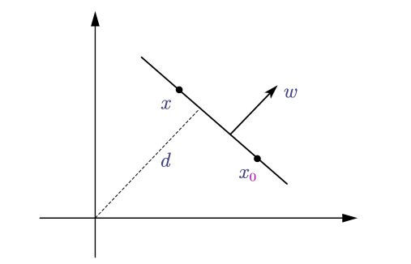

对超平面各个参数的思考
======================

> 在学习SVM的时候感觉自己没有很感性的认识到`超平面`这个东西，结合在学SVM时所研究的东西进行一个简单的整理

定义

- 超平面：线性空间中维度为$n-1$的子空间，他把这个线性空间分成了两个不相交的部分，例如二维空间中的一条线、三维空间中的一个面。
- 法向量：垂直于该平面的向量

> 为什么是$n-1$维度？(为什么$n-1$维能将线性空间划分？)
>
> - TODO: 从理论上我不知道

对于$2$维空间，我们需要一个法线，以及这个平面经过的点就能确定这个平面了，假设这个平面上所有的点为$x$，则必然满足：
$$
w^T(x - x_0) = 0 = w^Tx - w^Tx_0 = 0
$$

- 等式中的$w^Tx$即表示$x$投影到$w$的长度乘以$w$的长度，特别的，当$w$长度为1时，$w^Tx = d$，换句话说：$w^T x$的值的大小是以$\Vert w\Vert$为单位为长度的"平面到原点的距离"
- 所以，当我们要以$w^Tx$来表示距离时，一定要除以一个$\Vert w\Vert$(或者直接将其大小设置为1)

最终超平面的参数方程为：
$$
w^Tx + b = 0
$$

- 其中$w$表示该平面的发现
- $b$表示原点的平面的距离(以$\Vert w\Vert$为单位)

