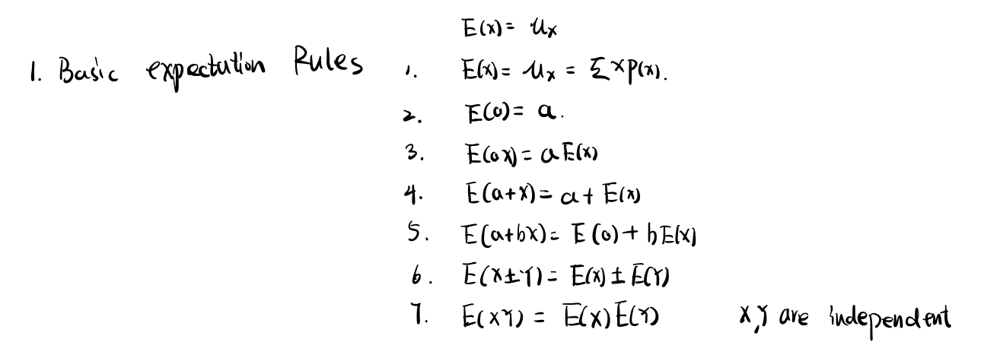
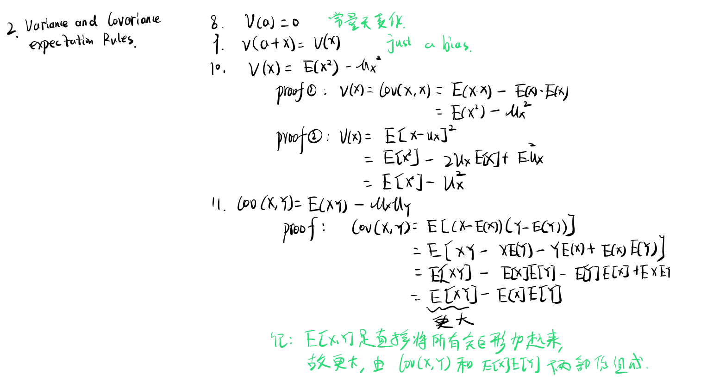
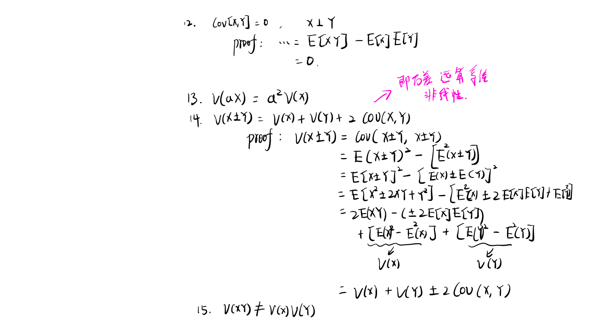
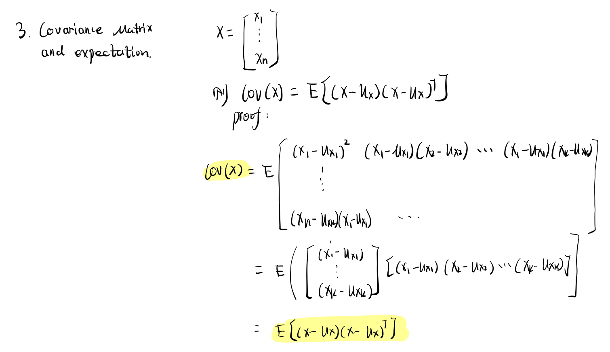

> 在学习KalmanFilter的时候，需要用到期望代数相关的推导公式，故这里单独对期望、方差在随机变量为多维的情况下做整理

期望
====

方差和协方差
============

基本性质
--------

协方差内不含有平方项，具有非线性的特点，故不会像期望那样具有线性的特性。

协方差矩阵
----------

N维随机变量的协方差与期望的关系：
$$
Cov(X) = \bold{E}[ (X - \mu_X)(x - \mu_X)^T ]
$$

对随机变量做线性变换后，其协方差矩阵满足：
$$
Cov(AX) = ACov(X)A^T
$$

- 带入上面的公式即可证明

