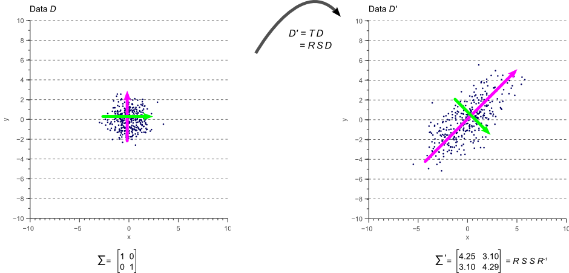

参考
====

> - [geometric-interpretation-covariance-matrix](https://www.visiondummy.com/2014/04/geometric-interpretation-covariance-matrix/)

geometric-interpretation-covariance-matrix
==========================================

要点
----

- 掌握协方差矩阵对角线、非对角线的值的含义(大小、正负)
- 理解协方差其拉伸最大$N$个方向，分别对应于特征值从小到大排列所对应的特征向量(归一化正交的特征向量)
- 理解协方差矩阵与线性变换的关系、白数据到普通数据的变换过程、变换矩阵
- 主成分分析(PCA)

协方差矩阵
----------

variation 可以用来解释一个数据沿着某个轴的延伸程度，但是无法描述对角线的相关性，而这可以用协方差来描述，对于一个$N$维向量，将这二者总结在一个矩阵里面，即构成了协方差矩阵：
$$
\begin{equation*} \Sigma = \begin{bmatrix} \sigma(x,x) & \sigma(x,y) \\[0.3em] \sigma(y,x) & \sigma(y,y) \\[0.3em] \end{bmatrix} \end{equation*}
$$
如果$x$正相关于$y$，反之也成立，故有：$\sigma(x,y) = \sigma(y,x)$，所以协方差矩阵一般是 symmetric matrix，方差在其对角线，而协方差在非对角线。

数值大小及其意义：

- 对角线的数值越大，则代表沿着对应轴的分散程度越大
- 非对角线的值的成对大小($(x, y)$和$(y, x)$构成一对儿)反映了对应两个轴上，数据的相关性

协方差矩阵的特征值分解
----------------------

> 明确了协方差矩阵的特征值分解中特征值、特征向量的物理意义。

如果我们想找到一个向量来表示协方差矩阵，那么我们可以先寻找一个向量，它指向数据延伸最大的方向，而其对应的的幅度则等于沿着这个方向延伸的方差。(TODO: 这很直观吗？)

假设这个向量是$\vec{v}\in \mathbb{R}^{N\times 1}$，原数据点是$D \in \mathbb{R}^{N\times K}$，则将数据点投影到该轴上后即$D' = \vec{v}^T D$(K个标量)，其方差为$\vec{v}^T \Sigma \vec{v}$，显然这样的$v$有无数个(平行)，所以我们给定$\vec v$是一个归一化的向量。由于这个方向是源数据投影过去方差最大的方向，故需要在$\vec v$为单位向量的前提下，最大化$f(\vec v) = \vec{v}^T \Sigma \vec{v}$即可。

下面寻找$\vec{v}^T \Sigma \vec{v}$的最大值，在$\vec v$ 没有任何约束的情况下，该二次型为正定二次型，故具有最小值，最大值可以无限大，但是在这里，将其限制为了$\vec v$在单位圆上，故其一定有最大值，且可以证明其最大值即最大特征值、对应的取值即对应特征向量。

总结一下：**协方差的最大特征值对应的向量，对应原数据最大方差的投影方向，这个向量的幅度，对应于其投影方差**，而第二大的则对应于第二大方差的伸展方向。

当协方差矩阵为对角阵时的例子如下，那如果不是对角阵呢？则可以旋转数据，或者说数据是被旋转过来的。

协方差矩阵做线性变换
--------------------

对于原本的白数据(协方差矩阵为单位阵)，将其先做拉伸，再做旋转，即得到了右边的数据。

下面说明旋转和拉伸矩阵如何求解：对于右边的数据$D'$，我们记其协方差矩阵为$\Sigma' = Cov(D')$。首先，对$D$做$S$的拉伸，得到$D_1$，此时$Cov(D_1) = SS^T = S^2$，然后再对$D_1$做旋转得到$D' = RD_1$，此时$Cov(D') = RS(SR)^T=\Sigma'$，而$\Sigma' = P\Lambda P^T = P\sqrt{\Lambda}\sqrt{\Lambda} P^T = P\sqrt{\Lambda}(P\sqrt{\Lambda})^T $，即有$R = P$，$S = \sqrt{\Lambda}$ 

- 即：对于给定数据$X_{n\times k}$，求得其协方差矩阵为$\Sigma = Cov(X) \in \mathbb{R}^{n\times n}$，然后将其分解得到$\Sigma= P\Lambda P^T$(其中$P$是单位正交基)。则可知$X = (P\sqrt{\Lambda})X_{white}$

协方差矩阵做PCA
---------------

设从白数据经过拉伸轴的中间数据为$X_1$，则$X_1=P^{-1}X$(旋转回去)，旋转回去后的数据$X_1$，在各个方向具有最大的方差，且方差的值等于对应的特征值，将选出最大特征值对应的特征向量进行投影，即得到了主成分。详细证明如下。

给定数据$X \in \mathbb{R}^{n\times m}$，其中$n$表示维数，$m$表述数据量，记$\Sigma = Cov(X)$，我们希望找到一个变换$T$，使得$Y = TX$后，$Y$在各轴上具有最大的方差(分散程度，即两个数据间不构成相关关关系)，即$\Sigma' = Cov(Y)= T\Sigma T^T$的非主对角线为0，主对角线上元素具有最大值。显然我们只需要找到$N$个方向，沿着这$N$个方向时数据具有最大的拉伸。这$N$个方向也就对应于$\Sigma$的特征向量，拉伸程度即对应于对应的$\sqrt{\lambda_i}$。

总结：
$$
Y = P^{-1}X
$$

理解协方差为什么能表示两个随机变量的相关性
==========================================

> 参考: [(40条消息) 协方差为什么能表示两个随机变量的相关性？_HuntingGo的博客-CSDN博客](https://blog.csdn.net/huntinggo/article/details/47430777)

对于两个随机变量$X$和$Y$，如何理解其协方差能表示相互之间的相关性？在这之前首先得先将两个随机变量之间的相关性用数学语言描述出来：相关性的对立面即独立，也就是两个变量之间完全没有影响，所以如果两个变量之间存在相关性，则当某一个变量增大时，必然导致另一个变量朝着某一种趋势变化(增大、减小)。

对于采样的$n$个点，我们构造差向量来描述这$n$个点相对该变量的期望的变化量：
$$
\Delta X = (x_1-\bar{X}, x_2-\bar{X}, \cdots, x_n-\bar{X})
\\
\Delta Y = (y_1-\bar{Y}, y_2-\bar{Y}, \cdots, y_n-\bar{Y})
$$
 如果二者存在相关性，那么$\Delta X$和$\Delta Y$的朝向应该很接近，例如如果$X$减小时$Y$也会减小，那么对应的$(x_1 - \bar{X})$和$(y_1 - \bar{Y})$应该都是负数，而且由于他们量纲不同，所以可以直接用角度来度量二者的相似性，$\theta$越小则二者之间的相关性越大，则直接计算$\cos(\theta)$，从而值越大表示角度越小即相关性越强：
$$
cos(\theta) = \frac{\Delta X \Delta Y}{\Vert \Delta X \Vert \Vert \Delta Y \Vert} = \frac{\sum_{i=1}^n(x - \bar{X})(y - \bar{Y})}{\sqrt{\sum_{i=1}^n(x_i - \bar X)^2} \sqrt{\sum_{i=1}^n(y_i - \bar Y)^2}}
$$

- 也即$\cos(\theta) = \rho_{X,Y}$
- 从这里也可以看出，除以方差的目的是消除两个变量的量纲对结果的影响

