总体
====

第一章 概率论的基本概念
========================

随机实验、随机事件及样本空间
----------------------------

- 随机现象：一定条件下，可能发生也可能不发生，即条件不能完全确定结果
- 为什么要用概率论，存在一些现象，其条件和结果之间具有偶然性，数量关系无法用函数来描述，但是在大量的试验观察中有存在一定的统计规律性，而概率论就是来研究这种规律现象的。

基本概念

- 样本空间、样本点
- 随机事件：样本空间的子集
- 不可能事件：不在样本空间中

事件的关系和运算

- 事件之间的关系同集合之间的关系
  - 包含、相等、并、差、交
- 互不相容、对立事件
- 完备事件组：不重、不漏
- 运算性质

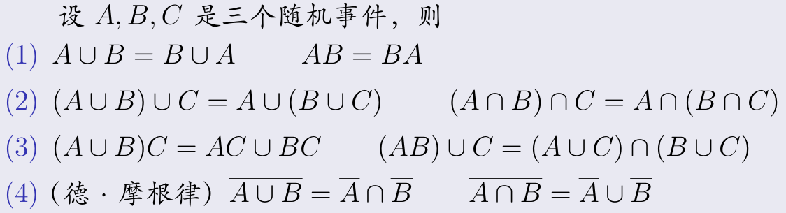

频率与概率
----------

- 频率时实验观察的结果，概率是随着实验次数增大时频率逐渐趋近的那个值

古典概型和几何概型
------------------

- 古典概型，样本空间有限且每个样本点等概
- 集合概型，样本空间的测量可以转换为面积、体积等可测量量

排列组合

- 加法原理，完成同一件事情的不同种类方法的方法数可相加
- 乘法原理，完成同一件事情的多个步骤具有不同的方法，相乘
- 排列，有序，$n$中选出$m$个，$A_n^m = \frac{n!}{(n - m)!}$
  - 理解1：$n\times (n-1)\times\cdots\times (n - m + 1)$
  - 理解2：先取出$n!$种，对于最终选出$m$个元素中，有$(n-m)!$个会重复，所以除以！
- 组合，无序，$n$中选出无序的$m$个，$C_{n}^m= \frac{n!}{(n - m)!m!}$
  - 理解1：排列数中选出了长度为$m$的中，将会有$m!$重复，所以多除以$m!$

条件概率
--------

- 条件概率，$P(B|A)  =\frac{P(AB)}{P(A)}$
  - 在$A$的事件域下，$B$的部分即$AB$所占的比例即条件概率
  - 显然当二者互斥时条件概率为0、二者相同时条件概率为1
- 概率乘法公式，$P(ABC) = P(A)P(BC|A)P(C|AB) $
  - 理解1：首先$P(A)P(BC|A)$可以理解为在$A$中去寻找$BC$那一块，然后递归……
- 全概率公式，$P(A) = \sum_{i = 1}^n P(B_i)P(A|B_i)$
  - 其中$B_1\cdots, B_n$是样本空间的一个划分
  - 理解：在所有$B$的各个部分中去寻找$A$，然后加起来
- 贝叶斯公式，在$A$发生的情况下，来自于$B_j$的概率
  - 理解1：无非就是所有$A$的部分加起来 分之 来自$B_j$的$A$的部分
  - $P(B_j|A) = \frac{P(A|B_j)P(B_j)}{P(A)}$
  - 理解2：$P(B_j)$描述了各个部分发生的可能性，属于先前就知道的(先验知识)，然后$P(B_j|A)$描述了在$A$发生之后$B_j$发生的可能性，属于知道了一些经验之后对世界观的重新认识，贝叶斯公式就是描述了这整个过程

事件的独立性
------------

- 两个事件独立，则知道了一个事件的情况(经验)之后，也无法得到另一个事件的信息
  - $P(AB) = P(A)P(B)$
  - $P(B|A) = P(B)$
  - $P(A)P(B|A) = P(AB) = P(A)P(B)$
- 区别于互斥
  - 互斥描述的是同一个事件域下么没有交集
  - 而独立指的是两个事件分别所在的样本空间没有交集

第二章 随机变量及其分布
=======================

前言
----

todo

一维随机变量及其分布
--------------------

- 随机变量即样本点$w$ 有且仅有一个 对应的$X(w)$
- 分布函数，$F(x) = P(X \le x), x\in R$
  - 理解：$F(x_0)$表示小于$x_0$都发生概率

离散型随机变量
--------------

- 概率能量高度集中在某一些点

常见离散分布

- 两点分布
- 等可能分布
- $n$重伯努利实验，做$n$次两点分布的实验，最终构成的分布
- 二项分布$x\sim B(n, p)$
  - 发生了$k$次的概率等于$C_{n}^{k}p^k\times (1 - p)^{n - k}$
    - 理解：某一个特定的发生$k$次的概率为xxx，共有xxx个
- 泊松分布，在一定时间内，出现$k$次的概率分布
  - 应用：排队论中，一定时间内，新来$k$个人加入排第的概率
  - $X\sim P(\lambda)$
- 帕斯卡分布，负二项分布
  - 想要出现$r$次，做$n$次实验的概率，即想要结果，问这个结果可能来自多少
  - $x\sim NB(r, p)$
- 几何分布
  - 要做$n$次事件才会出现第一次，$X\sim Ge(p)$
  - $P\{x = k\} = p\times(1 - p)^{k-1}$

连续型随机变量
--------------

- 密度函数描述了其在某一点周围出现的能量
  - 而离散随机变量在某一点的能量是$\delta(x - x_0) \times P\{x = x_0\}$
  - $X\sim F(x)$
  - $X\sim f(x)$
  - $F(x)  = \int_{-\infty}^x f(t)dt$

常见连续随机变量分布

- 均匀分布
  - $X\sim U(a, b)$

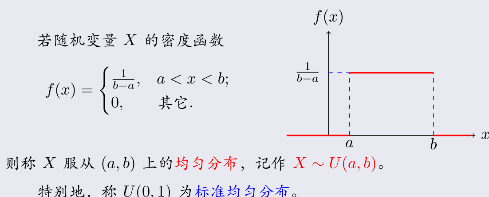

- 指数分布
  - $X\sim E(\lambda)$
  - 无记忆性:前面观测到的事件，丝毫不影响未来的事件

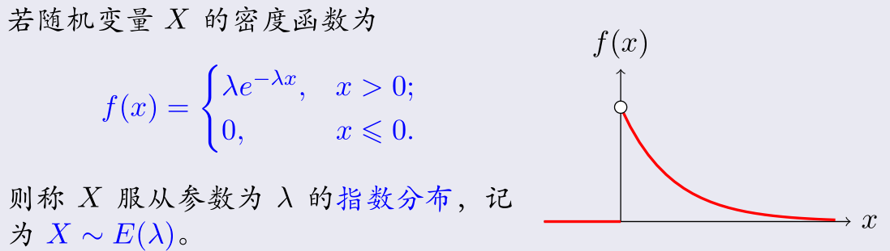

- 正态分布

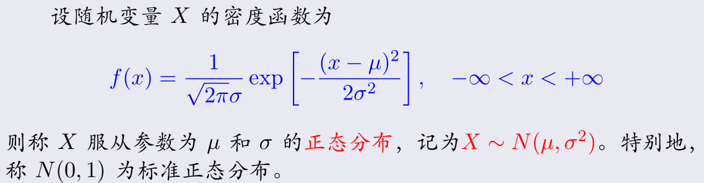

随机变量函数的分布
------------------

- 离散随机变量
  - 映射过去，然后合并相同项
- 连续型
  - $F(Y) = P\{y \le Y\} = P\{f(x) \le Y\}$，带入后根据$y$的范围来讨论即可

第三章 多维随机变量及其分布
===========================

> - 重点在于感性认识各个基本概念，从而能快速反应出不同基本概念之间的关系

3.1 二维随机变量
----------------

变量来源：随机试验$E$的样本空间为$\Omega$，其中一变量为$X = X(\omega)$，另一变量为$Y = Y(\omega)$，二者组成二维随机变量$(X, Y)$

- 注：分别来自同一样本空间
- 显然，当增加变量后可以推广至多个

二维分布函数

- $F(x, y) = P\{ X\le x, Y \le y \}$

边缘分布函数：某一个随机变量的分布函数

- $F_{x_i}(x_1, x_2, \cdots, x_n) = F(+\infty, \cdots, x_i, \cdots, +\infty)$
- 其描述了在无其他变量影响的情况下，某一个变量的分布

二维离散随机变量，用分布律来表示

二维连续性随机变量

- $f(x, y)$为$(X, Y)$的联合密度函数
  - 其实定义在二维平面上的曲面，某一点描述了改点附件的能量密度

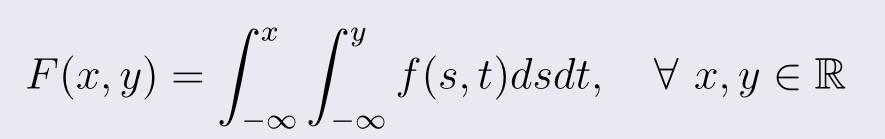

- 边缘密度，给定轴，将该轴上其他密度都搜集起来！

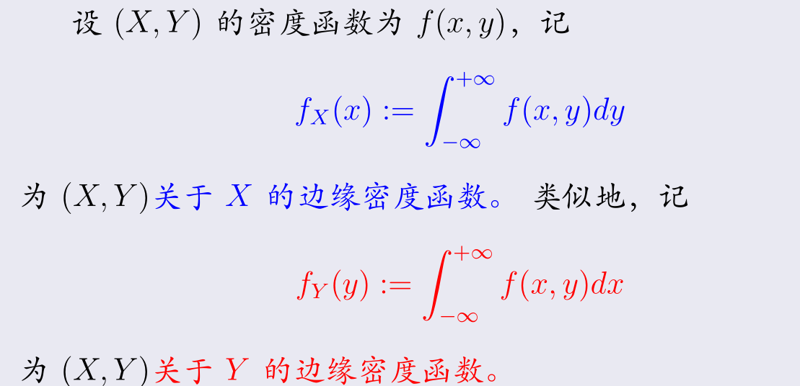

一个求概率的理解角度

- $P\{X \le Y\}$，首先明确$\{X\le Y\}$在二维平面上的含义，是一段区域，那么这件事情的概率就等于在这个区域上的能量总和：
  $$
  \iint_{X\le Y}f(x, y)dxdy
  $$
  

感性认识连续性随机变量的三种函数 by 二维曲面积分

- 联合分布函数，描述了在点$(x, y)$左下角的曲面积分 -> 体积
- 边缘分布函数，$F_y(y)$描述了在点$(+\infty, y)$的曲面积分 -> 体积
- 边缘密度函数，$f_y(y)$，描述了在$y$轴确定的情况下，整个$x$方向的所有积分 -> 面积

两个常用二维连续性分布

- 均匀分布，即能量平均分布在一个给定区域
  - 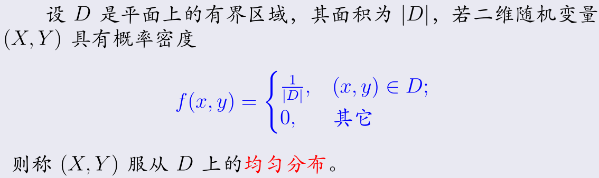
- 二维正态分布
  - 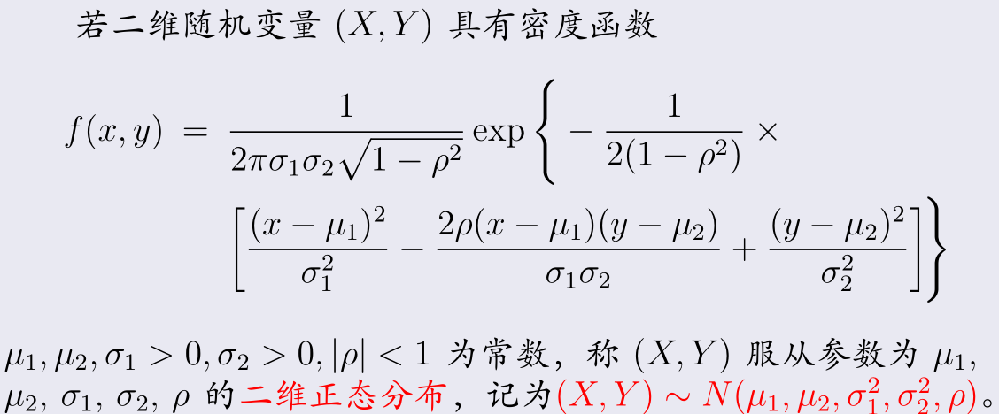

3.2 条件分布
------------

- todo

3.3 相互独立的随机变量
----------------------

相互独立

- 则显然，联合分布等于边缘分布的乘积：$F(x, y) = F_X(x)F_Y(y)$

3.4 两个随机变量函数的分布
--------------------------

### 离散

对于离散型的多维度随机变量

- 首先明确整个每一个变量进行笛卡尔积构成整个样本空间，样本空间中每一个点的能量(即概率)可以通过原本的分布计算！
- 然后通过$Y = F(X)$获得目标随机变量值

求解离散型的两种方法

- 正向：列出整个坐标空间，然后求解对应函数值，最后相同值进行合并
- 反向：假设目标为$k$，然后将所有能组成$k$的情况加起来

二项分布具有可加性

- 二项分布要求各个实验都独立，不论是$X$还是$Y$都是分别由多个独立的两点分布相加，故这两个独立的试验具有相加！

$$
X+ Y \sim B(n_1 + n_2, p)
$$

泊松分布的可加性

- 显然，当多个排队的随机变量相加时，其拥塞程度必然增加，而拥塞程度是由$\lambda$决定的，故最终的拥塞程度可能是所有$\lambda$求和，诶，搞好，就是他！

正态分布的可加性

- 显然，多个独立的正态分布相加时，均值和方差具有可加性

### 连续

$Z = X + Y$的密度函数

- todo

极大(小)值的分布

- 并联$M = \max\{ X, Y \}$

  - 首先明确分布函数感性上说是小于那个变量的所有概率，那么对于某个$M$，小于其的所有概率就是$X$和$Y$均小于$Z$

  - $$
    F(m) = P\{ X \le m, Y\le z \} = \prod_{i = 1}^n F_{X_i}(z)
    $$

- 串联$N = \min\{ X, Y \}$

  - $$
    F(n) = P\{N\le n\} = 1 - P\{ N > n \} = 1 - P\{X> n, Y>n\} = 1 - \prod_{i = 1}^n [1 - F_{X_i}(z)]
    $$

3.5 $n(\ge 2)$ 维随机变量的概念
-------------------------------

就是将前面的概率进行扩展到高维，之前已经总结了！

- 变量
- 分布函数
- 边缘分布函数
- 相互独立
- 二项分布的可加性
- 泊松分布的可加性

第四章 随机变量的数字特征
=========================

4.1 数学期望
------------

### 定义

数学期望、均值
$$
E(X) = \sum_{k =1}^{+\infty} x_k p_k = \int_{-\infty}^{+\infty}xf(x)dx
$$

### 常见离散分布的期望

#### 两点分布

- $E(X) = p$，即两点分布的期望就是其成功的概率，so 其期望反映了做一次成功的"次数"，显然成功概率越大，则这个"次数"越大

#### 二项分布

- 同样，相对于两点分布，那么做n次，成功的概率依然是 n*p! -> 两点分布就是 1 * p

#### 泊松分布

- $X  \sim \pi(\lambda)$
- $E(X) = \lambda$
- $\lambda$的物理意义即平均到达的人数，反映了排队队长的拥塞程度，其越大，代表队伍越拥塞

### 常见连续分布的期望

均匀分布

- 由于从$a$到$b$均匀分布的每一个小块都是等可能的，相当于质量均匀分布，故中点、重心、期望就是$\frac{a + b}{2}$

### 随机变量函数的期望

#### 离散型

- 离散型随机变量的函数也是离散型随机变量，只需要求出每一个函数值对应的概率，然后合并为最终的分布，而后计算期望即可

#### 连续型

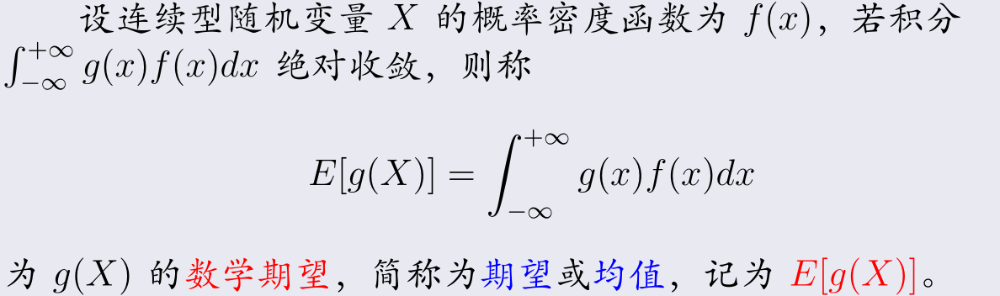

- **对公式的理解:** 随机变量$Y=g(X)$，其对应的概率密度函数为$g(x)$，则$Y$在$x$点附近的值为$g(x)$概率大小为$f(x)dx$，则对应的期望公式为 $\int_{-\infty}^{+\infty} g(x)f(x) dx$
- 所以，对原本$X$期望的公式中的$x$也可以理解为$X$的函数，即$Y = X$这个函数

### 二维随机变量的数学期望

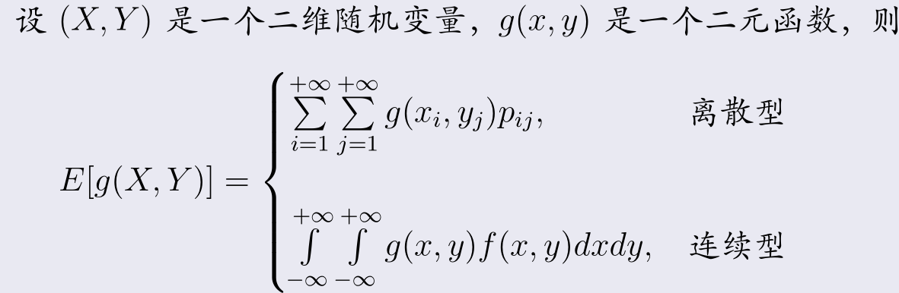

### 数学期望的性质

#### 线性

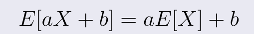

- 对随机变量(整体数据)做拉伸、偏移，这都将会导致对应的质心发生同样的拉伸和偏移

#### 可加性

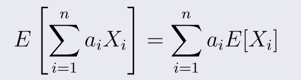

- 不同随机变量之间相加，必然导致重新的同样相加

#### 乘法法则

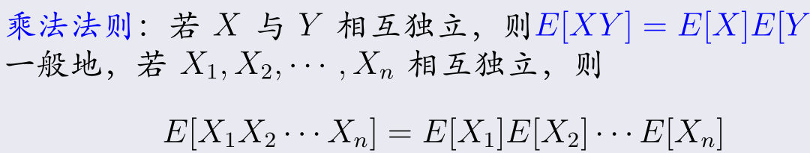

4.2 方差
--------

### 如何理解 Bias 和 Variance

- Bias反映的是样本心偏离的程度
- Variance反映的是样本分散的程度

在机器学习中

- Bias过大，说明模型的选择就错了，应该选择复杂度大一些的
- Vairance过大，则说明模型欠拟合

#### 方差的定义

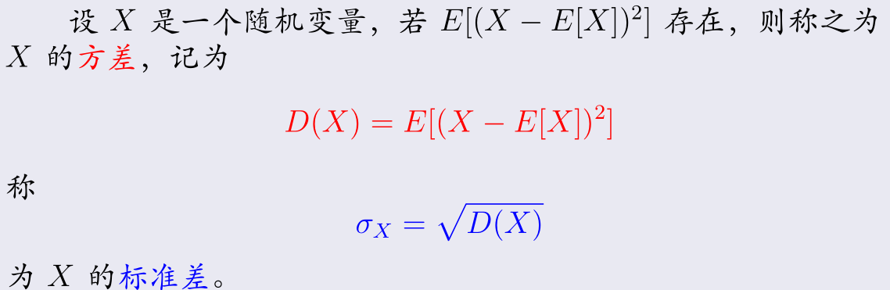

如何理解方差的物理意义

- 方差是偏差大小的均值，故其反映了数据点的分散程度

### 方差的计算

本质上对应于随机变量函数期望的计算

#### 离散型

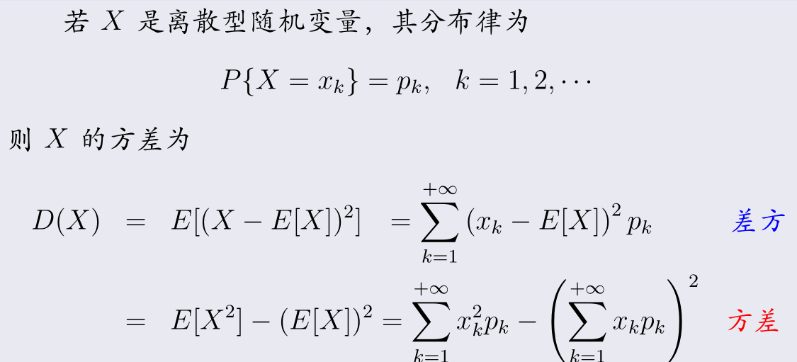

#### 连续性随机变量

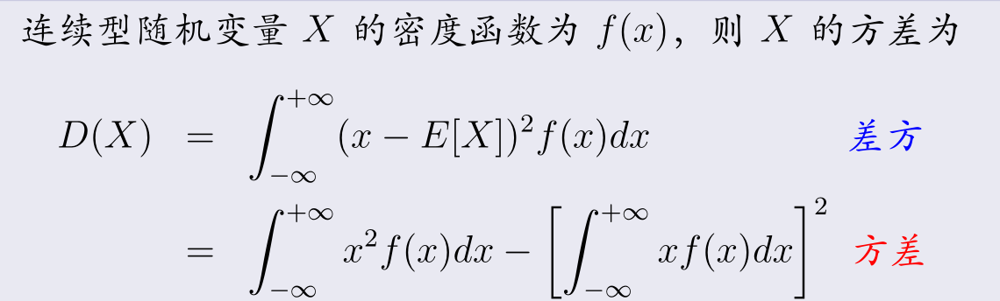

### 方差的性质

#### 方差与差方

$$
E[(X -  E(X))^2] = E(X^2) - (E[X])^2
$$

- 平方的均值要比均值的平方大一些，而大的原因就是这个数据存在方差、不够几种
- 如果足够集中，对于那些小于$E(X)$的数据将会不会那么小

#### 数值性质

- 常数不具有分散程度，故$D(C) = 0$

- 方差是非线性运算，准确的来说其量纲是平方，故对$X$做$k$倍运算后，其对应的方差需要扩展为$k^2$倍

  - $$
    D(kX)=  k^2D(X)
    $$

  - 如果$|k|>1$，则会导致方差变大，即分散程度变大，因为整体数据都原理了质心

  - 如果$k = -1$，相当于将数据进行了方向，但是整体分散程度没有变，故$D(-X) = D(X)$

- 标准化变量

  - 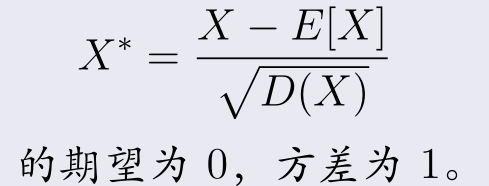
  - 这样的一个压缩变换会将原本的X变为期望为0，方差为1的变量

- 相互独立的两个变量相加: $D(X \pm Y) = D(X) + D(Y)$

  - 理解: 反映的是偏差平方的期望，残差为$\delta_X$，则$X = u_X + \delta_X$，而$D(X) = E(\delta_X^2)$，对于$Y$，$D(Y) = E(\delta_Y^2)$，而$X + Y = u_X + u_Y + \delta_X + \delta_Y$，则$D(X + Y) = E[(\delta_X + \delta_Y)^2]$ ，由于二者相互独立，故有$E(\delta_X\delta_Y) = 0$，故$D(X + Y) = D(X) + E(Y)$

- 推展: 任意独立的随机变量$X_i$，有
  $$
  D(\sum_{i = 1}^n a_i X_i) = \sum_{i = 1}^n a_i^2
  $$

### 定理

#### 切比雪夫不等式

切比雪夫不定式，反映的是一段随机变量区域的界限，反映了**财富集中效应:**
$$
P\{|X - u_X| \ge \varepsilon\} \le \frac{\sigma^2}{\varepsilon^2}
$$

- 城市聚集效应: 距离均值比较近的地方，其概率一定有一个下限，这就相当于如果你距离群众的质心($\mu_X$)很近，那么你周围的人一定会很多。综合起来描述就是，重心$\mu_X$方圆$\xi$范围内的数据，其总的占比一定不会少，也就是一定有一个下限，下限就是$1 - \frac{\sigma^2}{\varepsilon^2}$(无量纲)
- **外围财富再多也不会很多: **反过来可以理解为**财富集中效应**，对于在富人区以外的贫困区域，其财富一定不会很多，也就是有一个上限，这个上限就是$\frac{\sigma^2}{\varepsilon^2} $，也可以从参量上去直观理解，如果财富越不集中，即$\delta$越大，则边缘的财富就会越多

附: 常见随机变量的期望与方差
----------------------------

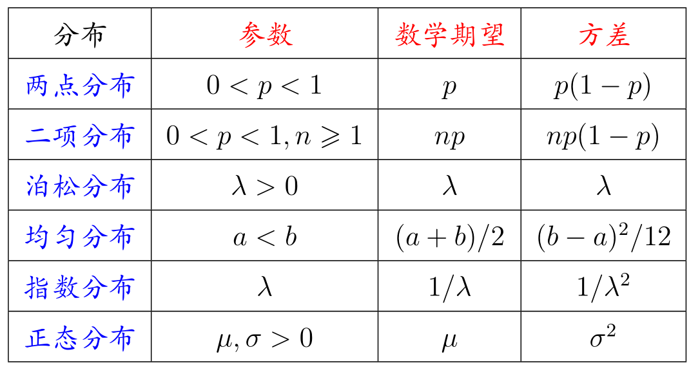

4.3 协方差与相关系数
--------------------

### 协方差

#### For 表示二维随机变量偏离中心的程度

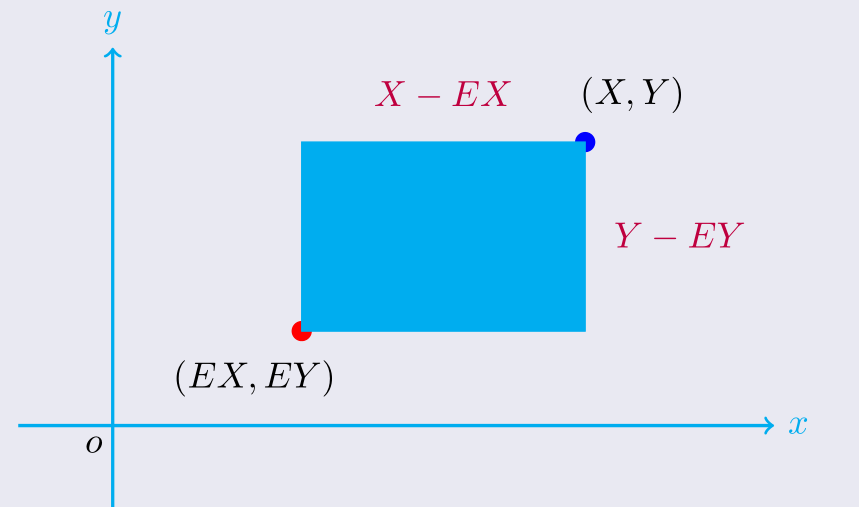

对于二维随机变量$(X, Y)$，其中心为$(E(X), E(Y))$，然后利用随机变量与中心的(有方向的)面积来表示偏差$\delta(X, Y) = (X - E(X))(Y - E(Y))$​，然后求其期望.
$$
Cov(X, Y) = E[(X - E(X))(Y - E(Y))]
$$

#### 重要公式

**(1)** 方差是协方差的一种
$$
Cov(X, X) = D(X)
$$
**(2)** 两个随机变量和的方差与这两个变量的协方差有关!
$$
D(X\pm Y) = D(X) \pm 2 Cov(X, Y) + D(Y)
$$

- 直观上: 如果$X$和$Y$正相关，则$X$和$Y$之间会携起手来，当$X+Y$时，则会导致整体偏差变大
- 在数值上: $X$的不稳定性，会导致$Y$也变得不稳定，从而导致整体的不稳定性增加
- 相反，如果$X$和$Y$负相关，则$X$和$Y$之间相互抑制，有种负反馈的感觉(通信电路中振荡器的稳定性)，当$X$不小心被扰动而增加时，$Y$就会下降，从而导致整体几乎不变

记忆: 要从其推导上来理解
$$
\begin{align*}
D(X+Y) & = E[(\delta_X + \delta_Y)^2]
\\
& = E[ \delta_X^2 + 2\delta_X\delta_Y + \delta_Y^2 ]
\\
& = E[\delta_X^2] + 2E[\delta_X\delta_Y] + E[\delta_Y^2]
\\
& = D(X) + 2Cov(X, Y) + D(Y)
\end{align*}
$$

- 可见，这里的$2$是由于开平方后存在两个交叉项而得来的

**(3)** 协方差与期望
$$
Cov(X, Y) = E(XY) - E(X)E(Y)
$$

- 特别的，对于单个变量 $D(X) = E(X^2) - (E(X))^2$
- 这个推导也比较简单，主要是明确: 乘积的期望是最大的！

#### 协方差性质

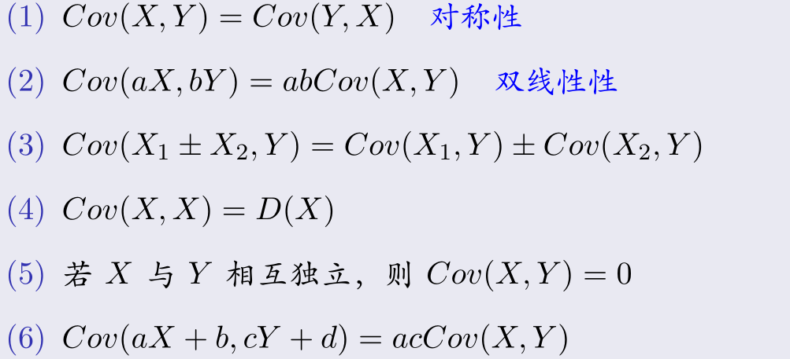

- 式$(2)$描述的是对称双线性，本质上是协方差是其中两个式子的乘积，再结合式$(3)$就可以总结出: 计算函数协方差的要点：直接对应相乘相加，然后同一变量变为方差，不同变量变为协方差

  - $$
    \begin{align}
    &Cov(aX+bY, cX+dY) 
    \\
    &= acCov(X, X) +  adCov(X, Y) + bcCov(Y, X) + bdCov(Y, Y)
    
    \end{align}
    $$

    

- 式$(3)$的原理是$(X_1 + X_2)$被拆开后就分成了两个部分了

- 式$(5)$描述的是整个统计空间，如果两个变脸没有相关性，则他们构成的矢量面积矩形求和之后刚好在正中心

- 式$(6)$描述了如果对某些变量做偏移，这不会影响到其中的相关性

### 相关系数

#### 定义

协方差描述了两个变量的相关性，但是其有量纲，所以无法通过其具体值大小来判断相关性大小，那我们就将变量进行归一化后再求协方差:
$$
\rho_{XY} = Cov(\frac{X - E(X)}{\sigma_X}, \frac{Y - E(Y)}{\sigma_Y})  = \frac{Cov(X, Y)}{\sigma_X\sigma_Y}
$$

- 显然量纲为1

#### 性质

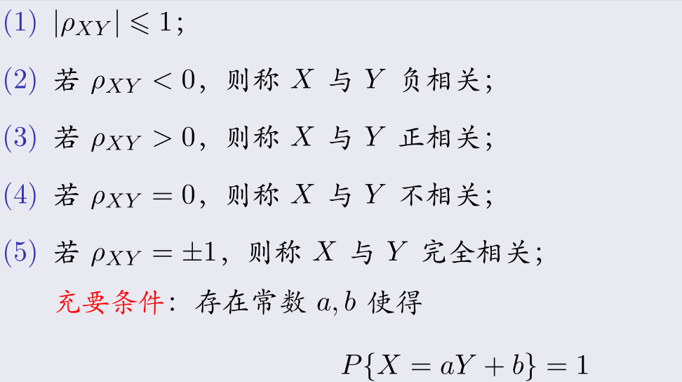

- **二者相关:** 指的是某一个变量能由另一个变量的线性函数表示出来
  - 注意不是要求$Y = X + B$，不要求其中的$a=1$
  - 本质上: 再除以$\sigma$后，都将归一化

#### 独立和相关

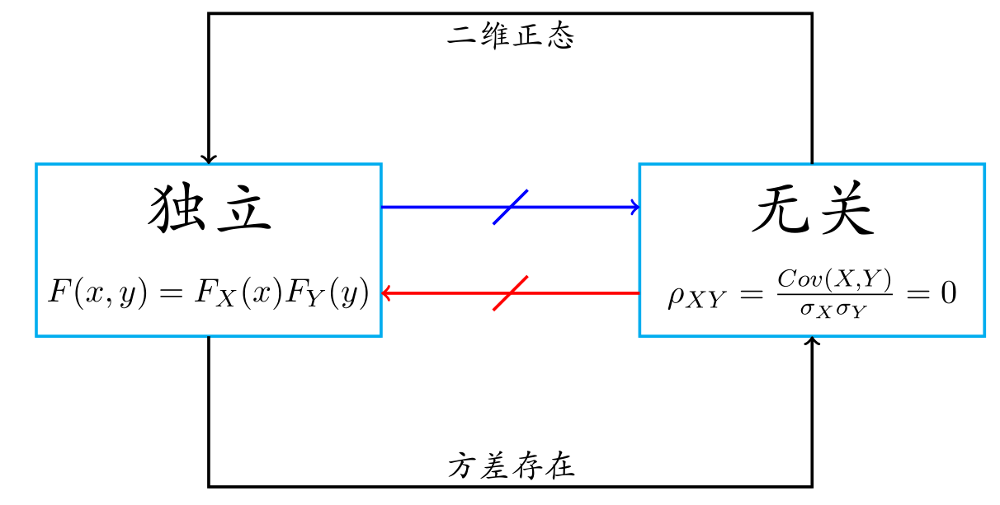

- 首先明确: 二者之间没有直接的联系，只有在两种特殊的情况下能对应
- 两个变量独立，则如果方程存在，则无关
  - TODO: 那方差不存在呢？
- 无关几乎不能说明独立，但是如果是二维正态这个特殊的分布，则可以，即如果二维正态的两个变量之间无关，则这两个变量之间独立

4.4 矩与协方差矩阵
------------------

### 矩

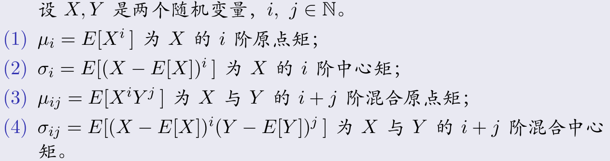

- TODO

### 偏度和分度

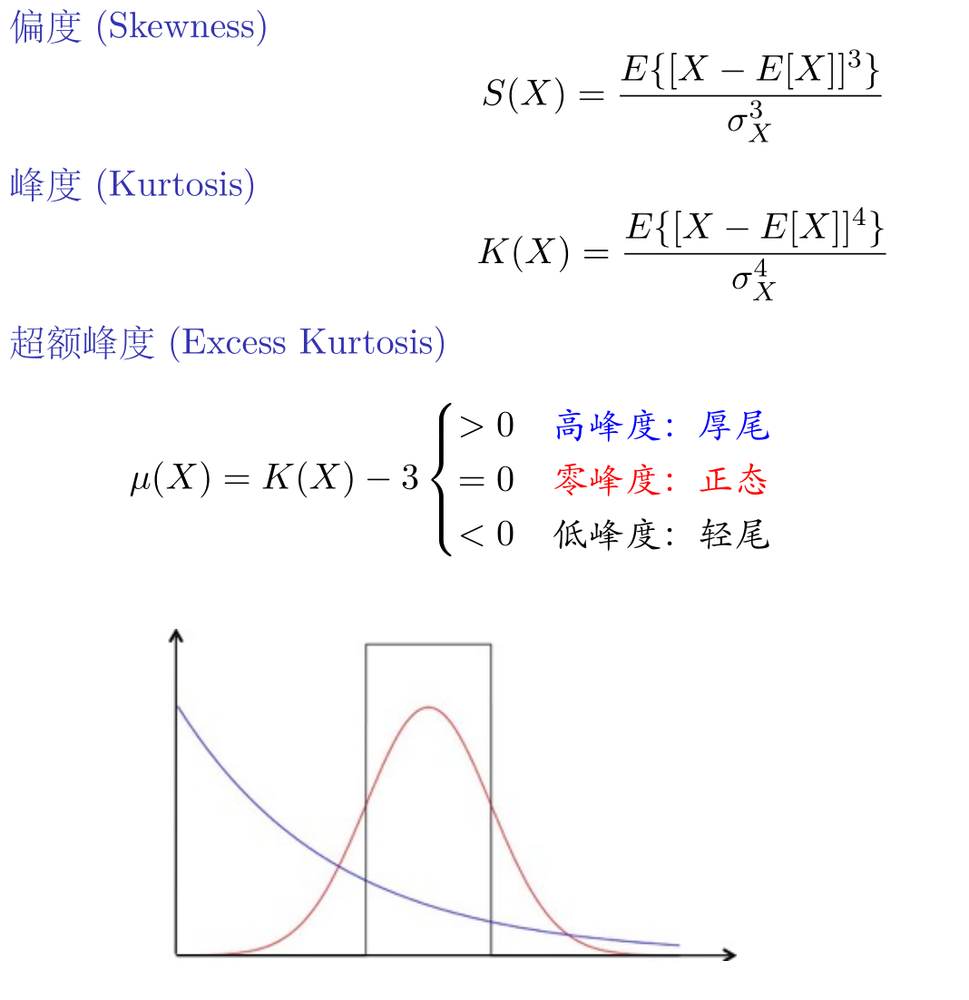

- TODO

### 协方差矩阵

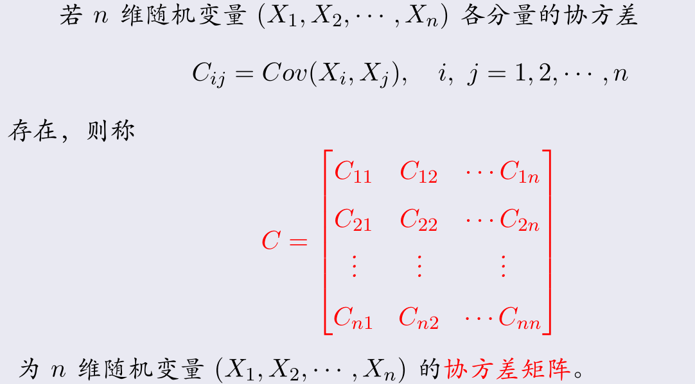

#### 协方差矩阵的性质

**(1)** 主对角线为方差

- $C_{ii} = D(X_i)$

**(2)** 对称矩阵

- $C = C^T$

**(3)** C非负定

- 这是由协方差矩阵具有平方的性质而带来的
- 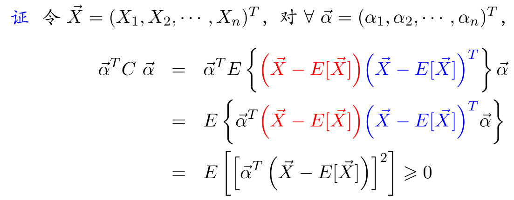

### 正态分布

#### 二维正态分布

$$
(X_1, X_2) \sim N(\mu_1, \mu_2, \sigma_2^2, \sigma_2^2, \rho)
$$

TODO: 用到的时候再来

第七章 参数估计
===============

总体
----

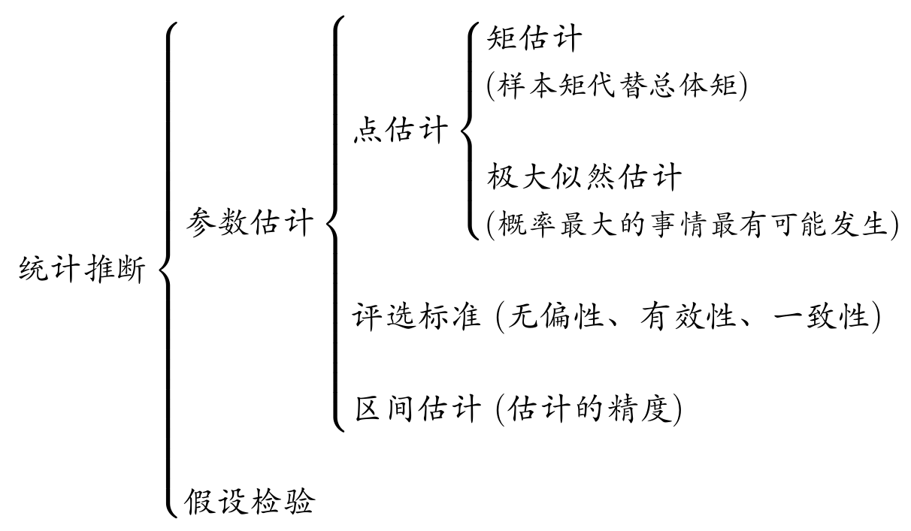

点估计
------

- 点估计值：借助X的一个样本估计总体未知参数的值，例如正态分布的均值$\mu$
- 估计量：样本构成的统计量
- 估计值：估计量的观测值

### 矩估计

- 基本思想：样本矩代替总体矩
  - 实作：计算样本的矩($k$阶原点矩)，计算样本的矩，然后相等，而后解方程

- 常见分布的矩估计
  - todo: 推导

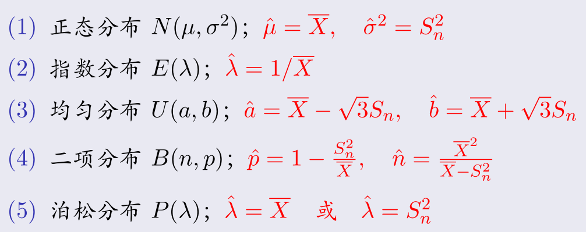

- 矩估计结果一定么？使用不同的矩，求解出来的参数是不同的。

### 极大似然估计(Maximum Likelihood Estimation)

- 思想：对于待估计的参数，其值域中的某一个值能使得样本发生概率，那他就是我们想要的那个值
- 实作：计算样本发生的概率$L(x_1, x_2, \cdots, x_n; \hat{\theta})$，使得这个$L$有最大的那个$\theta$即我们需要的那个值
  - Key：求$L$的极大值 得 极值点 $(\theta, L_{\max})$ -> 得到估计量 -> 带入数据 -> 得到估计值
- 对于多个参数适用？适用，根据极大似然估计的思想，其实在参数空间中找到那一个能使得似然函数极大的那一组参数即可，如果只有一个参数，则就是在以为空间上寻找，如果有三个参数，无非就是在三维空间上寻找。
- 一般步骤
  - 似然函数
  - 去对数，求最值

估计量的评选标准
----------------

- 目的：评估待估计参数的哪个估计量更好
- 无偏性：估计值不偏离真实的期望，估计量的均值等于未知参数，则为无偏估计
  - $E([\hat{\theta}]) = \theta$ -> 注意是估计值的均值，也就说在固定采样数$n$不变的情况下，多次重复做实验，估计值的均值将会不断趋近真实均值
  - $\bar{X}$总是某个分布均值的无偏估计
  - 样本方差总是总体方差的无偏估计
    - 而样本二阶中心距有偏
- 有效性：有效，反映估计量的稳定性，越稳定，即其方差越小，则越有效
  - 感性上说某个人说总是变化多端，那么其承诺可能也是没有什么效用的
  - $D(\hat{\theta_1}) < D(\hat{\theta_2})$，则认为前估计量更好
- 相合性：取样个数趋于无穷时，保证最终的结果将会趋于真实值
  - todo

区间估计
--------

- 目的：点估计不能反映估计值的精度，感性上说，我们的估计值其实应该在一个区间内，这便是区间估计，即给出一个范围，在给定可信度下的参数范围
- 区间估计：找到那样两个估计量，构成一个区间，而未知数在这个区间内的概率在要足够大，这里要求等于$(1 - \alpha)$
  - $\alpha$反映了~~可靠度，越小越可靠~~ -> 或者叫做可变度，若要求估计越精确，则需要参数的 可变 范围越小，也就是可变度越小
  - $(1 - \alpha)$反映可靠度，即落在这个区间内的可靠程度，显然越大越好
- 求解方法：枢轴量法
  - todo
- 单个独立正态的参数区间估计

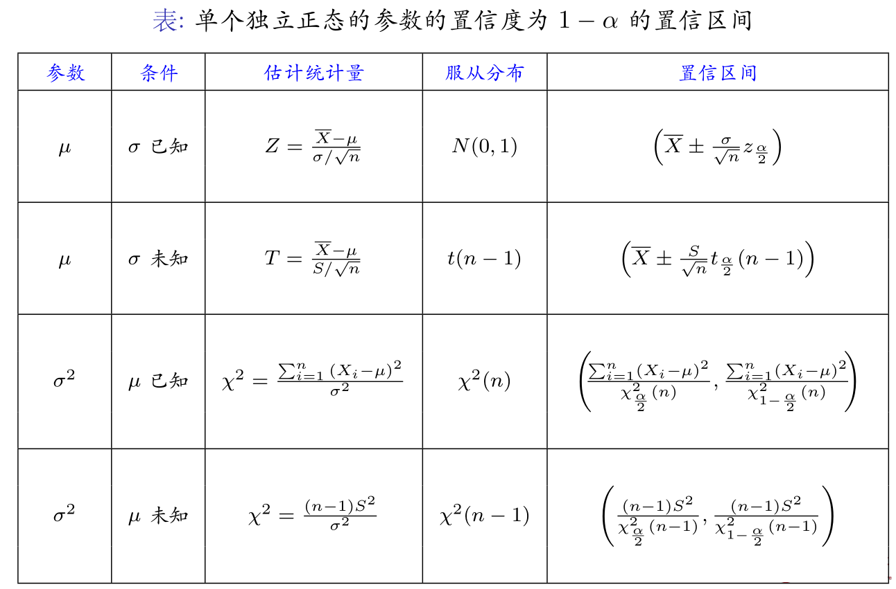

第八章 假设检验
===============

直观上理解假设检验

- 对于一个事件，我们经过重复观测之后提出了一个假设
  - 例如一个葡萄糖的包装机，**正产工作时**，其包装结果服从标准差为`0.015kg`，均值为`0.5kg`的正态分布
  - 某一次检测时随机抽查了$n$个数据，$x_1, x_2, x_3, \cdots, x_n$
  - 提出假设：包装机在正常工作吗？
  - 分析：如果包装机还在正常工作，那么此时包装机的分布依然需要均值为`0.5kg`
- 即假设:机器现在分布的均值$\mu$和原$\mu$应该相同，而$\bar x$是其无偏估计，即$|\bar x - \mu|$需要足够小，刚好$\bar x\sim N(\mu, \frac{\sigma^2}{n})$，则$y = \frac{\bar x - \mu}{\sigma / \sqrt{n}}\sim N(0, 1)$
- 我们算一下$y$的值(根据当前观察到的数据即可计算)，其发生的概率应该要足够大，如果过小，则原假设就不成立

总结

- 根据观察数据，我们可以用于判断一些假设的合理性，也就是对其进行检验！
- 检验的时候，我们假设他是符合我们的假设的，但是在我们如此相信他的情况下，居然露出了巨大的马脚，那只能说我们的假设需要被推翻了！
  - 即，在该种假设下，观察事件及其不容易发生，则只能说我们假设是不合理的！

编一个故事：小明买菜

- 有一天小明去买菜，看着街上琳琅满目的菜品着实不好选，因为在生物科技如此发达的今天，想买到一颗纯正白萝卜真的不容易！作为数学家的小明，为了家人的安全当然得非常严谨才行，他查阅到纯正白萝卜的重量服从均值为$\mu = 2.5kg$，方差为$\sigma^2 = 0.2$的正态分布，于是他叫老板一个一个白萝卜的称重，然后记下来，数据是$2.4, 2.4, 2.5, 2.6, 2.3, 2.4$，总共6个白萝卜的数据！
- 首先他假设这些白萝卜都是土生土长的纯正白萝卜，那么这些白萝卜均值一定不会偏离$2.5 kg$太多，他计算了一下白萝的重量的均值$\bar x = 2.4333$，那这个值到底是偏差`2.5`大不大呢？？？？这确实不好说，他想起来正态分布随机变量的均值是服从均值为$\mu$方差为$\frac{\sigma^2}{n}$的正态分布，也就是$\bar x \sim N(2.5, 0.0333)$，而这个分布产出了一个值是$2.4333$，小明脑子里一闪而过该分布的图

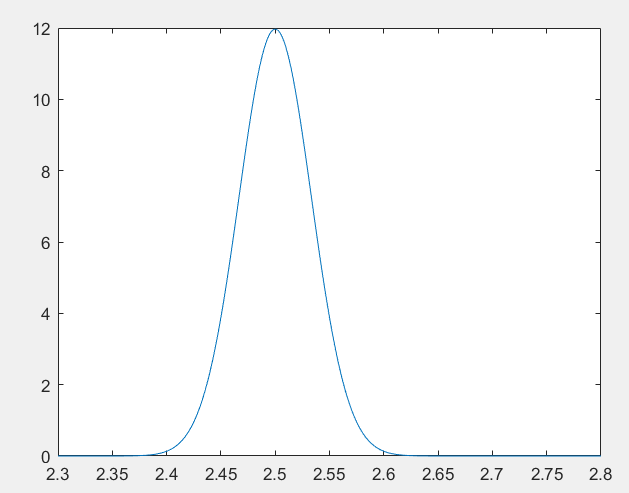

- 他立马知道，此时不同寻常……

理解性Blog
==========

如何理解
--------

- 连续概率分布的期望求解公式(积分)
- 概率分布函数是否一定有均值？
  - 根据其公式来理解

对无偏估计的理解
----------------

