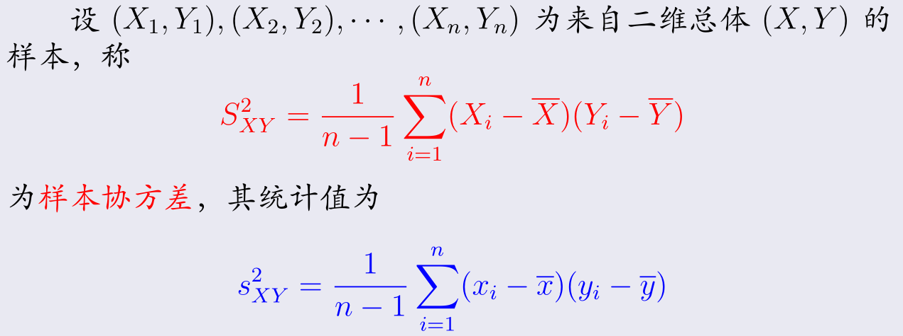
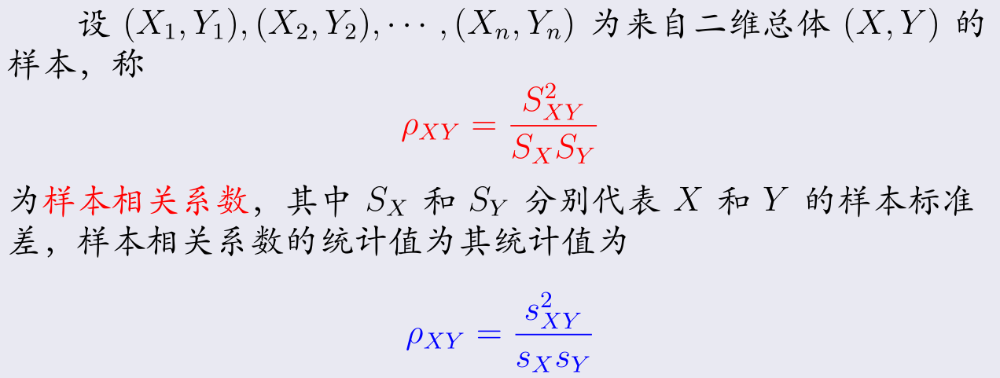
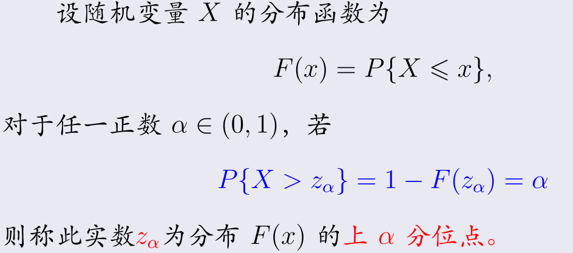

第六章 数理统计的基本概念
=========================

6.0 前言
--------

**数理统计核心:** 局部推断整体

- 1 参数估计
- 2 假设检验
- 3 方差分析
- 4 回归分析

6.1 总体与样本
--------------

### 基本概念

#### 总体

研究对象的全体

- 总体即分布

#### 个体

构成总体的每个成员

#### 参数

确定，但是未知的数

- 例如总体的$\mu$是确定的，但是我们确不知道

#### 样本

- 从总体$X$中抽取$n$个个体称为容量为$n$的样本或子样，记为$X_1, X_2, \cdots, X_n$

#### 观察

- $x_i$为$X_i$的一个观察值，称$x_1,x_2, \cdots, x_n$为总体$X$的一个容量为$n$的样本观察值，或样本的一个实现

#### 简单随机抽样

### 统计量

### 常见统计量

#### 顺序统计量

#### 样本极差

- "最大" - "最小"

#### 样本众数

#### 样本均值

#### 样本方差

#### 样本标准差

### 样本变异系数

#### 样本矩

#### 样本偏度系数

#### 样本峰度值

#### 样本协方差

#### 样本相关系数

6.2 经验分布于直方图
--------------------

### 经验分布函数

### 直方图

6.3 常用统计量的分布
--------------------

### 单个正态总体的样本均值的分布

理解

- 含有$n$个信息后，均值显然是不变的，但是我们对其中的集中程度会上升，即方差降低为$\frac{1}{n}$

可用于

- 由于里面含有可控参数，故可以用来计算采样容量

### 非正态总体的近似分布

- 也就是说，**样本值的期望，将会近似为正态分布**

### 两个正态总体下的样本均值的分布

- 相互独立的话，直接对应相加即可

### 分位点

- 对于随机变量的一个取值，大于这个取值的概率为$\alpha$

### 三大抽样分布

#### $\chi^2$分布

#### $t$分布

- $t$反映了其陡峭程度

##### $t$分布性质

##### $t(n)$典型模式

##### $t(n)$的上$\alpha$分位点

#### $F$分布

图像

#### $F$分布典型模式

##### $F$分布的性质

##### $F$分布的上$\alpha$分位点

#### 三大分布与正态分布的关系

### 正态总体的抽样分布

#### 单个正态总体的抽样分布

#### 两个正态总体的抽样分布

