线性代数中的SVD和图像压缩
=========================

> - [奇异值分解（SVD）和图像压缩（中英文字幕）_哔哩哔哩_bilibili](https://www.bilibili.com/video/BV1Jr4y1U7WH/?spm_id_from=333.788)

要点
----

- 视角1：理解矩阵就是分三步的乘法，而SVD就是求解出这是三个步骤的算法
- 视角2：SVD看做是多个矩阵之和(不同矩阵具有不同的幅度)

总结
----

> - SVD，Singular Value Decomposetion
> - 看法1：其将矩阵这个线性变换分解为三个步骤
> - 看法2：其将矩阵分解为多个维度较低的矩阵之和

### SVD就是分步矩阵乘法

首先理解，矩阵就是一个线性变换，这个线性变换分成三个步骤，可以用三个矩阵的连乘来表示，而这三个矩阵也就是我们对$A$进行奇异值分解得到的三个矩阵：
$$
A = U\Sigma V^T
$$
这三个步骤

- 先用$V^T$进行旋转，注意，其只涉及到旋转，不会造成向量长度的变化，因为其是**单位正交**的！
  - 单位正交矩阵的线性变换不会导致$x$被拉长，显然也不会导致其维度降低
  - 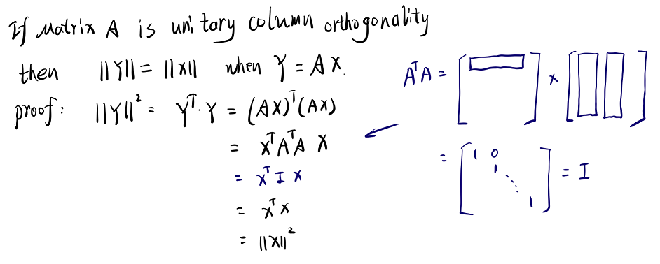

- 然后再利用$\Sigma$进行拉伸，注意，其只涉及向量在某一个轴上的伸缩(伸长、缩短)，所以仅对角线上有值
  - 当对对角线上某一个值为0时，该轴对应的分量退化为0！
  - 所以显然$\Sigma$的秩和原矩阵的秩相同
- 最后使用$U$进行旋转，其性质同$V^T$

### 将SVD看成是多个矩阵之和

这里不将SVD的过程看成是三个线性变换，而是将这三个矩阵的乘法分解为多个矩阵的相加

- 由于$\sigma$是从大到小排列的，故重要成分逐渐降低
- 从以下可以看出，$\sigma$越小则对应成分月弱

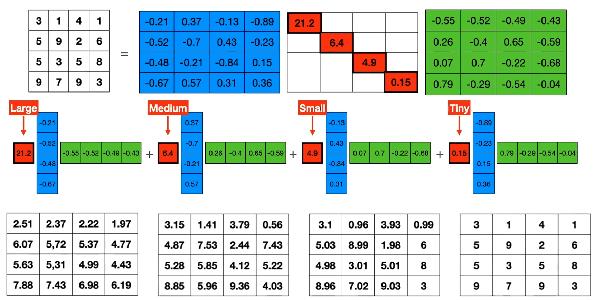

矩阵就是一个线性变换
--------------------

所谓的线性变换也就是对向量的两种操作：

- 拉伸：即沿着某一个轴拉伸，对角阵对应于沿着某一个值拉伸，特殊的当变换矩阵为$I$时表示不拉伸
  - 因子大于1则为拉伸、反之则压缩

- 旋转：添加非对角元素，则描述了旋转

所有线性变换可以看做是 **先旋转、再拉伸，再旋转**：

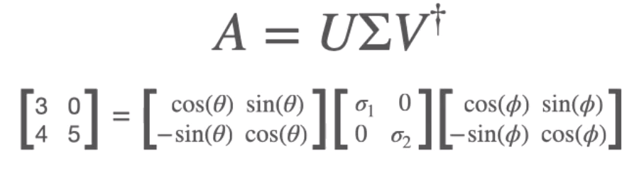

- 对于圆形的变换例子：
  - 首先对圆做一个旋转，当圆没有颜色时，看似没有效果！但它的确是转了！
  - 然后再水平方向和垂直方向分别做拉伸
  - 最后再旋转一次

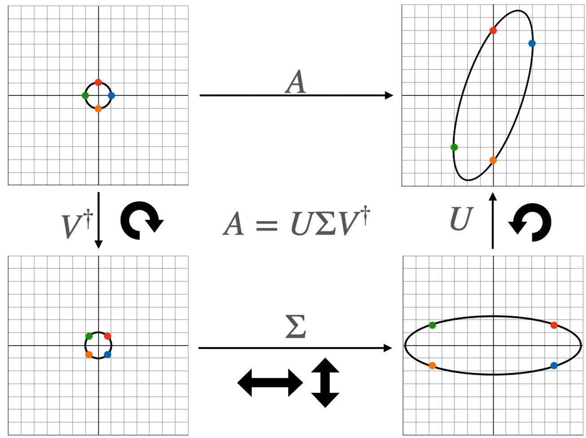

退化的变换
----------

- 显然旋转不会导致坐标的压缩，在拉伸的时候，某一个轴的缩放因子(即$\Sigma$上的一个值)变为了0，则这个轴将不复存在！
  - 平面一个圆圈，最后压缩成了一条直线

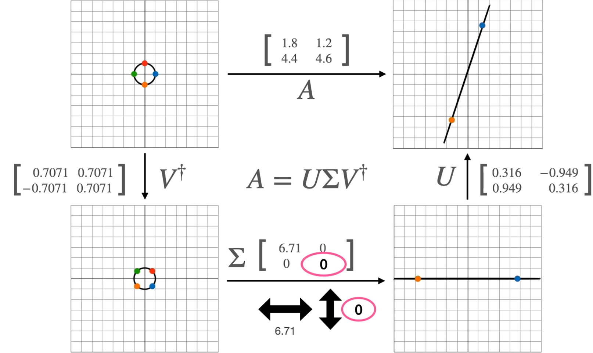

- 此时也对应于行列之间存在关系，存在关系则说明其能表示的空间将会是$n$维压缩了一些维度的空间。
- 这个矩阵行相关，说明他没有包含足够的信息，所以我们可以将其编码成一列(一维)

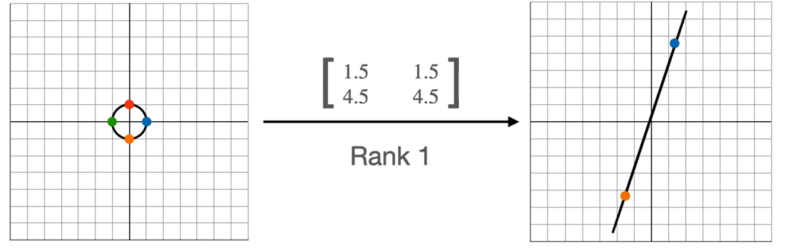

SVD压缩的原理
-------------

当矩阵的秩为1时，如下图中可以将矩阵的列之间存在相关性，则可以用少一些行、列来表示

- 存储空间变小了 -> 压缩(compression)
- 用一个维度即可表示 -> 降维(dimentional reduction)

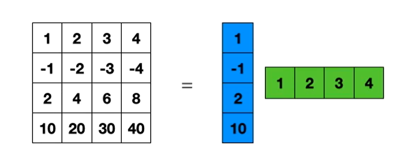

- 对于秩为$n$的矩阵，也就是满秩，各个列之间不存在相关关系，故必须全部存储

SVD分解的感性认识
-----------------

SVD的原理是将矩阵，看做是多个秩为1的矩阵之和

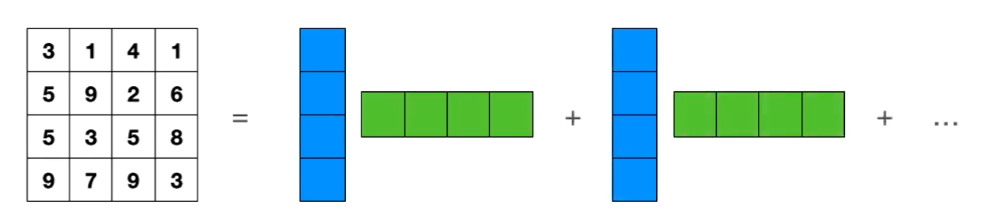

奇异值分解也是在做这件事
- 我们可以将后面比较小的几个去掉，此时即使仅仅使用几个成分也可以有效的恢复出原来的

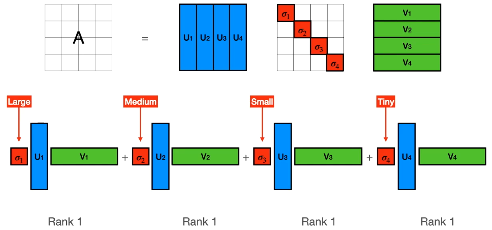

奇异值分解示例

矩阵的秩与分解
--------------

一个矩阵的秩越小，则其行/列之间的可预测性越高，从而我们更容易使用他们之间的相关性

- 当满秩时，我们就只能用对应维度的矩阵线程来表示

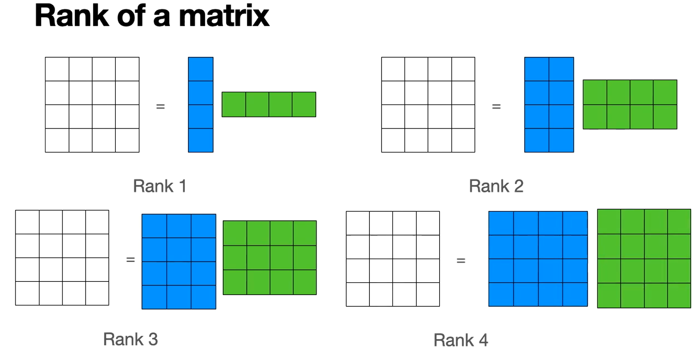

降维的意义
----------

我有一个矩阵，他可能有很高的秩，但是我可以找到一些秩比较低的矩阵相乘来得到他，这样存储就容易多了

## 非方阵的SVD

一样的道理，和方阵没有什么不同

- 由于一定非满秩，则一定是退化的，则整个维度一定是降低的

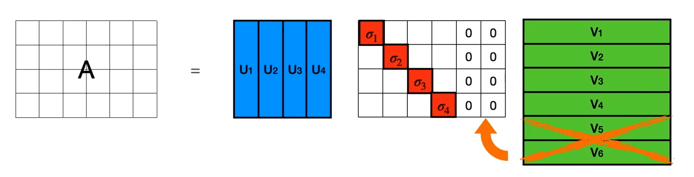

图像的压缩&&奇异值分解与傅里叶分解
----------------------------------

对矩阵进行奇异值分解，和傅里叶分解相似，都是分解为不同的分量

- 中间的$\Sigma$是各个分量的强度
- 从下图中可以发现，不同分量之间的重叠程度比较少

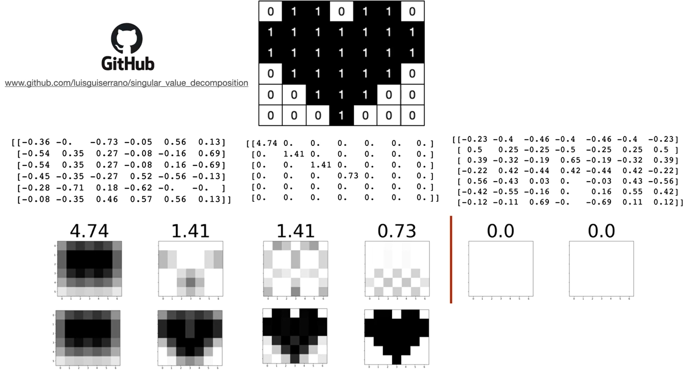

Numpy::SVD
----------

一个对椭圆进行线性变换的过程，分解成三个步骤，依次绘制中间步骤：

- 首先蓝色椭圆做旋转得到橙色椭圆
- 然后在新的轴上进行拉伸得到红色的椭圆
- 然后旋转得到最终绿色椭圆

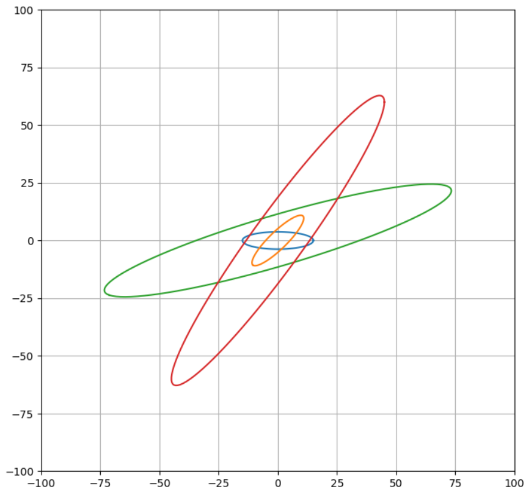

todo: SVD的数学原理
-------------------

- 进一步用线性代数去验证、证明其中的数学原理
