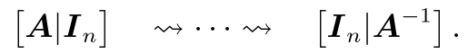
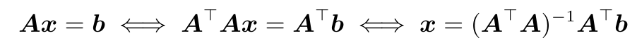

2 Linear Algebra
================

求解线性方程组
--------------

对于任意一个线性方程组，都可以写成矩阵的形式：
$$
Ax = b
$$
其中$A \in \mathbb{R}^{m\times n}$，$x, b\in \mathbb{R}^{n\times 1}$

**求解过程**

我们先将$A$写成增广矩阵的形式，然后利用下面三种基础的变换将$[A|b]$变换为行阶梯型，最后变换成简化的行阶梯型矩阵。

- 交换两行
- 某一行乘以常数$\lambda \in \mathbb{R}\backslash 0$
- 两行相加

最后直接看出特解(最右边一列)和通解(负一技巧)，最后解就表示为：特解 + 特解

**解空间大小的三种情况**

- 无解：行阶梯型中左侧有非0的而右侧为0
- 唯一解：行阶梯型中左侧矩阵秩为$n$, $|A|\ne 0$
- 无穷解：非满秩

求矩阵的逆
----------

**解线性方程组的方法**

对于方阵$A$，为了计算其逆，我们需要找到一个$X\in \mathbb{R}^{n\times n}$满足$AX = I_n$。那我们依然通过最基本那三种变换来对增广矩阵$[A|I]$进行变换，变换成$[I|B]$，由于基本的行列变换不会改变方程的解，也就是说$AX = I_n$的解和$IX = B$的解相同，而后者的解就是$X = B$，故前者的解也是$X = B$。所以求矩阵的逆就可以总结为如下过程：

**伪逆**

- 其中$(A^TA)^{-1}A^{T}b$即伪逆(Moore-Penrose pseudo-inverse)
- 缺点：计算量大、对精度的要求高

4 Matrix Decomposition
======================

求特征值和特征向量
------------------

根据定义来求解即可，对于给定方阵$A$，其特征值即求解：
$$
\det(A - \lambda I) = 0
$$
对于每个特征值，求解$(A -\lambda I)x = 0$即得到对应的特征向量。

注意

- 一个特征值至少对应1个线性无关的特征向量，其数目称为该特征值的重数
- 不同特征值的特征向量一定线性无关

