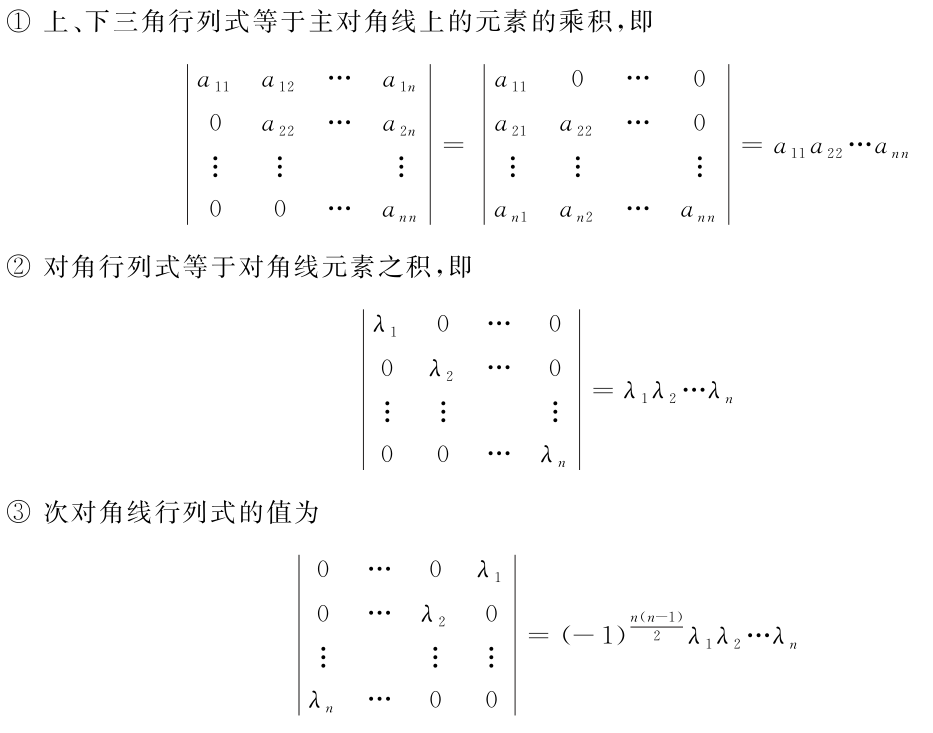
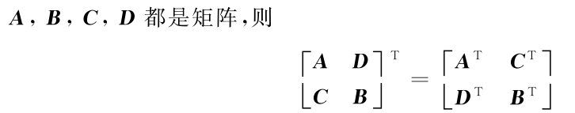

> 参照《线性代数习题精解及考研辅导》，整理每一章节的知识点

第一章 行列式
=============

> - 方阵才谈行列式，如果不是方阵，则这面积要么压缩为0，要么为无穷大，没有了意义！

n阶行列式计算公式
-----------------

- 其中$(p_1p_2\cdots p_n)$是$1\sim n$的排列数，该序列中逆序对的个数为$\tau$
- 直观上，每一行选取一个元素，且各行元素不同列，然后乘起来作为一项，最后将各个项求和

**特殊形式矩阵的行列式公式**
----------------------------

- 对于$1,2$，在求和的所有排列中，只有$(12\cdots n)$可能含有非0元素，且$\tau = 0$，故最终结果等于对角线的乘积
- 对于$3$，$\tau = \frac{n(n - 1)}{2}$，且只有副对角线上可能存在元素不为0

行列式性质
----------

> - 行列同性质，所有在行上面执行的性质，在列上面依然执行！

- $\det(D) = \det(D^T)$
  - 从公式上即可理解，将$a_{1p_1}a_{2p_2}\cdots a_{np_n}$替换为 $a_{p_11}a_{p_22}\cdots a_{p_nn}$后，就相当于在每一类逐个的进行取，最终结果依然不变
- 互换行列式的两行(列),行列式改变符号
  - 从公式上理解，交换两行后，每一个式子的$\tau$将会增加或减少一个(原本就逆序的则减少，原本未逆序的增加)，从而每一个式子都将乘以$(-1)$，所以最终的式子将会乘以$(-1)$，即换号
- 行列式的某一行(列)中所有的元素都乘以同一数k,等于用这个数k 乘以此行列式,即行列式中某一行(列)的所有元素的公因子可以提到行列式符号的外面
  - 显然，这会使得每一个式子乘以$k$
- 若行列式的某一列(行)的元素都是两数之和,则
  - 
  - 每一个式子都可以拆出来，从而形成两个式子
- 把行列式的某一列(行)的各元素乘以同一个数然后加到另一列(行)对应的元素上,行列式的值不变
  - 据此，可以对行列式的行、列进行任意相加相减的变换，变换成我们想要的形式来计算

行列式按行(列)展开
------------------

- **代数余子式:** 把$n$ 阶行列式元素 $a_{ij}$ 所在的第$i$行和第$j$ 列划去后所成的$(n-1)$阶行列式称为元素$a_{ij}$ 的余子式,记作 $M_{ij}$. $A_{ij} = (-1)^{i + j}M_{ij}$ 称为元素$a_{ij}$ 的代数余子式.

- 行列式等于它的任一行(列)的各元素与其对应的代数余子式乘积之和,即行列式按行(列)展开法则:
  - 
- 一个$n $阶行列式,如果其中第i行所有元素除第$i$行第$j$ 列元素$a_ij$ 外都为$0$,则该行列式等于$a_ij$ 与它的代数余子式的乘积,即 $D =a_{ij}A_{ij}$.
  - 直观上: 某个元素孤苦伶仃后，只需要计算其代数余子式即可.
- 行列式某一行(列)的元素与另一行(列)的对应元素的代数余子式乘积之和等于0,即
  - 有种，正交的感觉
  - 
- 范德蒙行列式
  - 
  - 证明过程:
  - 

克拉默法则
----------

含有$n$个方程$n$个未知数的方程组:
$$
AX = b
$$

- 若$\det(A) \ne 0$，则有唯一解，$x_i = \frac{\det(A_i)}{\det(A)}$，$A_i$表示将$A$的第$i$列元素替换为$b$得到的矩阵
  - $A$的列空间长成整个$n$维空间，必然能表示出$b$
- 若行列式$D = 0$，则无解或者有无穷解
  - $A$的列空间张不成$n$维空间，若再$span(A)$之外则无解，若在$span(A)$之内则有无穷解
- 若方程为齐次方程，即$AX = 0$，则当$\det(A) \ne0$时，方程只有0解，否则方程有无穷解(因为$span(A)$一定是包含$0$向量的)

注意

- 仅适用于含有$n$个未知数的情况

要点归纳
--------

### 计算逆序数

3241675为例

- 1前面有3个数比1大
- 2,1
- 3,0
- 4,0
- 5,2
- 6,0
- 7,0

故共有$3 + 1 + 2 = 6$个逆序对

### 计算行列式

- 利用性质，对矩阵做行列变换(提取供应式、逐行相加、相减)，变换成三角阵
- 有一些特殊形式的矩阵，在进行行列式变换时有一定技巧
  - 爪形
- 某一行0元素较多时再展开

第二章 矩阵及其运算
===================

定义
----

$A_{m\times n}\in \mathbb{R}^{m\times n}$

- 方阵: $m =n$
- 列矩阵、向量: $n = 1$
- 矩阵相等: 大小相同且对应元素相等

特殊的矩阵
----------

- 零矩阵: 所有元素为0
- 对角阵: 非主对角线上元素均为0
- 三角阵: 主对角线以上或一下均为0，成下、上三角阵
- 矩阵转置: 将矩阵沿着对角线翻折
- 对称阵: $A = A^T$
- 反对称阵: $A = -A^T$
- 伴随矩阵: $A_{ij}$ 为行列式$|A|$中$a_{ij}$ 的代数余子式,则伴随矩阵:
  - 
- 退化矩阵、奇异矩阵: $\det(A) = 0$，否则为非退化、非奇异矩阵

逆矩阵
------

### 伴随矩阵

- 矩阵$A$的伴随矩阵为$A^*$，其中$(A^*)_{ij}$是$A_{ji}$的代数余子式(注意要翻转一下)
  - 
  - 则有$AA^* = A^*A = \det(A)I_n$
  - 直观上: $A_{i, :}$与$A_{:, j}$做内积时，当$i \ne j$时为0(这是代数余子式的性质)，否则结果为$\det(A)$

### 逆矩阵定义

- $AB=BA=I_n$，则$B = A^{-1}\quad B^{-1} = A$

### 矩阵可逆条件

- 方阵$A$可逆 $\Leftrightarrow$ $\det(A) \ne 0$
- $A^{-1} = \frac{1}{\det(A)}A^*$

### 逆矩阵的性质

- 逆矩阵可逆

- 转置运算和可逆运算可以交换，原因$(A^*)^T = (A^T)^*$

分块矩阵的性质
--------------

> 分块矩阵可以被看做单独的元素！

- 分块矩阵也可以整体看成三角阵
  - 
- 可以被看成单独的元素
  - 

- 可以被看做单独的元素
  - 

题型
----

### 矩阵乘法

- 不满足交换律
- 满足结合律和分配律: $(AB)C = A(BC)$
- $|kA| = k^n |A|$

### 矩阵的幂

方法

- 矩阵本身特点
- 数学规律法: 先算 $A^2\quad A^3$

### 方阵行列式

- 对于 $(2)$，直观上，行列式将$A$和$B$之间的运算变得限制不那么多了

### 求逆矩阵

### 伴随矩阵相关性质

- 伴随矩阵很接近矩阵的逆了，只有一个常数关系
- 所以伴随运算和转置运算也可以换顺序
- 伴随矩阵不可逆，伴随之后再伴随，原矩阵$A$要被缩小
- 伴随运算和逆运算也可以交换顺序

