第三章 矩阵的初等变换与线性方程组
=================================

初等矩阵
--------

初等矩阵定义: 单位阵经过一次变换后的矩阵，三种

- $e(i, j)$: 交换低$i$行和第$j$行
- $e(i(k))$: 第$i$行乘以$k$倍
- $e(i, j(k)): $ 第$j$行的$k$倍加到第$i$行上

性质

- 初等矩阵转置也是初等矩阵
  - 行初等变换、列初等变换
- 初等矩阵可逆，且其逆矩阵也是初等矩阵
  - 无非就是变换回去和变换回来
- 若矩阵$A$可逆，则$A$可以表示由单位阵$I_n$经过一系列行变换而来的，即$A = P_1P_2\cdots P_n$
- 行变换对应左乘初等矩阵，列变换对应右乘初等矩阵
- 方阵$A$可逆 $\Leftrightarrow$  $A$经过行变换能变成单位阵
- 若 $[A|B]$经过初等行变换能变换为$[I_n|X]$，则$A$可逆，且$X = A^{-1}B$
  - 即解方程$AX = B$
  - 特别的，当$X = I_n$时，即对应于矩阵逆的定义

矩阵的秩
--------

定义

- $R(A)$: 是矩阵$A$列向量构成的空间的维数，其存在$R(A)$阶余子式不为0，且所有阶数更大的余子式都为0
- 满秩: $R(A) = n$

性质

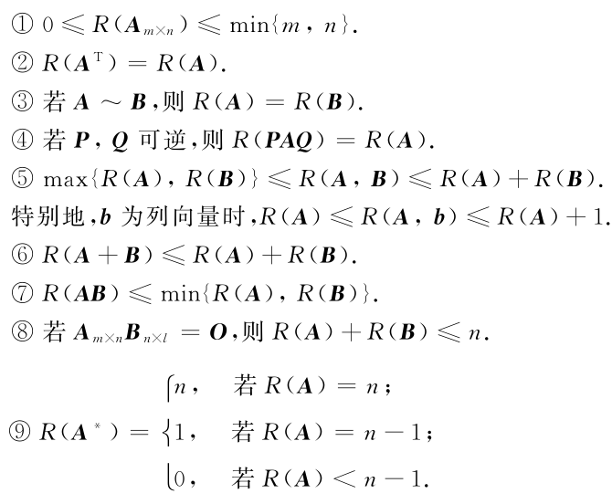

线性方程组的解
--------------

对于$n$元非齐次方程组$Ax = b$

- 无解: $R(A) < R([A|b])$
- 唯一解: $R(A) = R([A|b]) = n$
- 无穷解: $R(A) = R([A|b]) < n$

齐次方程$AX = 0$有非0解的冲要条件是 $R(A) < n$

矩阵方程$AX = O$的只有$0$解的冲要条件是$\det(A) \ne 0$

矩阵方程$AX = B$有解的冲要条件是$R(A) = R([A|B])$

题型
----

### 求矩阵的秩

- 初等变换法将矩阵$A$经过初等变换化为阶梯形矩阵$B$,则矩阵的秩等于阶梯形矩阵 $B$的非零行的行数

### 线性方程组解的求法

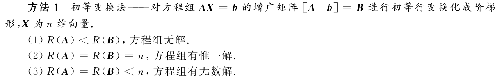

第四章 向量组的线性相关性
=========================

向量组
------

- $n$维向量组: $n$个有次序的数 $\alpha_1, \alpha_2, \cdots, \alpha_n$ 构成的有序数组即为$n$向量

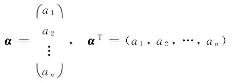

- 向量组: 若干同维数的(列/行)向量组成的集合

线性组合与线性表示
------------------

- 线性组合: 给定一组系数，将向量组进行加权求和，$k_1 a_1 + k_2a_2+\cdots + k_m k_m$
- 等价: 向量组$A$和$B$能相互表示(即任一列向量都能又另一矩阵列空间表示)，则二者等价
- 向量$b$能由$A$线性表示的冲要条件: $R(A) = R([A|b])$
- 向量$A$与向量$B$等价的充要条件: $R(A) = R(B) = R(AB)$
- $B$能由$A$线性表示，则$R(A) \le R(B)$

向量组的线性相关性
------------------

- 向量组线性相关的几种表述
  - 存在某个向量，能被其他向量线性表示
  - $Ax = 0$有非0解
  - $R(A) < n$
  - $\det(A) = 0$
- 线性无关
  - $Ax = 0$只要$0$解
  - $\det(A) \ne 0$

线性方程组解的结构
------------------

### 齐次线性方程组

​	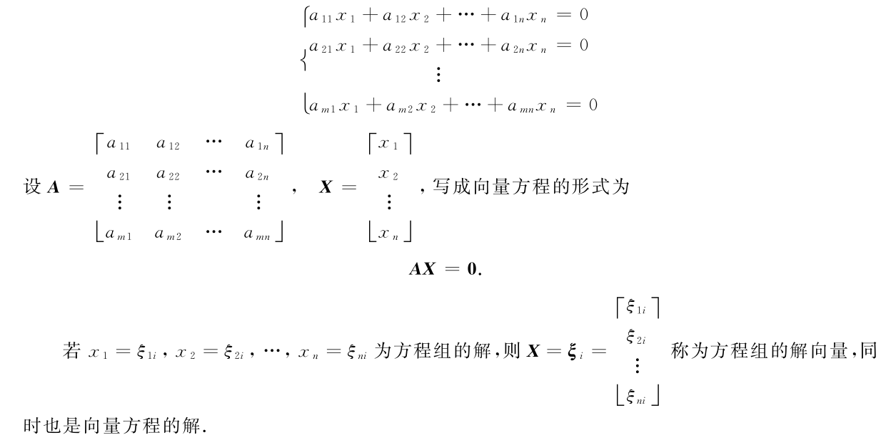

### 解向量的性质

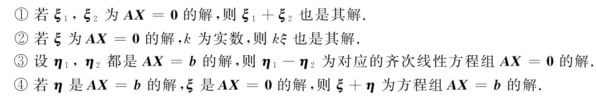

### 齐次方程组的基础解系

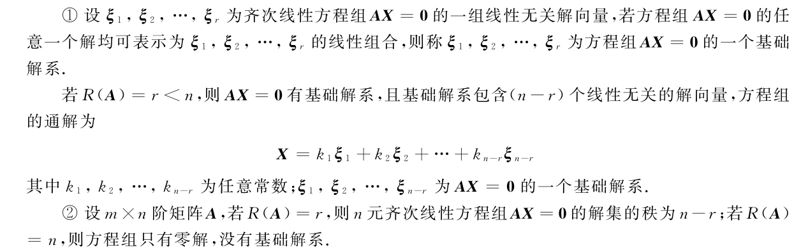

### 非齐次线性方程组的解系

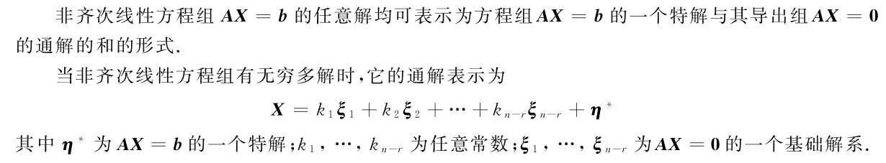

题型
----

### 向量组相关性的判断

方法：

- 判断某个向量是否能被其他向量线性组合
- 对于$n$个$m$维的向量组，对应矩阵$A $大小为$m\times n$
  - 若$R(A) < n$则一定线性相关，否则线性无关
  - 若$m < n$，则一定线性无关，因为$R(A) \le m < n$
- 方阵则可以看行列式 $\det(A) \ne 0$ 则线性无关、方阵可逆

### 某一向量是否能由一个向量组表示

方法：

- 解方程: 若$Ax = b$有解，则$b$能由$A$的列空间表示
- 等秩法: $R(A|b) = R(A)$则说明$b$能由$A$线性表示

第五章 相似矩阵及二次型
=======================

向量的内积、长度及正交性
------------------------

- 内积: $\langle x, y \rangle = \sum_{i}x_iy_i$

  - 注: 内积的单位是 $(长度单位)^2$

- 长度: $\Vert x \Vert = \sqrt{\langle  x,x\rangle}$

- 单位向量: 长度为1的向量

- 长度的性质

  - 非负性，当且仅当$X=0$时，长度为0
  - 齐次性，$\Vert\lambda x \Vert = |\lambda| \Vert x \Vert$
  - 三角不等式: $\Vert  X + Y\Vert \le \Vert X \Vert + \Vert Y \Vert$ 

- 正交向量组

  - 正交向量组: $\langle X, Y \rangle = 0$ 则二者正交，0向量与任意向量正交
  - 正交向量组：向量组内向量两两相互正交
  - 非0正交向量组，一定线性无关

- 正交基

  - 规范正交基: $n$维向量组$e_1, \cdots, e_r$，是向量空间$V$中的一组基，两两正交，且都是单位向量，则称其为$V$下的一组规范正交基

- 施密特正交化步骤: 将一组非规范非正交的基变成规范正交基的过程

  - 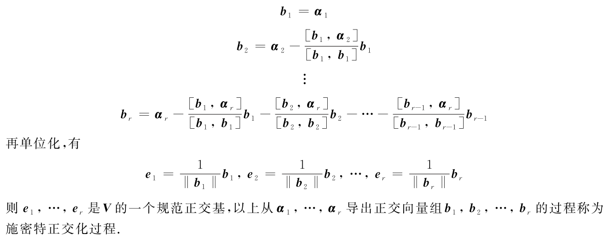

- 正交矩阵: 若$A^T A = I_n$，即$A^T = A^{-1}$，则称$A$为正交矩阵，且$|A| = 1 或 -1$

  - 直观上，根据$A^T A = I_n$，以及对矩阵乘法中每个元素都可以看成左边的一个行向量与右边的一个列向量的内积，则有
    $$
    \langle A_{:, i}, A_{:, j} \rangle  = \begin{cases}
    1 & i = j \\
    0 & i \ne j
    
    \end{cases}
    $$
    

- 正交变换: $Y = PX$，其中$P$为正交阵

方阵的特征值与特征向量
----------------------

### 定义

- 方阵 $A$，满足$Ax= \lambda x$是，称$\lambda$ 是$A$的特征值，$x$是其对应的特征向量

### 特征多项式与特征方程

**(1) 求特征向量与特征方程**

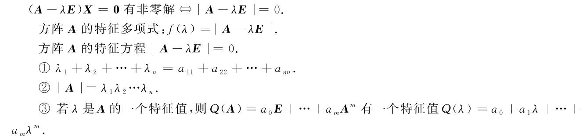

**(2) 不同特征值对应的特征向量一定线性无关**

- 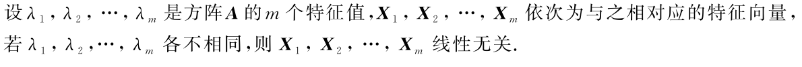

- 理解1: 假设两个不同的特征值$\lambda_i$和$\lambda_j$对应的特征向量线性相关，则$v_i = kv_j$其中$k \ne 1$，两边乘以$A$，得到$\lambda_i v_i = k\lambda_j v_j$，即$\lambda_i = \lambda_j$，这与假设不符合
- 理解2: 伸展率不同，则一定对应不同的伸展方向
- 注意1: 伸展率相同时，不一定对应相同的方向，因为同一特征值可能有多个线性无关的特征向量
- 说明: 朝着同一方向的伸展比率是定值，这也可以从$Ax = \lambda x$看出来

## 相似矩阵

- **定义:** $A$和$B$都是$n$阶矩阵，若有可逆矩阵$P$，满足$B = P^{-1} AP$，则说$A$和$B$相似
  - 直观理解: $A$对应在原空间的变换，$B$对应在另一个空间的变换，虽然在不同空间进行变换，但是当变换转换到某一个空间时，效果居然一样.
- **相似矩阵具有相同的特征多项式:** 即他们具有相同的特征值
  -  也就是说，在$A$空间下的拉伸率，和在$B$空间下的拉伸率居然相同，但是拉伸方向会发生变换
  - 直观: 将一个平面弄歪，其对应拉伸方向的拉伸比率不变，但是拉伸方向可能发生改变
- **$A$与对角阵相似:** 由于对角阵的拉伸即对角线上的数值，故其特征值就是对角线上的数值，而相似矩阵拉伸率不变，这说明$A$的拉伸率也是那么多！
  - 注意: 这一点理解很重要，这说明我们将一个复杂的矩阵$A$，变换到其另一个空间$B$，若$B$是一个对角阵，则对应的操作就很简单了，只需要沿着轴进行拉伸
- $n$阶矩阵$A$与对角阵相似(即$A$能通过初等行变换变成对角阵)，则$A$可对角化的冲要条件是$A$有$n$个线性无关的特征向量。
  - 相似，则说明$A$可逆，然后如果又有$n$个不同的等比例拉伸方向，则一定可以在象空间找到那样的对角阵来进行变换
- 若$n$阶矩阵$A$有$n$个线性无关的特征向量，则$A$与对角阵相似
  - 显然，如果没有$n$个不同的方向来做拉伸，则在象空间不可能有$n$个轴来做拉伸

对称矩阵对角化 
---------------

- 对称矩阵特征值为**实数**
- 不同特征值的特征向量相互正交
  - 证明: 对于实对称矩阵$A$，其两个不同特征值$\lambda_1, \lambda_2$，对应特征向量为$e_1, e_2$，则$P_1^T \lambda_1 P_2 = (\lambda_1 P_1)^T P_2 = (AP_1)^TP_2 = P_1^T A^T P_2 =P_1^T A P_2 = P_1^T \lambda_2 P_2$
  - 等式最左边和最右边比较，由于$\lambda_1 \ne \lambda_2$，则$P_1^T P_2 = 0$，即二者正交
  - 理解: 实对称矩阵具有一定对称性，故其特征方向刚好正交，例如对角阵，这也说明实对称矩阵中的拉伸成分一定是沿着轴来拉伸的，这样才不会将原本正交的轴给拉歪
  - TODO
- 一定可以相似对角化: 存在正交矩阵，使得$P^{-1}AP = P^T A P = \Lambda$
  - 直观的理解: $A = P \Lambda P^{-1}$
  - 先看左边: 矩阵$A$做的变换，就是将整个空间沿着$n$个**正交的轴**进行拉伸(因为他有那几个特征向量一定是正交的)
  - 再看右边: 先利用正交旋转矩阵$P^{-1}$，将空间旋转一个角度，然后再沿着对应的轴进行拉伸(拉伸比例就是$\Lambda$)，然后再通过$P$变回去，这不就等价于$A$，直接沿着那几个轴进行变换吗！！！
- $\lambda$是矩阵$A$特征方程的$k$重根，则矩阵$A - \lambda I_n$的秩等于$n - k$，从而对应$\lambda$的$k$个线性无关的特征向量
- 对称矩阵$A$对角化的步骤
  - 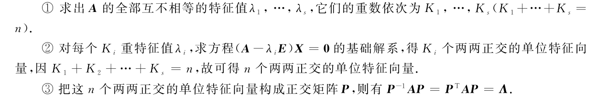

二次型及其标准型
----------------

### 二次型及其标准型

TODO

- 合同矩阵: 对于$n$阶矩阵$A$和$B$，若存在可逆矩阵$C$，使得$B= C^{T}AC$，则称二者合同，将$A$演变为$B$的过程叫做合同变换
  - 几何上: 对于满足$f(x) = x^TAx = 1$的圆锥曲线们，假设其是一个椭圆，然后将对应的$x$进行变换$x =  Py$，得到$f(y) = (Py)^T A (Py) = y^T (P^T A P)y$
  - TODO
- 任一二次型$f = x^T A x$，总存在正交变换$X = PY$，将其化为标准型，即$f = x^T B x$，其中$B$为对角阵，对角阵的值是$A$的$n$个特征值
  - 额，由于矩阵$A$是对称矩阵，故一定可以通过对角化

### 正定二次型

- TODO
- 这个教材上讲得太不直观了！！！

第六章 线性空间与线性变换
=========================

线性空间的定义域性质
--------------------

### 定义

- 满足以下8个运算的空间

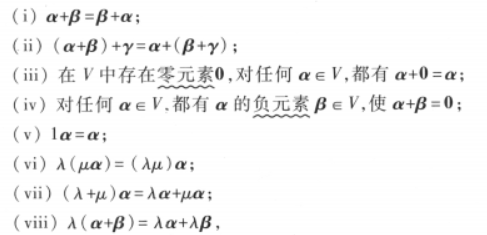

### 性质

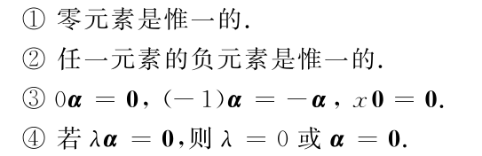

### 子空间

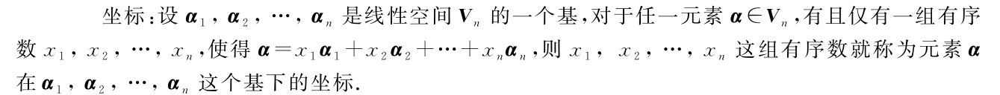

维数、基与坐标
--------------

> TODO: 太不直观了！

### 基

线性空间$V$中，存在$n$个元素 $\alpha_1, \alpha_2, \cdots, \alpha_n$满足以下条件则为其基:

- 线性无关
- $V$中任一元素，总可以由该线性组表示

只含有一个零元素的线性空间没有基,规定它的维数为$0$;维数为$n$的线性空间称为$n$ 维线性空间,记作$Vn$

