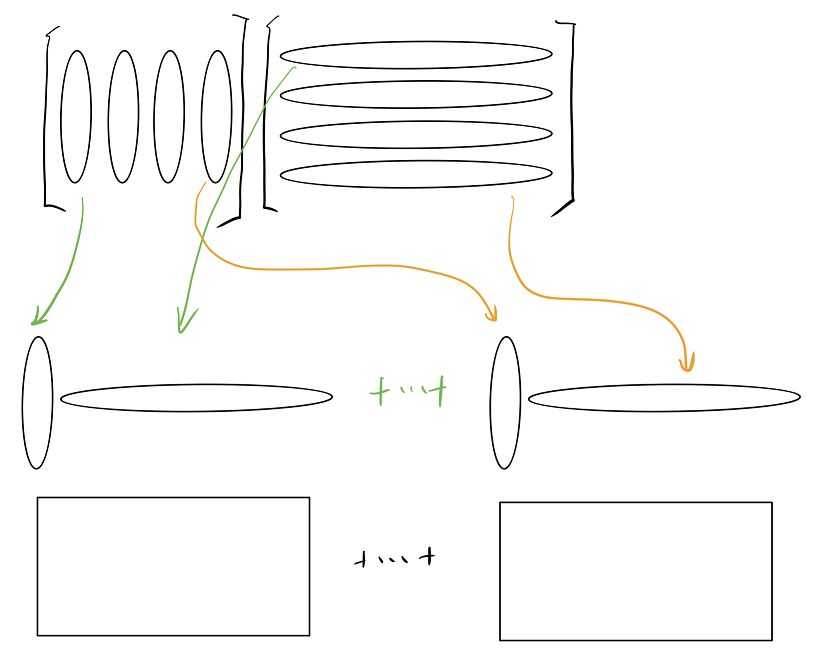

定义及性质
==========

矩阵的转置、逆运算及其性质
------------------

### 逆

**定义:** 方阵$A\in \mathbb{R}^{n\times n}$，另一方阵$B$满足$AB = I_n = BA$，则$B$和$A$互为逆，$B$可以被 denote 为 $A^{-1}$.

**性质:**

- $A$可逆，则$A$可以被叫做` regular/invertible/nonsingular`
- 如果可逆则逆矩阵唯一
- 二维矩阵的逆

### 转置

**定义: **矩阵$A\in \mathbb{R}^{m\times n}$的转置为$A^T\in \mathbb{R}^{n\times n}$，其中$A^{T}$是将$A$沿着对角线翻折后的矩阵，满足$A_{ij} = A'_{ji}$.

### 逆运算的性质

矩阵和矩阵的逆互逆
$$
AA^{-1} = I_n = A^{-1}A
\\
(A^{-1})^{-1} = A
$$
逆运算的结合律
$$
(AB)^{-1} = B^{-1}A^{-1}
$$

- $AB(AB)^{-1} = I_n \rightarrow B(AB)^{-1} = A^{-1} \rightarrow (AB)A^{-1} = A^{-1}B^{-1}$

矩阵相加的逆
$$
(A + B)^{-1} \ne A^{-1} + B^{-1}
$$
转置
$$
(A^T)^{-1} = (A^{-1})^T
$$

- $A^T\times (A^{-1})^T = (A^{-1}\times A)^T = I_n^T = I_n$

### 转置的性质

转置的转置
$$
(A^T)^T = A
$$
矩阵相加的转置
$$
(A+B)^T = A^T + B^T
$$

- 这很直观，两张纸，叠在一起后再翻折 == 先翻折再叠在一起

矩阵相乘的转置
$$
(AB)^T = B^TA^T
$$

- $((AB)^T)_{ij} = (AB)_{ji} = \langle A_{j, :}, B_{:, i}\rangle$
- $(B^TA^T)_{ij} = \langle(B^T)_{i, :}, (A^T)_{:, j}\rangle = \langle B_{:, i}, A_{j, :}\rangle$

矩阵增益
$$
(\lambda A)^T = \lambda A^T
$$

- 直观：将一张纸增大再翻转 == 先翻转再增大

公式记忆
========

二阶矩阵求逆、行列式
--------------------

求逆：主对调、次换号，除以行列式

行列式：对角线交叉相乘相减

运算技巧
========

矩阵乘法、矩阵乘向量的几种理解
------------------------------

**矩阵乘法的定义: ** 对于矩阵$A \in \mathbb{R}^{m\times n}$，矩阵$B\in \mathbb{R}^{n\times p}$，则矩阵乘法$AB = C$，其中
$$
C_{ij} = \sum_{k=1}^{n} A_{i,k}B_{k, i}
$$

- 注: 内积向量的长度即两个矩阵拥有相同长度的$n$

### 矩阵乘矩阵

**视角1: 线性变换**

- $AB = [AB_{:, 1}, AB_{2, 1}, \cdots, AB_{n, 1}]$，即表示$A$对$B$的每一列做线性变换，然后拼凑起来.
- 从这里可以理解，在解方程$AX = B$时，只需要逐个解出$AX_{:, i} = B_{:, i}$即可

**视角2: 矩阵相加**

- 第一个矩阵的列向量与第二个矩阵的行向量对应相乘，得到最终矩阵的分量，然后将各个分量加起来

### 矩阵乘向量

**视角1: 线性组合**

**视角2: 投影 | 线性变换**

- $b_i = \langle  a_{:, i}, x\rangle$，即，$b_i$的值是将$x$投影到$a_i$这个基上的长度，也就是，$x$在$A$列向量构成空间里的坐标!
- 也就是说$Ax$的结果，即将$x$从笛卡尔积变换到了$A$的列向量构成的坐标基.

SVD中矩阵形式的看法
-------------------

其中$B$是一个类似对角阵的矩阵，如下所示：

直观：$B$对$C$的每一行做增益，然后再和$B$相乘(像[普通矩阵乘法](矩阵乘法的几种理解)那样)

一个例子：

单位正交基构成的矩阵
--------------------

$D\in \mathbb{R}^{n\times n}$的$n$个列向量能长成$n$维空间，且各个基长度为$1$且正交:
$$
\Vert D_{:, i}\Vert_2 = 1 , i = 1, \cdots, n
\\
D_{:, i}\perp D_{:, j}, i\ne j
$$
**性质1: **  $DD^T = I$ 即 $D^{-1} = D^T$ 即 $D$的转置和$D$的逆运算等价

- 令$A = DD^T$，则对于主对角线上的元素$A_{i,i} = \langle D_{i, :}, (D^T)_{:, i}\rangle = \langle D_{i, :}, D_{i, :}\rangle = 1$，对于非主对角线上的元素$A_{i,j} = \langle D_{i, :}, (D^T)_{:, j}\rangle = \langle D_{i, :}, D_{j, :}\rangle = 0$ (正交)

对角阵二次型的结果
------------------

对于对角阵$\Lambda$，其二次型
$$
F(x) = x^T\Lambda x = \sum_{i} x_i^2\lambda_i
$$

- 可以从[对角阵做左乘和右乘](#对角阵做左乘和右乘)来理解，$\Lambda$先对$x$的每一行做拉伸，然后再和$x$做内积

对角阵做左乘和右乘
------------------

- 左乘：对于一个对角阵$A$，左乘矩阵$B$，则相当于将$B$对应的轴进行拉伸，即将$B$的第$i$行拉伸为$a_i$倍。
- 右乘：即对应拉伸$B$行空间，即，将$B$的第$i$列拉伸为$a_i$倍

EigenValue
==========

对角阵的特征值及其特征向量
--------------------------

**结论**

- 对角阵的特征值即对应的$n$个主对角线元素，其特征向量(归一化特征向量)即$n$个$e_i$。

**从几何上来理解特征向量**

- 对于一个对角阵$A$，其线性映射即把对应轴的拉伸$a_i$倍，其中$a_i$即$A$主对角线上第$i$个数值，显然队友$e_i$会仅仅会产生拉伸，即$Ae_i = a_i e_i$，所以显然$e_i$是特征值$a_i$的特征向量，而$e_i$共有$n$个，且是线性无关的，所以这$n$各$e_i$刚好构成了整个特征空间的基向量。

