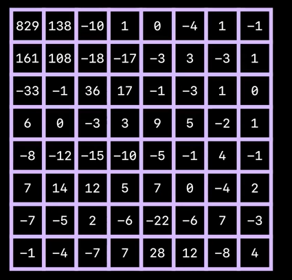

JPEG那不可思议的图片压缩原理
============================

要点
----

- 理解JPEG压缩的总体流程(有损、无损)
- 明确DCT进行压缩的原理(颜色空间变化、DCT压缩)

前言
----

2022年5月20日中午看到了这个视频: [The Unreasonable Effectiveness of JPEG: A Signal Processing Approach - YouTube](https://www.youtube.com/watch?v=0me3guauqOU)

最惊艳的点

- 理解DCT的变换原理 by 向量的乘法

要点

- 对压缩的哲学思考
  - `Lossy compression`: 无损压缩利用到了数据的冗余特征，例如哈霍曼编码
  - `Lossless compression`: 有损压缩利用到了主观意识下对某些数据的不明感性，例如这里的`JPEG`压缩方式
- `DCT`分解
  - 感性认识
  - 对其中可逆性的理解

一些图片
--------

`JPEG`总体流水线

`JEPG`使用流水线

A和B实际是完全相同的像素值

- 这是截图然后拼凑到一起的结果
  - 
  - 完全一致，但是从整体上差异很大

`YCbCr`空间

正文
----

### Color treatment

- 人类的视觉对亮度的敏感程度高于对颜色的敏感程度
- 将图片从`RGB`转换到`YCbCr`空间，直接从`Y`上去调控整体的亮度
- 既然对`Cb`和`Cr`不明感，那我们就对其下采样，并且保持`Y`不变

- `Cb`和`Cr`均压缩为`1/4`，从而整体压缩了`50%`

离散波形被分解

- 疑问是，8个点，真的能被七个其他系数来代表吗？

### JPEG Encoder

#### Forward DCT

两个信息

- 相机拍摄的图像，主要成分是低频
- 人眼对高频不敏感

DCT

- 对于时域中的采样信号，表示为$n$向量$\vec{x}$

- $X_k = \vec{C}^T_k\times \vec{x}$，反映了$\vec{x}$和$\vec{C_k}$的相似性，而$\vec{C_k}$是第$k$个基信号的采样值
- 当$\vec{x}$中不含有第$k$个分量的信号时，则在该基信号上的幅度即为0，不过能这样使用的前提条件是所有基得正交，且信号的确可以被这样分解(可证明)
- DCT是可逆的！

- $\vec{x}$是对应基信号以$\vec{X}$为权重的叠加，则$\vec{X_k}$是用于反映基信号$C_k$和$\vec{x}$的相似性
- 总之，通过对离散信号做$DCT$变换，可以将其分解为多个**已知**的信号的加权求和形式，而这些**已知的信号中有一些信号对图像视觉观感的影响很小，故可以去掉！**

图像的DCT压缩

- 以一个$8\times 8$的图像为例
- 对其做二维的DCT变换
  - 338则代表了其直流分量 -> 总亮度

- Energy Compaction: 能量的集中性

- 大多集中在低频，so，去掉一些高频影响不大

#### Quantization

- 实作取出高频的方法，并不是直接将高频的成分去处！因为我们并不(不能科学的)知道到底该去掉哪些成分，这里我们需要使用到`Quantization`方法
- 利用到量化的数值特点，来保证我们需要的数值特性: 数值较大者在量化、恢复后变化不大(例如下图的)
  - 感性上理解这里，

- 一个小实验，设置像素值`x = 338`,分别将n从1到100，然后计算量化误差:
  - 所以并不是除以的值越大，误差一定越大，总体规律
    - 周期性
    - 最大误差不断增加(灵敏度大)

#### Lossless Encoder

- 编码结果是稀疏矩阵，可以使用游程编码、哈夫曼编码

