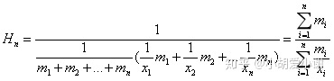

四种平均数
==========

算数平均数
----------

$n$个数据权值相同，都为$\frac1n$

- $f = \frac1n\sum_i x_i$
- 完全同等的对待每个数据
- 最终值再所有值的内部

加权算数平均数

- 基于事实给予不同的权值
- $f = \sum_i w_i x_i$
- 根据权值来设定重要程度

调和平均数
----------

### 简单调和平均数

- $f = \frac{1}{\frac1n \sum_{i=1}^n\frac1 {x_i}} = \frac n {\sum_{i = 1}^{n}\frac{1}{x_i}}$
- 二元的情况: $f = avg(a, b) = \frac{2}{\frac 1a + \frac 1b} = \frac{2ab}{a + b}$
- 值会变小：最终值均小于原本值 $a < a(\frac{b}{a + b})$
- 偏向更小者: 若$a < b$，则$ f < a < b$，显然$f$会更靠近$a$
- 偏爱更小者: 更小者对$f$的灵敏度更大，$\frac{\partial f}{\partial a} > \frac{\partial f}{\partial b} $ if $ a < b$

### 加权调和平均

几何平均数
----------

### 简单几何平均数

$$
f = \sqrt[n]{x_1x_2\cdots x_n}
$$

### 加权集合平均数

$$
f = \sqrt[{\sum_i w_i}]{\prod_i x_i^{w_i}}
$$

TODO: 理解其应用场景
====================

