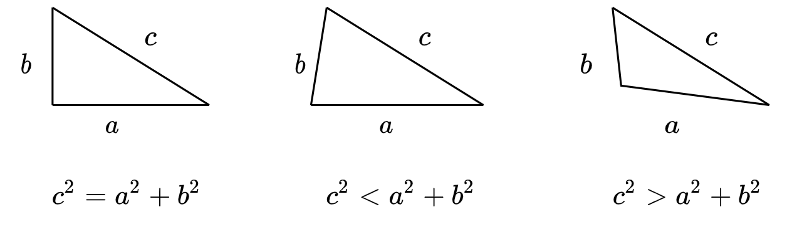
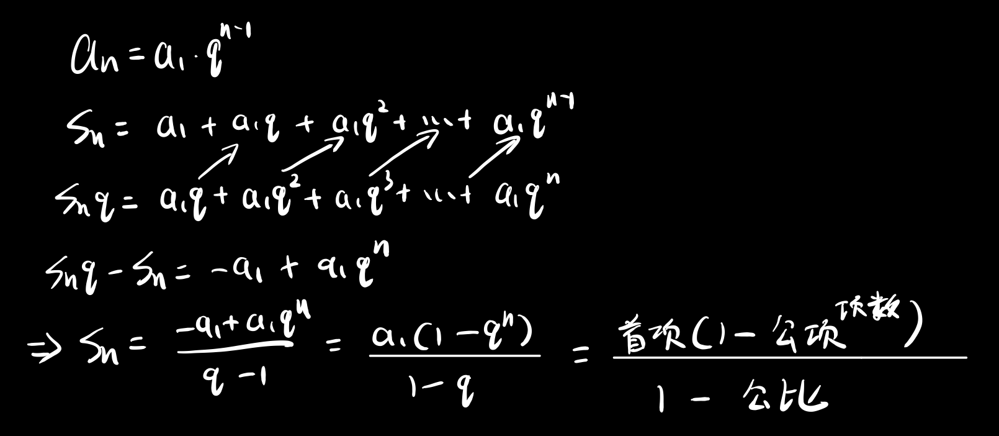

双重求和
======

从矩阵的视角来看
----------------

> 理解
>
> - 为什么双重求和可以交换顺序？
> - 为什么可以将一些常数外面来？

$$
\sum_{i}^m\sum_j^n a_{ij}^ = \sum_j^n\sum_i^m a_{ij}
$$

可以将这个过程看做是对矩阵$A^{m\times n}$中每个元素先行内求和，然后将最终的一列求和，等价于下列矩阵操作：
$$
x^{1\times m}A^{m\times n} y^{n\times 1}
$$

- 其中$y^{n\times 1}$是一个列向量，全由$1$组成，$x$也是全由$1$构成的向量
- 两个计算顺序无非是利用到了向量乘法的结合律：($x^{1\times m}A^{m\times n}) y^{n\times 1} = x^{1\times m}(A^{m\times n} y^{n\times 1})$

如何理解解线性方程时出现的$0=0$
===============================

在解线性方程组的时候，出现$k$个$0=0$的方程，这说明去掉这$k$个方程后不会改变方程组的解集，这$k$个方程是没有用处的，他们可以由那几个有用的方程推导出来。

- 即这$k$行，是另外那$n-k$行的线性组合，是没有信息的等式

三角形判断法则
==============

是否构成三角形
--------------

需要三条边都满足小于其余两边之和
$$
\begin{cases}
a + b > c \\
a + c > b \\
b + c > a
\end{cases}
$$

判断三角形形状
--------------

注
$$
\cos(C) = \frac{a^2 + b^2 - c^2}{2ba}
$$

等差数列求和公式的理解
======================

$$
1 + 2 + \cdots + n = \frac{n(n + 1)}{2}
$$

- 首尾成对，例如$1$和$n$成对，$2$和$n-1$成对，每一对求和的结果是$n+1$
- 不管$n$为奇数还是偶数，都将有$\frac n2$对$n+1$

所以等差数列求和结果即:
$$
\frac{项数}{2} (首项 + 末项) = \frac{a_1 + a_{n}}{2}
$$

等比数列求和公式的理解
======================

- 构造出另一个$S_n$，然后一相减发现求和符号(需要加很多项的那个符号)没了
- 错位相减法

