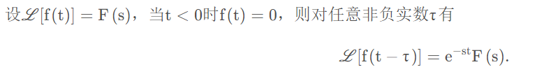

参考
====

- [MIT—微分方程笔记20 拉氏变换求解线性常微分方程 - 知乎 (zhihu.com)](https://zhuanlan.zhihu.com/p/107466016#:~:text=拉普拉斯变换解微分方程 微分方程  [y'' %2B Ay' %2B By,[y (0) %3D {y_0}%2Cy' (0) %3D {y'_0}] 。)

拉普拉斯变换
============

定义及基本变换
--------------

函数$f(t)$的拉普拉斯变换:
$$
F(s) = \int_0^{+\infty} f(t)e^{-st}dt
$$
**基本变换公式:**
$$
\begin{align}
\mathcal{L}(1) &= \frac1s
\\
\mathcal{L}(e^{at}f(t)) &= F(s - a) , (s > a)
\\
\mathcal{L(\cos(at))} &= \frac{s}{s^2 + a^2} 
\\
 \mathcal{L(e^{at})} &= \frac{1}{s - a} 
\\
 \mathcal{L}(t^n) &= \frac{n!}{s^{n+1}}
\\
 \mathcal{L}(\sin at) &= \frac{a}{s^2 + a^2}
\end{align}
$$
**导函数变换公式:**
$$
\begin{align}
\mathcal{L}(f'(t)) &= sF(s) - f(0)
\\
\mathcal{L}(f''(t)) &= s^2F(s) - sf(0) - f'(0)
\end{align}
$$
**线性特性:**

**相似特性:**

- 将时域压缩，则$s$域被拉伸(假设 a > 1)

**微分性质**

**$s$域微分:**

**积分:**

**$s$域积分:**

**延迟特性:**

**位移特性:**

求解微分方程
------------

步骤：对方程两边做拉氏变换，求出$Y(s)$，最后使用拉氏逆变换

**例1:** 微分方程$y'' - y = e^{-t}$，初值$y(0) = 1, y'(0) = 1$

因式分解技巧
------------

- 求系数的口诀: 原分子/当前阻尼带入其他分母的乘积

