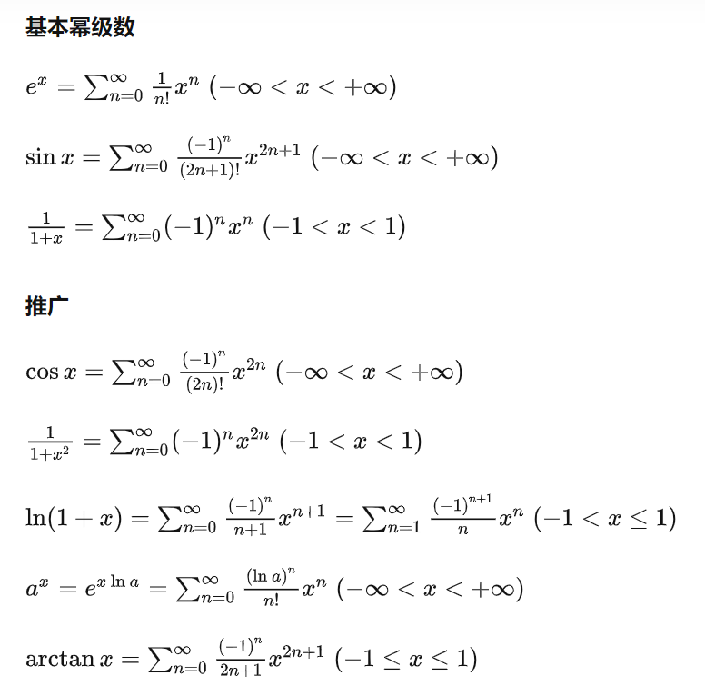

泰勒展开
--------

函数$f(x)$在$x_0$这一点展开:
$$
\begin{align}
f(x) &= f(x_0) + f'(0)(x - x_0) + \frac{1}{2!}f''(x_0)(x - x)^2 +  ... \frac1{n!}f^{(n)}(x - x_0)^n + O(x - x_0)^n (x \rightarrow x_0)
\\
&= \sum_n^{\infty} =  \frac{f^{(n)}(x)}{n!}(x - x_0) ^n

\end{align}
$$
当$x_0 = 0$时，即为麦克劳林级数.

初等函数的幂级数展开
--------------------

