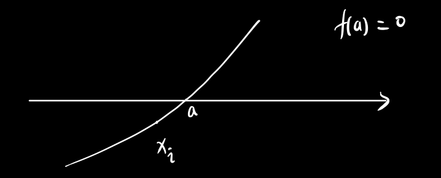
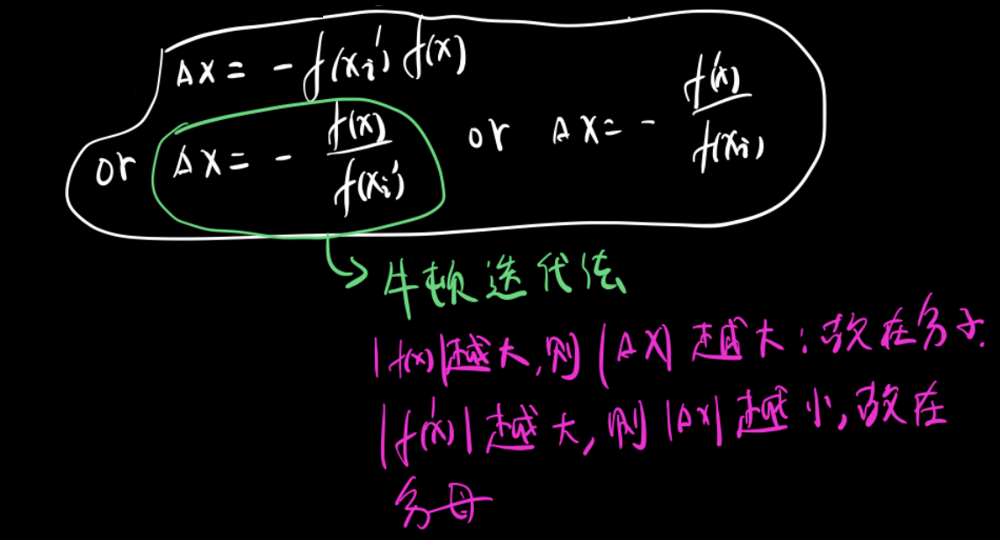

牛顿迭代法求零点的理解
======================

对于$f(x)$，想要求得其零点$a$，可以通过牛顿迭代法来不断逼近$a$，不同迭代法迭代都是更新$x_i \rightarrow x_i + \Delta x$，关键在于这个$\Delta x$的计算，这篇博客完成两件事情：

- 证明$\Delta x$与$f(x_i)f'(x_i)$异号
- 直观上理解牛顿迭代法的$\Delta x$
- TODO: 证明牛顿迭代法的优点

证明$\Delta x$与$f(x_i)f'(x_i)$异号
-----------------------------------

令
$$
G(\Delta x) = \{f(x_i + \Delta x) - f(a)\}^2 = f^2(x_i + \Delta x)
$$
我们希望我们的$G(\Delta x)$满足$G(\Delta x) < G(0)$，而$G'(0) = 2f(x_i)f'(x_i)$，则:

- 若$f(x_i)f'(x_i) > 0$，则$\Delta x < 0$
- 反之

即$\Delta x$与$f(x_i)f'(x_i)$异号

直观上理解牛顿迭代法的$\Delta x$
--------------------------------

满足异号的情况下，$\Delta x$的三种情形：

$$
\Delta x = - \frac{f(x)}{f'(x_i)}
$$
