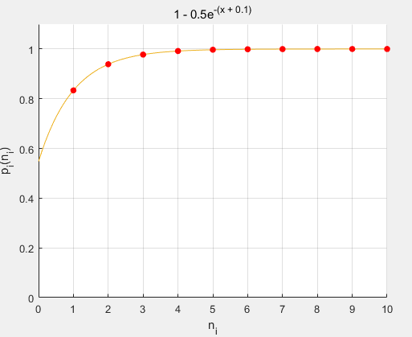
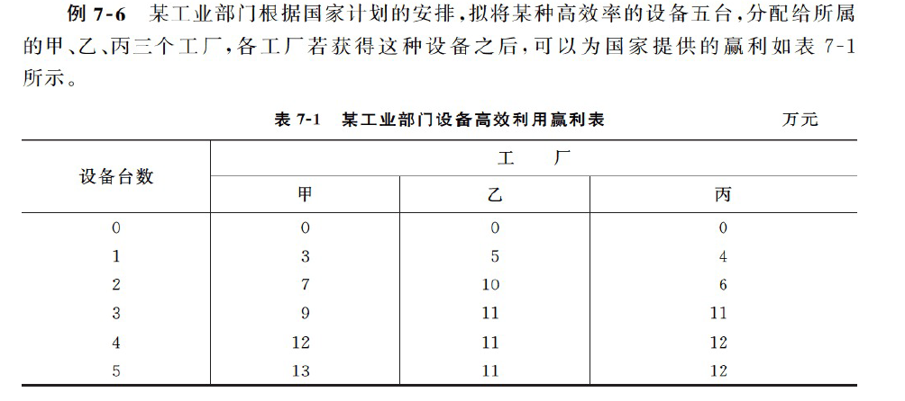

概述
=======

- 将一类多阶段决策过程转化为一系列相互联系的单阶段规划问题。
- 最优性原理
- 普遍针对：以时间划分阶段的动态过程的优化问题。
  - 一些静态优化可以人为的引入时间因素

动态规划基本方程
===================

基本要素
--------

### 阶段 - step

- 按照时间、空间划分阶段
- 第$k$阶段，$k = 1, 2, \cdots, n$，共$n$个阶段。

### 状态 - state

- 每个阶段所处的**自然状态** -> 能描述当前决策的**环境**
- 无后效性：此后阶段仅与该阶段的状态有关，而与之前的状态无关
- 状态变量：$s_k$
- $S_k = \{s_k\}$ -> 第$k$阶段允许的状态集合

### 决策 - decision

- 根据当前情形（状态），做出一种选择（决策），进入到下一个阶段 -> 决策（控制）过程
- $u_k(s_j)$ -> 决策变量 -> 第$k$阶段处于第$j$个状态所做的决策
- 允许决策集合：$\mathcal{U}_k(s_j)$

### 策略 - policy

- 决策序列组成策略
  - 全过程策略：$p_{1n}(s_1) = \big\{ u_1(s_1), u_2(s_{j2}), \cdots, u_n(s_{jn}) \big\}$​ -> 从初始状态到过程结束的所有策略序列​
  - 后部子过程策略
  - 阶段子过程策略

### 状态转移方程 - equation of state transition

- 下一个状态 由 上一个状态 及 其所作的策略 决定。
- $s_{k + 1} = T_k(s_k, u_k), k = 1,2, \cdots, n$

### 指标函数 objective functions

- 评价某个策略（决策序列）的优劣

- $\mathcal{V}_{kn}(s_k, u_k, s_{k+1}, \cdots, s_{n + 1})$​

  - 阶段$s_k$​​做出决策$u_k$​，一直到最后一个状态$s_{n + 1}$。注意，可以做出决策的状态有$n - k + 1$个，即$n - k + 1$个阶段

- 阶段指标：阶段$j$的状态为$s_j$，决策为$u_j$，则这一阶段的评价（收益、指标、损失……）为$v_{j}(s_j, u_j)$

  - 显然$j = 1, 2, \cdots, n$​

- 不同问题的评价指标累计方法不同，形式有

  - 和：$\mathcal{V}_{kn} = \sum\limits_{j = k}^{n}v_j(s_j, u_j)$
  - 积：$\mathcal{V}_{kn} = \prod\limits_{j = k}^{n}v_j(s_j, u_j)$
  - 极大：$\mathcal{V}_{kn} = \max\limits_{k \le j \le n}v_j(s_j, u_j)$
  - 极小：$\mathcal{V}_{kn} = \min\limits_{k \le j \le n}v_j(s_j, u_j)$

- $\mathcal{V}_{kn}$可以由当前所处状态以及次以后的策略决定

  - $$
    \begin{array}{l}
    \mathcal{V}_{kn}
    &= \varphi_{kn}(s_k, u_k, \mathcal{V}_{(k+1)n}(s_{k+1}, \cdots, s_{n+1})) \\
    
    
    \end{array}
    $$

### 最优值函数

- 状态$s_k$给定，后部子过程策略的最优值函数叫做最优值函数，优劣程度由指标函数确定

- $$
  f_k(s_k) = \underset{p_{kn}\in P_{kn}(s_k)}{OPT}\mathcal{V}_{kn}(s_k, p_{kn})
  $$


  - 即最优的值，状态$s_k$的最优值是在从$s_k$开始的整个策略集合中选出的最优策略。

### 最优策略和最优轨线 optimal policy and optimal trajectory

- 从第$k$阶段开始到最后使得指标函数达到最优值的策略
  - 最优策略即：$p^*_{kn} = \big\{ u^*_k, u^*_{k + 1}, \cdots, u^*_{n} \big\}$
- 最优轨迹即按照最优策略走过的每一个状态
  - 最优轨迹即：$s^*_{k(n+1)} = \big\{ s^*_k, s^*_{k + 1}, \cdots, s^*_{n+1} \big\}$

## 动态规划基本方程

### 两个结论

- 评价指标是和的形式

#### 最优性原理

- 若$p^*_{kn}$是最优策略，则对任意$k\le j \le n$，他的子策略$p^*_{jn}$对任意之前所有策略一定是最优的。
  - 即只要走到了$j$，那么沿着$p^*{jn}$​一定是最优的 -> 即直接用子问题的解了，复杂度大大减小。

#### 结论2

$$
f_k(s_k) = \underset{u_k\in U_k(s_k)}{OPT}\big\{ v_k(s_k, u_k(s_k)) + f_{k + 1}(u_j(s_k)) \big\}
$$


- 动态规划基本方程

$$
\begin{cases}
f_k(s_k) = \underset{u_k\in U_k(s_k)}{OPT}\big\{ v_k(s_k, u_k(s_k)) + f_{k + 1}(s_{k+1}) \big\}  \\
f_{n + 1}(s_{n+1}) = \varphi(s_{n+1})  & \text{终端条件} \\
s_{k+1} = T_k(s_k, u_k(s_k)), s_k\in S_k & \text{状态转移} \\
k = n, n-1, \cdots, 1

\end{cases}
$$

- 其中终端条件不同问题可以设置，一般和形式为0，积形式为1

### 求解步骤和思路

- 充分理解问题，划分阶段，选取状态变量和决策变量->确定状态转移方程->确定评价函数，确定最优值函数。
- 从边界条件开始，递推寻优。
- 核心：前一阶段和未来各阶段相互分离，当前效益和未来效益结合起来。
- 回溯可以得到最优路线。

动态规划建模
===============


生产与存储问题
--------------

### 符号说明

| 符号                             | 说明                                                      | 单位 |
| -------------------------------- | --------------------------------------------------------- | ---- |
| $n$                              | 总共有$n$个阶段                                           |      |
| $s_k\quad (n = 1, 2, \cdots, n)$​​ | 第$k$​个阶段所处的状态为$s_k$​，该阶段初商品的存储量为$s_k$ |      |
| $u_k\quad (n = 1, 2, \cdots, n)$ | 决策变量，第$k$个阶段生产的产品数量                       |      |
| $M$​                              | 每个阶段的生产上限                                        |      |
| $d_k$                            | 第$k$个阶段市场对商品的需求量                             |      |
| $p_k$                            | 第$k$个阶段生产一件产品所需要的成本                       |      |
| $q_k$                            | 第$k$个阶段一件产品的售价                                 |      |

### 模型建立

第$k+1$​个状态由第$k$​个状态和第$k$​个状态所做出的决策$u_k$​​决定，故：
$$
s_{k+1} = s_{k} + u_k - d_k
$$
在第$k$​​​个状态，由决策$u_k$​​​决定的成本为该阶段的成本，同时考虑生产准备费用$K$​，则有​：
$$
c_k(s_k, u_k) = \begin{cases}

u_kp_k + K & u_k > 0 \\
0 & u_k = 0
\end{cases}
$$
$f_k(s_k)$表示第$k$​个阶段初存储量为$s_k$时，从第$k$个阶段到第$n$个阶段按最优策略经营所获得的最小成本时的成本指标函数，则有：
$$
f_k(s_k) = \underset{p_{kn}\in P_{kn}}{OPT}\mathcal{V}_{kn}(s_k, p_{kn}(s_k)) = \max \big\{ v_k(s_k, u_k) + f_{k + 1}(s_{k+1}) \big\}
$$
考虑到第$k$个阶段初具有一定的货物存储量$s_k$，对应的存储成本为：
$$
h_k(s_k)
$$
综上可知第$k$个阶段所需要的成本为：
$$
v_k(s_k, u_k) = c_k(s_k, u_k) + h_k(s_k)
$$
再考虑到每个阶段的生产量具有上限$M$​​​​，且每个月的销售量不能超过初始存储量和生产量，此问题的动态规划基本方程为：
$$
\begin{cases}
f_k(s_k) = \min\limits_{s_k - d_k\le u_k \le M}^{} \big\{ v_k(s_k, u_k) + f_{k + 1}(s_{k+1}) \big\}  \quad (n = 1, 2, \cdots, n)\\
s_{k+1} = s_{k} + u_k - d_k \quad (n = 1, 2, \cdots, n-1) \\
0 \le u_k \le M \quad (n = 1, 2, \cdots, n) \\
0 \le d_k \le s_k + u_k \quad (n = 1, 2, \cdots, n)  \\
f_{n+1}(s_{n+1}) = 0

\end{cases}
$$
所以该问题的数学模型为：
$$
\begin{array}{l}
\min & \sum\limits_{k=1}^n\big(v_k(s_k, u_k)\big) \\
s.t. &
\begin{cases}
s_{k+1} = s_{k} + u_k - d_k\quad (k = 1,2, \cdots, n)  \\
s_0 = 0, s_{n + 1} = 0\\
0\le u_k \le M  \\
x_k \text{为正整数}
\end{cases}

\end{array}
$$

- 为什么教材上$u_k$的范围可以从0开始？？？

资源分配问题
------------

### 符号说明

| 符号       | 说明                                                       |
| ---------- | ---------------------------------------------------------- |
| $s_k$      | 待分配给剩余第$n - k + 1$​个个产品的资源数量，显然$s_1 = a$ |
| $x_k$      | 第$k$个产品所分配的资源数量，显然有$s_k \ge 0$             |
| $g_k(x_k)$ | 第$k$个产品的收益                                          |


### 模型建立

第$k$个产品的允许决策集合:$U_k(s_k)=\{ x_k|0\le x_k \le s_k \}$

最优值函数表示以数量为$s_k$的原料分配给第$k$种值第$n$种产品所能得到的最大收益，则动态规划基本方程为：
$$
f_k(s_k) = \underset{0\le x_k \le s_k}{\max}\big\{ g_k(s_k) + f_{k+1}(s_{k+1}) \big\} \quad k = n, n - 1, \cdots, 1
$$
其中状态转移方程为:$s_{k+1} = s_{k} - x_k$​

初始状态：$s_1 = a$

### 总结

- 整个模型的建立是首先确定了状态变量和决策变量
  - 其中状态变量是一个阶段量，反应的是该阶段资源、形式等等
  - 决策变量是可动变量，由于其具有一定的可动性，故通过调整不同的决策变量可能导致不同的收益情况
- 然后建立状态转移方程
  - 状态之间的转换过程
  - 同时注意决策变量的允许决策集合
- 然后确定阶段指标函数的形式，从而明确再某个状态做出某个决定所带来的收益、损失等等
- 最后根据目标，将阶段指标函数和状态状态转移联系起来确定动态规划基本方程。
- 如果要求解，则需要确定终端状态，逐个计算。

系统可靠性问题
--------------

### 问题明确

对于$n$个串联的设备，每个设备都可以添加备用$n_i$个备用元件来提高整体可靠水平。显然备用元件越多可靠性越强，倒是有两个限制：

- 整个备用设备（不包括正常使用的设备）的总重量不超过$W$
- 备用元件总费用不超过$C$

如何分配$n_i$可以使得最终的可靠性最大？

### 关键点：可靠性

感性上说，每一个设备的可靠性是关于备用设备$n_i$的正相关函数，所以就可以定义为$g_i(n_i) = n_i$。

但是要注意系统处于串联状态，故系统的可靠性可以由最最低可靠性设备来评价。即
$$
\max \min\big\{ g_i(n_i) \big\}
$$
考虑这样一种情况，设备各不相同，比如说一个电阻，也许一个电阻正常平均使用时间为1年，几乎只需要一个备用就好了。但是对于一个LCD显示屏，也许用了一个月就不行了，所以需要配12块才行。显然直接用备用的数量来定义$g_i(n_1)$是不可取的。考虑到每个设备的可靠性是相互独立的，同时我们希望他们对目标函数的贡献是平等的，故可以考虑对每一个设备的可靠性用概率来进行描述，且由于相互独立，故系统可靠性是乘积关系
$$
\max \prod_{i = 1}^np_i(n_i)
$$
我们需要根据系统来获取这个概率。

感性认识这个函数，对于电阻，随着个数的增加，其概率几乎稳定为1，而且即使备用个数为0，但是其概率也很高。例如：



### 静态规划模型

综上所述，该模型是一个有约束的**非线性整数规划**模型
$$
\begin{array}{l}
\min & P = \prod_{i = 1}^np_i(n_i)  \\
s.t. &
\begin{cases}
\sum\limits_{i = 1}^n n_ic_i \le C \\
\sum\limits_{i = 1}^n n_iw_i \le M \\
n_i\text{均为非负整数}
\end{cases}

\end{array}
$$

### 动态规划模型

> 按照上面总结的步骤，一步一步来，实际上这是顺理成章的。

将该问题划分为$n$步决策问题，考虑第$k$步考虑第$k$​个设备所需要安装的设备数量$n_k$，建立动态规划模型。

对于第$k$个阶段，做出决策所需要的信息包括两个状态变量，分别是：剩余可增重量$y_k$和剩余可用费用$z_k$，由于存在两个状态变量，故有两个状态方程：
$$
\begin{cases}
y_{k+1} = y_{k} - n_kw_k  \\
z_{k+1} = z_k - n_k c_k 
\end{cases}
$$
第$k$个设备的允许决策集合：
$$
U_k(y_k, z_k) = \left\{ n_i|0\le n_i\le \delta _k \right\} \ \text{其中\ }\delta _k=\min\text{\,\,}\left\{ \lfloor \frac{y_k}{w_k} \rfloor \,\,\lfloor \frac{z_k}{c_k} \rfloor \right\}
$$
当当前状态是$\left( y_k,\ z_k \right) $，则从第$k$个设备到第$n$个设备决策过程种的最大可靠程度为$f_{k}(y_k, s_k)$，则该过程的动态规划基本方程为：
$$
f_k\left( y_k,\ z_k \right) \ =\ \underset{0\le n_i\le \delta _k}{\max}g_k\left( n_i \right) f_{k+1}\left( y_{k+1}\left( n_i \right) ,\ z_{k+1}\left( n_i \right) \right)
$$
终端条件有：
$$
f_{n+1}(y_{n+1}, z_{n+1}) = 1
$$

整数分割问题
------------

### 问题明确

一个正整数$C$，将其拆分为n个正整数之和，如何拆分能使得这$n$个正整数的乘积最大。

### 静态规划模型

$$
\begin{array}{l}
\max  & \prod\limits_{i= 1}^nx_i  \\
s.t. &
\begin{cases}
\sum\limits_{i = 1}^nx_i = C  \\
x_i \in Z^+

\end{cases}

\end{array}
$$

- 整数非线性规划！

### 动态规划模型

> 注意到每一个决策变量可以看作是对应阶段所作出的决策。从而可以用建立动态规划的模型，利用动态规划算法来进行求解。

状态设置为拆分第$k$​个数时还剩余的整数$s_k$​，显然有$s_1 = C$。又需要保证一定能拆分成指定的整数个数故有$\ s_k \ge n - k + 1$​​。

第$k$个阶段拆分出来的数为$x_k$。

状态转移方程：$s_{k+1} = s_k - x_k$

允许决策集合为：
$$
U_k\left( s_k \right) \ =\ \left\{ x_i|1\le x_i\le n-s_k+1 \right\}
$$
则该问题的动态规划基本方程为：
$$
f_k\left( s_k \right) =\ \underset{1\le x_i\le n-s_k+1}{\max}f_{k+1}\left( s_{k+1} \right) \times x_i
$$
终端条件为：
$$
f_{n+1}(s_{n+1})= 1
$$

### CPP实现

- 要点
  - 采用递归
  - 由于每一层的次数不定，故每一层用map来存储
- 代码核心
  - 递归的每一次填充$D[C][n]$，当然在函数中需要递归的取调用其子问题
- 注意
  - 使用某一分支前需要检查是否已经计算过了：`if (dp[C - x].find(n - 1) == dp[C - x].end()) // 没找到`
  - 递归基返回时需要对$dp$赋值

```C++
3 10
dpValue[2][10] = 25
dpValue[2][9] = 20
dpValue[2][8] = 16
dpValue[2][7] = 12
dpValue[2][6] = 9
dpValue[2][5] = 6
dpValue[2][4] = 4
dpValue[2][3] = 2
dpValue[2][2] = 1
dpValue[2][1] = 0
dpValue[2][0] = 0
dpValue[3][10] = 36
  3  3  4
```

### 输出

```powershell
10 3
10      3
9       2
8       1
7       1
6       1
5       1
4       1
3       1
2       1
1       1
8       2
7       2
6       2
5       2
4       2
3       2
2       2
DP(1, 1) = 1
DP(2, 1) = 2
DP(2, 2) = 1
DP(3, 1) = 3
DP(3, 2) = 2
DP(4, 1) = 4
DP(4, 2) = 4
DP(5, 1) = 5
DP(5, 2) = 6
DP(6, 1) = 6
DP(6, 2) = 9
DP(7, 1) = 7
DP(7, 2) = 12
DP(8, 1) = 8
DP(8, 2) = 16
DP(9, 2) = 20
DP(10, 3) = 36
  4  3  3
```

========================

一维资源分配问题
----------------



这里的时序过程可以是：逐个分配机器给甲乙丙三个工厂，即分为三个阶段，编号为1,2,3。建模

- $s_k: $ 第$k$个阶段还剩余的机器数量，显然$s_k \in [0, 5]$，且$s_1 = 5$
- $x_k:$ 第$k$阶段所做的决策，表示分配给第$k$个工厂的数量，显然有$0\le x_k \le s_k$
- $s_{k+1} = s_k - x_k$： 状态转移方程
- $opt_k(s_k) = \max_{0\le x_k \le s_k}\{ P_k(x_k) + opt_{k+1}(s_k - x_k) \}$
- $f_4(s_4) = 0$: 边界条件，显然要求最终必须分配完成

动态规划解决线性规划问题
========================

$$
\begin{array}{l}
\max  & x_1x_2x_3  \\
s.t. &
\begin{cases}
x_1 + 5x_2 + 2x_3 \le 20  \\
x_i \in Z^+
\end{cases}

\end{array}
$$

显然，可以将每一个看作是一个状态，然后递归解决。

状态：第$k$个状态为$s_k$，表示剩余的资源，该状态的决策变量为$x_k$​。

则状态转移方程为：
$$
s_{k+1} = s_k - x_kc_i
$$
显然允许决策集合为：
$$
U_k\left( s_k \right) \ =\ \left\{ x_i|0\le x_i\le \lfloor \frac{s_k}{c_k} \rfloor \right\}
$$
其中$c_k$是第$k$个阶段的系数。

则动态规划基本方程为：
$$
f_k\left( s_k \right) =\ \underset{x_i\in U_k\left( s_k \right)}{\max}x_if_{k+1}\left( s_{k+1} \right) 
$$
终端条件为：
$$
f_{n+1}\left( s_{n+1} \right) \ =\ 1\
$$

CPP实现
-------

```c++
#include "myLib.h"

// 1
#define NOTFIND(MAP, targetValue) (MAP.find(targetValue) == MAP.end())
const int MAXN = 100;            // 最大决策变量个数
map<int, int> dpValue[MAXN + 1]; // 对于某一层i 选择决策变量资源数量，对应的最优值 dpVale[i][x]->second
int coeVec[MAXN + 1];            // 各个决策变量的系数

// 2
void dpFunc(int i, int source)
{
    // printf("dpValue[%d][%d]\n", i, source);
    // 最后一个变量了
    if (i == 1)
    {
        dpValue[i][source] = source / coeVec[i]; // 最后一层直接用，表示只有一个决策变量的时候
        return;
    }

    // 非最后一个变量
    dpValue[i][source] = 0;
    _for(x, 0, (source / coeVec[i]) + 1)
    {
        // 子问题未解，则递归求解
        if (NOTFIND(dpValue[i - 1], source - x * coeVec[i]))
        {
            // printf("Not find %d %d\n", i-1, source - x * coeVec[i]);
            dpFunc(i - 1, source - x * coeVec[i]);
        }

        // 决策
        int temp = dpValue[i - 1][source - x * coeVec[i]] * x;
        if (dpValue[i][source] < temp)
        {
            dpValue[i][source] = temp;
        }
    }
    printf("dpValue[%d][%d] = %d\n", i, source, dpValue[i][source]);
}

void showDpPath(int decNum, int source)
{
    if (decNum == 1)
    {
        printf("X(%d) = %d\n", decNum, source / coeVec[decNum]);
        return;
    }

    // 查找决策变量
    _for(x, 0, (source / coeVec[decNum]) + 1)
    {
        if (dpValue[decNum][source] == dpValue[decNum - 1][source - x * coeVec[decNum]] * x)
        {
            printf("X(%d) = %d\n", decNum, x);
            showDpPath(decNum - 1, source - x * coeVec[decNum]);
            break;
        }
    }
}

int main()
{
    int decNum, source;
    while (cin >> decNum >> source)
    {
        // initial dp map
        _for(i, 1, decNum + 1)
            dpValue[i]
                .clear();

        // input coefficient
        _for(i, 1, decNum + 1)
                cin >>
            coeVec[i];

        dpFunc(decNum, source);
        showDpPath(decNum, source);
        cout << endl;
    }
}
```


输出
----

```
3 20
1 5 2
dpValue[2][20] = 20
dpValue[2][18] = 16
dpValue[2][16] = 12
dpValue[2][14] = 9
dpValue[2][12] = 7
dpValue[2][10] = 5
dpValue[2][8] = 3
dpValue[2][6] = 1
dpValue[2][4] = 0
dpValue[2][2] = 0
dpValue[2][0] = 0
dpValue[3][20] = 28
X(3) = 4
X(2) = 1
X(1) = 7
```

问题总结
--------

- 理解`map<decNum, source> dpValue` 对应于状态确定一个状态，source里面存储所有的状态信息(例如剩余资源)，$s_k \rightarrow dpValue[k][source]$​​  可以很好的确定在阶段k下面，面对已有资源source做出最优决策。source是要对当前状态量的一种编码，当状态量比较复杂度时候，可以考虑存储结构体指针，然后存储在结构体中

