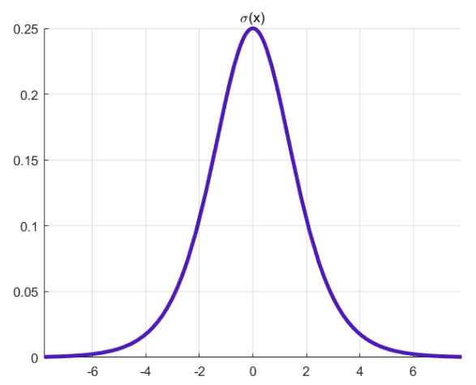

前言
====

这篇文章起源于不理解使用**交叉熵**做分类问题损失函数，首先介绍了源自信息论中关于**自信息、熵**的概念，然后说明使用**交叉熵**来进行概率分布相似性评估的可行性，随后说明使用交叉熵进行模型优化的方法。然后解决最初的疑问(即为什么使用交叉熵做分类问题损失函数会更好(而不使用均方差)？)，最后给出**KL散度**的定义，并尝试解释其直观理解。

正文
====

给定随机变量$x$，这里假设为离散变量(谁叫离散的更好理解呢!)，其取值为$x_1, x_2, \cdots, x_n$

自信息
------

**理解事件发生的信息:**

自信息用于量化某一事件发生所能提供的信息量，直观上说某一事件越不出乎意料(概率越大)，则其发生所能提供的信息量越低，反之如果其发生的概率越小，则所能提供的信息量越大。

总之一个事件发生所能提供的信息量与其概率成反相关，且还额外规定当概率为$0$时，信息量无穷大，当概率为$1$时，信息量为$0$，从满足这三种性质中的函数集中挑出来一个函数：$f(x) = -\log(x)$ 来使用。

**自信息定义：**

设某一事件发生的概率为$P(x_i)$，则该事件**发生**所**带来的信息量**的大小为成为自信息，定义为：
$$
I(x_i) = -\log(x_i)
$$
**举例: **

- $x$表示太阳升起的方向，$x = \{东,西\}$，对应的概率$P(东) = 1\ \ P(西) =0$，则事件$x$发生为东的信息量为0，而发生为西的信息量为$+\infty$

信息熵
------

**理解及定义:**

自信息描述了随机变量$x$中某一事件$x_i$发生时所带来的的信息量，但是随机变量$x$有$n$个事件，如何评估这个随机变量的不确定性、所能带来的信息量呢？即信息熵，定义为$x$中各个事件的期望:
$$
H(x) = E[I(x)] = -\sum_{i = 1}^n P(x_i) \log (P(x_i))
$$
**举例:**

- 太阳升起的方向$x$这一随机变量，总体的信息量为$H(x) = 1\times 0 + \lim_{x\rightarrow 0} [x\log(x)]  = 0$，即这个随机事件总体的信息量为$0$

**直观理解:**

随机变量概率分布越不均匀，表示其可能偏向于某一趋势，即整体不确定性更低。当分布逐渐均匀后，观察者无法很好的预测该随机变量是否有某种趋势，所以整体的不确定性高，当均匀分布时对应的熵达到最大。

交叉熵
------

**明确目标:**

对于随机事件$x$，其真实分布为$P(x)$，其估计分布为$Q(x)$，那如何评估两个分布之间的差异呢？答: 交叉熵可以！下面首先给出交叉熵的定义，然后说明交叉熵的性质。

**交叉熵定义:**
$$
H(P, Q) =  E_P[I_Q(x)] =  -\sum_{i = 1}^n P(x_i) \log (Q(x_i))
$$
**交叉熵的性质:**

不等式:
$$
H(P, Q) \ge H(P)
$$

- **等号成立:** 当且仅当$P$和$Q$完全一致时
- **描述$P$和$Q$之间的差异大小:** 当两个分布$P(x)$和$Q(x)$差异越大时，$H(P, Q)$的值越大，差异越小则逐渐降低至$H(P)$
- TODO: 证明该不等式

**交叉熵用于分类模型的优化:**

分类模型的输出即$Q(x)$，而真实分布(训练标签)为$P(x)$，可令Loss函数为$L(x) = H(P, Q)$，通过优化方法来优化参数使得最小化$L(x)$，即最终模型的输出$Q(x)$和$P(x)$足够接近！

> NOTE: 核心在于理解$H(P, Q)$能描述$P$和$Q$之间的差异性，差异越小值越小，这符合训练模型时对$Loss$函数的要求！

**为什么分类模型使用交叉熵做损失函数，而不用均方误差?** 

答: 因为交叉熵做损失函数模型能更好的收敛! <- 交叉熵损失函数传递的梯度值更均匀，更合适(相对于均方误差)，下面以二分类模型的输出为例来推导两种$Loss$函数对应的梯度传递大小:

一个简单的分类模型: $\hat{y} = \sigma(wx + b)$ 令 $z = wx + b$

均方误差损失函数: $L_{mse} = \frac12(\hat{y} - y)^2$，对$w$求梯度:
$$
\frac{\partial L_{mse}}{\partial w}=\frac{\partial L}{\partial \hat{\hat{y}}}\frac{\partial \hat{\hat{y}}}{\partial z}\frac{\partial z}{\partial w}=\left( \hat{\hat{y}}-y \right) \sigma '\left( z \right) x
$$
交叉熵损失函数: $L_{cee} = -y\ln \hat{y}  - (1 - y)\ln[1 - \hat{y}]$
$$
\begin{align*}
\frac{\partial L_{cee}}{\partial w}=\frac{\partial L}{\partial {\hat{y}}}\frac{\partial {\hat{y}}}{\partial z}\frac{\partial z}{\partial w}&=\left( -\frac{y}{{\hat{y}}}-\frac{1-y}{1-{\hat{y}}} \right) \sigma '\left( z \right) x=\left( {\hat{y}}-y \right) x 

\end{align*}
$$

> NOTE: $\sigma '\left( z \right) =\sigma \left( z \right) \left( 1-\sigma \left( z \right) \right) ={\hat{y}}\left( 1-{\hat{y}} \right)$

对比两个梯度值，前者相对于后者乘以了个$\sigma^{\prime}(z)$的系数，该函数数值很小，且在$z$较大数值极小，从而容易造成梯度消失，而交叉熵损失函数则可以保持一个较大的梯度值。SO 选用交叉熵梯度更好！

KL散度
------

**KL散度来源及定义: **

前面给出了交叉熵$H(P, Q)$的定义，我们说其可以用于评估两个概率分布的差异程度，且其值随着两个分布的差异增大而增大，但是其最低点不是$0$，而是$H(P)$，故我们在$H(P, Q)$的基础上减去$H(P)$，定义KL散度为:
$$
D_{KL}(P||Q) = H(P,Q) - H(P)
$$
可以直接用于评估两个概率分布的差异程度，特点:

- 差异越大，则$D_{KL}(P||Q)$值越大
- 差异为$0$时，则KL散度值为$0$

**KL散度不可用于衡量两个分布之间的距离: ** 因为不具有对称性，即$D_{KL}(P||Q) \ne D_{KL}(Q||P)$

参考
====

> - [【数学知识】KL散度 - 知乎 (zhihu.com)](https://zhuanlan.zhihu.com/p/365400000)
> - [Kullback-Leibler(KL)散度介绍 - 知乎 (zhihu.com)](https://zhuanlan.zhihu.com/p/100676922)
> - [机器学习-各种熵概念理解 - 知乎 (zhihu.com)](https://zhuanlan.zhihu.com/p/143802951)
> - [为什么分类问题的损失函数采用交叉熵而不是均方误差MSE？ - 知乎 (zhihu.com)](https://zhuanlan.zhihu.com/p/104130889)

